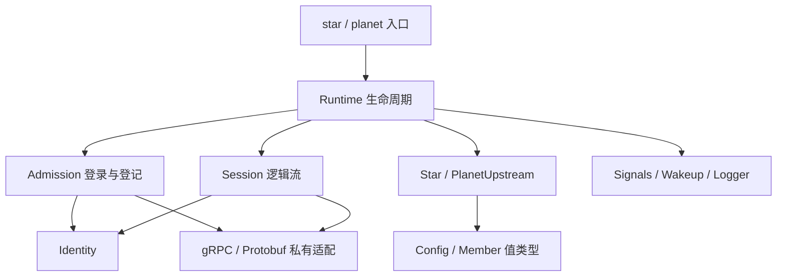

# 维护 Astra 核心服务

开始 C++ 工作前先阅读 [C++ 编码规范](../cpp-coding.md), 命名、作用域、性能取舍、注释和排版以该文为准.

从仓库根目录操作. 项目约定见 [coding.md](../coding.md), 协议与范围见
[当前架构](../docs/architecture.md). 此目录生产目标为 Linux x64 / GCC 16.2.0,
Pulsar 使用 C++ 提供独立登记与对时, Polaris/Astrolabe 使用 Go. 各服务数据库不互换, 已删除的 Go Supervisor 只从 Git 历史查阅.
旧 Rust Star 已废弃; 当前准入见[协议契约](../proto/README.md#admission),
当前实现与部署边界见 [Pulsar](pulsar/README.md).
时间模型与单一期限规则见 [Store](common/README.md), 最新执行结果见 [验证记录](../testkit/validation.md).
物理时间质量由宿主对时服务提供, 程序只读校验, 不自动安装/配置服务.

## 代码归属

| 位置 | 职责 | 修改时应保持的边界 |
| --- | --- | --- |
| `common/include/astra` | 配置、成员值、角色接口、进程入口 | 仅标准库和 Astra 类型, 不暴露 gRPC 或密码材料 |
| `common/src/options.hpp`, `config.cpp` | C++26 配置注解、解析、帮助与跨字段校验 | 一个选项声明生成解析和帮助, 外部输入仍显式验证 |
| `common/src/identity.*` | TLS 材料和准入验签 | 启动后只读, 原始凭证字节验签后才转换为成员值 |
| `common/src/admission.*` | Pulsar 登录和登记 | 持有上下文、请求和响应, 不修改角色索引 |
| `common/src/grpc_session.*` | 逻辑流、读写交接、Hello 与 Ping/Pong | 回调发布完成, 控制循环推进协议 |
| `common/src/rpc_status.hpp` | 稳定 gRPC 错误分类 | 只依据状态码, 不把远端 message/details 写入日志 |
| `common/src/process.*` | 信号、唤醒和 JSON 日志 | 私有进程设施, 有明确所有者和恢复路径 |
| `common/src/runtime.cpp` | 生命周期协调 | 按会话、准入、拨号、诊断的次序推进, 退出时等待完成 |
| `common/src/store.*` | 内部状态、批次历史、只读快照和 TTL 驱动 | 先准备分配再提交, 在同一把状态锁内补拍和处理续租 |
| `common/src/snapshot_index.hpp` | 内部 KV 的固定页写时复制索引 | Store/Almanac 在各自状态锁内捕获根与版本, 读完成与页复用通过同一状态锁同步; 不复制时间轮节点 |
| `star/src/almanac.*`, `library.*`, `receiver.*`, `readout.*` | Almanac 权威副本、两级路由、Polaris 接收和 Comet 下行 | 权威 +1, 全量私有准备及完整替换, View 独立同步寿命 |
| `star/src/catalog*`, `ephemeris*` | 各自原生状态、来源副本与公开投影 | 业务版本/TTL 与连续来源位置分离, 不广播副本本地到期删除 |
| `star/src/exchange.*`, `dispatch.hpp`, `landing.hpp` | 双域对等恢复、冻结根分页与完整 ACK | 只发自身来源, 有界预算/超时, 精确回补不能跨过其他 Key |
| `comet/cpp` | 原生 Client、Reader、Subscriber、Observer、Publisher、Beacon | 不把 gRPC 类型暴露给用户, 取消后等 OnDone 再释放 |
| `polaris`, `astrolabe`, `internal` | Go 权威持久、管理后端和共用准入 | 离线 Go 构建, 修改协议同时检查 C++ 消费者 |
| `common/src/clock.*`, `pulse_client.*` | 连续 Unix 时间、四时间戳和质量 | BOOTTIME 外推, 失联继续走时; Store 只存一个 deadline |
| `pulsar/src` | 独立登记服务、持久成员表与 Pulse | 对时和登记使用独立资源预算, 不引入业务数据存储 |
| `pulsar/tests` | 日志故障和真实 TLS/RPC 用例 | 临时状态由本例独占, 本轮修改后的用例需授权后执行 |
| `common/src/wheel.hpp` | 无动态分配的侵入式分层时间轮 | 不管理线程或读取时钟, Store 负责时间换算、批次提交和失败重排 |
| `star/src`, `planet/src` | 两个具体角色策略和各自入口 | 只维护内存索引, 不直接联网或在锁中取消 RPC |
| `common/tests` | 单元与真实 RPC 夹具 | `check.hpp` 的断言在 Release 也生效, `fixture.hpp` 只读取公开测试身份 |
| `bench` | 隔离的推流对照与存储微基准 | 不链接进服务, 不用实验消息扩充生产协议 |
| `build.py`, `test_*.py` | 离线构建及分层验证 | shell 仅选择已有 Python, 共享进程清理由 `testkit` 持有 |

保持角色与服务的目录边界. Moon/Planet 保持冻结, 不因共用库编译恢复其业务推进.
通用代码只因两个真实使用者共享行为而抽取, 不为未来数据层预建类层次.
测试夹具不进入生产 include 目录; 生成源码不手工编辑.

手写 C++ 直接使用完整协议名称: `proto::astra::v1::Hello`、`proto::orbit::v1::Member`.
未来 SDK 类型使用 `proto::comet::v1`; 隔离探针使用 `proto::astra::bench::v1`.
Pulsar 采样使用 `proto::pulsar::v1`, 登记继续使用 `proto::orbit::v1`.
不使用 `wire`、`orbit`、`probe` 等协议命名空间别名或 using namespace 隐藏归属和版本.

`Id` 是不透明字符串, `Principal` 是固定部署摘要, `Member::Epoch` 与 `Generation` 分别表达远端实例和本地会话代次.
不再提供 `HexId<N>` 或 `DialTarget` 包装. `Policy::due(now)` 返回一个可选的 `Member`,
Runtime 统一控制拨号间隔和并发预算; 策略只标记目标归属. 单用途转换的实现放在 `.cpp`, 不预建通用模板.
会话的首次关闭原因同时表示关闭阶段, 上游是否存在从 `active_member` 推导, 不维护两份可分歧状态.



## 注释与排版

仅引用根目录 [C++ 编码规范](../cpp-coding.md), 不在本指南复制命名、枚举、变量和代码块规则. 文件职责、线程交接与生命周期的具体约束见下文及所属源码.

## 生命周期审查

`Runtime` 的单控制循环拥有 `sessions_`, 推进准入和策略. 服务 handler 只在短锁内登记
`incoming_`; 控制循环通过 `collect` 接管. gRPC 自己管理 I/O worker.

`Session` 的接收对象必须经历 `StartRead -> OnReadDone -> 控制循环消费 -> StartRead`.
`read_inflight_` 和 `read_ready_` 分别表示 gRPC 与控制循环拥有缓冲区, 再提交读取时必须同时检查两者.
写消息直到 `OnWriteDone` 才可复用. 不嵌套持有策略锁和会话锁, 不在回调里处理角色或签名校验.

`cancel` 只提出关闭请求. 控制循环继续推进 Finish / RemoveHold, 收到 OnDone 后才能回收 reactor.
`completed` 发布 done 之后不能再访问成员, 回调只使用独立持有的 `Wakeup`.
`Admission` 禁止搬移, 因为 gRPC 借用了它的请求地址. 退出先停止接纳、取消并排空 RPC, 再关闭服务器.

会话中 Hello/Ping/Pong 优先, 双域数据由 Exchange 有界准备, 保持读取以接收心跳;
慢读/恢复超时必须关闭并归还冻结根预算. 存储的分配失败测试为独立可执行文件,
其故障注入替换型 new 不得链接到服务或其他测试进程; 显式分配测量目标是独立配置.

`Signals` 和 `Logger` 由入口/Runtime 唯一持有, 禁止复制, 析构恢复处理器或描述符状态.
日志管道背压丢弃诊断, 不阻塞协议推进. 这些设施保持私有, 不形成公开平台适配框架.

## 修改后的验证

先完成整理与格式化, 再按实际改动选择验证. 下列构建/测试命令须先取得本轮明确授权,
遵循根目录 [AGENTS.md](../AGENTS.md). 不以删除注释、错误分支或测试来减少行数.

```bash
# 已安装工具, 不下载依赖.
clang-format -i astra/common/src/runtime.cpp
python3 -m black --config testkit/pyproject.toml astra
bash astra/build.sh test --core-only
bash astra/build.sh regression --profile debug
```

格式化时选择实际修改的文件. 格式化器暂不理解的反射语法
仅局部使用 `clang-format off/on`. 当前 clang-tidy 不能解析这套 GCC 反射扩展, 不把编译成功称为 tidy 通过.

| 改动 | 必要的针对性检查 |
| --- | --- |
| 仅注释与格式 | clang-format 检查, 对照修改前工作副本核对非注释 token 与枚举顺序, 检查配置/枚举注释覆盖 |
| 构建入口或环境选择 | `python3 -B astra/test_build.py`, 相关配置实际执行 |
| 配置描述、成员和策略 | `test --core-only`, 涉及联网语义再执行进程回归 |
| 生命周期、并发、TLS/RPC | Debug/Release 回归, ASan/UBSan, 完整 TSan; 退出变化增加短故障循环 |
| 生产 `.proto` 或生成工具约束 | `generate`, `check-generated`, 当前 Go/C++ 互通回归 |
| `bench` 调度或采样 | 历史实验当前缺少可用比较接收器, 恢复前不以它作为生产性能门槛 |
| 准备或发布二进制 | 核对锁定来源、许可证、实际动态运行库和安装树, 在目标环境运行 |

`test` 与 `regression` 先构建 C++/Go 再执行 Go 和 CTest. 旧 `soak`/`scale` 当前明确拒绝, 不替代新链路验收. 入口重新启用
`BUILD_TESTING` 并拒绝零测试成功. 直接用 CMake 时仍可设置 `BUILD_TESTING=OFF` 构建纯服务,
但这种产物不能作为通过回归的证据. 不兼容的 core-only、分配测量和 sanitizer 组合直接失败.

发现缺陷时检查 C++ Star/Pulsar/Comet、Go Polaris/Astrolabe 及相关共享夹具的同类路径,
记录适用性; 冻结组件只有实际受共享问题影响时才扩展检查. 原始证据记录代码指纹和失败样本,
最新结果维护在固定 validation.md, 更早记录由 Git 保存, 不把旧长测或性能排名自动转记给新产物.

## 依赖和交付

`dependencies.lock.json` 是来源、版本与校验值的唯一清单. 普通构建、生成检查和测试都不下载.
依赖准备需要针对具体项目的授权, 不因缺少包而自动运行 fetch/install.
子进程工具路径和缓存留在项目下, 不修改用户或系统配置.

CMake 安装复制既有 C++ `star`, `planet`, `pulsar`、Comet SDK、根许可证和第三方授权文本. Go `polaris`/`astrolabe` 由 build.py 显式构建, 不再以占位入口代替.
开发构建的 GCC RPATH 不进入安装树.
交付时仍需提供匹配的 libstdc++ 与其他实际动态依赖, 并在目标发行版验收. 本连接骨架的源码组织
和测试门槛不等同于数据层或生产部署已经完成.
