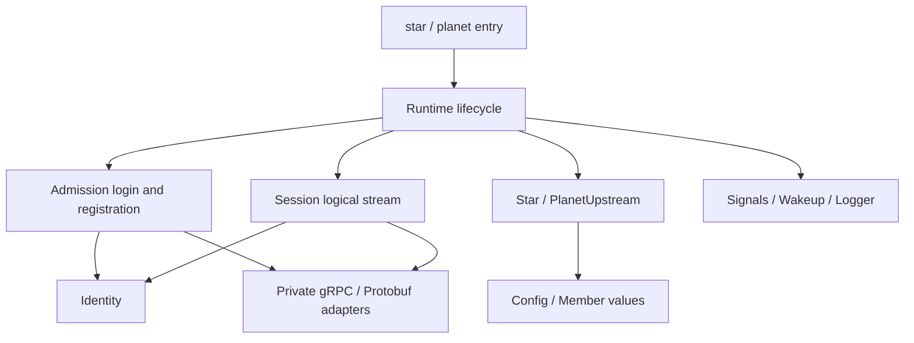

# Maintaining Astra

The [development standard](development.md) governs process/acceptance; [coding.md](coding.md) and its language sections govern coding/files. This guide adds Astra's tools, support scope, and implementation constraints, without duplicating language rules. C++ work must read [the C++ section](coding.md#cpp).

Commands/paths are relative to Astra's root. See [AGENTS.md](../AGENTS.md) for authorization/environment and [architecture](architecture.md) for scope. Production servers target Linux x64/GCC 16.2.0. Pulsar provides C++ admission/time; Polaris/Astrolabe use Go. Databases are not interchangeable. Deleted Go Supervisor/obsolete Rust Star are historical; use current [admission](../proto/README.md#admission) and [Pulsar deployment](../pulsar/README.md). [Storage](../common/README.md) owns single-deadline/time semantics; [validation](validation.md) owns results. Host time services provide physical quality; programs only inspect it, never install/configure services.

## Feature design entries

| Feature ID | Design/contracts | Current boundary |
| --- | --- | --- |
| `development-verification` | [Gate/pilot](features/verification.md); development.json contracts/checks | Delivered scope/unverified work in design/validation |
| `windows` | [Visual Studio/Windows](features/windows.md); WIN-LAYOUT, WIN-BROWSE, WIN-COMPILER, WIN-TIME, WIN-REFERENCE, WIN-LIFETIME, WIN-STORE, WIN-RANDOM, WIN-CLUSTER | IDE/partial native adaptations implemented; measured scope in validation; full services/formal gate integration not ready |

## Project languages and tools

[Architecture status](architecture.md#status) defines active scope. C++ serves Star/Pulsar/Comet, Go Polaris/Astrolabe, TypeScript/Vue Admin, and Python build/test tools. Legacy SDK language, Lua, C ABI, and column-width rules do not automatically apply to Comet/Astra C++.

Use Section 7 standard English comments, adapted by language; handwritten production file headers explain responsibility. Apply this to new/edited comments while preserving contracts, without translating unrelated source en masse. Register [project overrides](coding.md#overrides), not conflicting Chinese-comment requirements.

Immediately run existing language formatters after handwritten source edits without weakening scope/configuration. Non-C++ width follows committed configuration, usually 160; C++ long-line rules are separate. Pass tools/caches to owning children; do not create external caches or alter shell/user/system global environments.

| Language/component | Convention |
| --- | --- |
| C++ | Local clang-format; RAII/expected for resources/failure; [C++](coding.md#cpp) |
| Go | gofmt/[Go](coding.md#go); no KDF/slow I/O under short admission locks; check C++ protocol consumers |
| Rust tools | rustfmt/Clippy/[Rust](coding.md#rust); no revival of frozen services |
| Python | Existing Black/[Python](coding.md#python); established SSH/tools/caches |
| Admin | Prettier/TypeScript under [Admin constraints](#admin); [JS/TS](coding.md#typescript), [frontend](coding.md#web) |
| Proto | [Protocol coding](coding.md#protocol); actual fields/generation in [protocol docs](../proto/README.md) |

Formatting/static syntax checks do not replace behavior tests. AGENTS.md governs downloads/builds/tests/commits; listing a tool authorizes neither installation nor execution.

## Code ownership

| Location | Responsibility | Boundary |
| --- | --- | --- |
| `common/include/astra` | Configuration, member values, role interfaces, process entry | Standard library/Astra types only; no gRPC/secret material |
| `common/src/options.hpp`, `config.cpp` | C++26 option annotations, parsing/help/cross-field validation | One declaration generates parsing/help; validate external input |
| `common/src/identity.*` | TLS material/admission verification | Readonly after startup; verify raw credential bytes before conversion |
| `common/src/admission.*` | Pulsar login/registration | Own context/request/response; no role-index mutation |
| `common/src/grpc_session.*` | Logical streams, I/O handoff, Hello/Ping/Pong | Callbacks publish completion; control loop advances protocol |
| `common/src/rpc_status.hpp` | Stable gRPC classification | Status codes only; no remote message/details in logs |
| `common/src/process.*` | Signals, wakeups, JSON logs | Private owned process facilities with restoration |
| `common/src/runtime.cpp` | Lifecycle coordination | Advance sessions, admission, dialing, diagnostics in order; await exit |
| `common/src/store.*` | Internal state/history/snapshots/TTL | Prepare allocations before commit; catch-up/renewal under one state lock |
| `common/src/snapshot_index.hpp` | Fixed-page COW internal KV index | Store/Almanac capture root/version under their locks; read completion/page reuse synchronize there; never copy wheel nodes |
| `star/src/almanac.*`, `library.*`, `receiver.*`, `readout.*` | Authority replica, two-level routing, Polaris intake, Comet output | Authority +1; privately prepare/full replacement; independent synchronized View lifetime |
| `star/src/catalog*`, `ephemeris*` | Native states/source replicas/public projections | Separate business versions/TTL from continuous source cursors; no expiry-delete rebroadcast |
| `star/src/exchange.*`, `dispatch.hpp`, `landing.hpp` | Dual-domain recovery/frozen paging/complete ACK | Own-source only; bounded budget/time; exact repair cannot skip other Keys |
| `comet/cpp` | Native Client/readers/writers | No public gRPC types; await OnDone after cancellation |
| `polaris`, `astrolabe`, `internal` | Go authority/management/shared admission | Offline builds; verify C++ consumers after protocol changes |
| `common/src/clock.*`, `pulse_client.*` | Continuous Unix time/four timestamps/quality | BOOTTIME extrapolation through outages; one Store deadline |
| `pulsar/src` | Admission/persistent members/Pulse | Separate time/admission budgets; no business store |
| `pulsar/tests` | Log faults/real TLS/RPC | Own temporary state; current-task execution permission |
| `common/src/wheel.hpp` | Allocation-free intrusive hierarchical wheel | No threads/clock reads; Store converts time, commits, reschedules failure |
| `star/src`, `planet/src` | Concrete role policies/entries | Memory indexes only; no direct networking or locked RPC cancellation |
| `common/tests` | Units/real RPC fixtures | check.hpp asserts in Release; fixture.hpp reads public identities only |
| `bench` | Isolated streaming comparisons/storage microbenchmarks | Not linked into services; no experimental production-protocol messages |
| `tools/build.py`, `tests/test_*.py` | Offline builds/layered verification | Shell selects existing Python; tests own shared process cleanup |

Keep role/service directory boundaries. Shared compilation does not resume frozen Moon/Planet. Extract common behavior for two actual consumers, not future hierarchies. Fixtures stay out of production includes; generated source is not hand-edited.

Handwritten C++ spells protocol namespaces fully: `proto::astra::v1::Hello`, `proto::orbit::v1::Member`, SDK `proto::comet::v1`, isolated probes `proto::astra::bench::v1`, Pulse `proto::pulsar::v1`, admission still `proto::orbit::v1`. Do not hide ownership/version with `wire`, `orbit`, `probe` aliases or using namespace.

`Id` is opaque text, `Principal` a fixed deployment digest; `Member::Epoch` and `Generation` distinguish remote instance/local session generation. No HexId<N>/DialTarget wrappers remain. Policy::due(now) returns optional Member; Runtime owns dial timing/concurrency and policies mark target ownership only. Single-use conversions belong in .cpp, not generic templates. First close reason also identifies phase; derive upstream presence from active_member rather than duplicate state.



## Comments and formatting

Follow [C++ coding](coding.md#cpp), without duplicating naming/enum/variable/block rules. Specific file, handoff, and lifecycle constraints follow here/in source.

## Lifecycle review

Runtime's single control loop owns sessions_ and advances admission/policy. Handlers register incoming_ under a short lock; collect transfers ownership. gRPC manages I/O workers.

Receive buffers follow StartRead → OnReadDone → control-loop consumption → StartRead. read_inflight_/read_ready_ identify gRPC/control ownership; rearming checks both. Reuse writes only after OnWriteDone. Never nest policy/session locks or process roles/signatures in callbacks.

Release consumed local messages before send preparation, then rearm one read so the next packet overlaps preparation. Consume at most one packet per round; arrivals during preparation wait for the next round, without duplicate reads overwriting them. Data::receive borrows until return; retained content needs ownership.

cancel requests closure only. Continue Finish/RemoveHold until OnDone before reactor reclamation. After completed publishes done, touch no members; callbacks use independently owned Wakeup. Admission is nonmovable because gRPC borrows its request address. Shutdown stops admission, cancels/drains RPCs, then closes servers.

Hello/Ping/Pong have priority; Exchange prepares bounded dual-domain output while reads receive heartbeats. Slow-read/recovery timeouts close and return frozen-root budgets. Allocation-failure tests are separate executables: replacement new never links into services/other tests. Allocation measurement is an explicit separate profile.

Entry/Runtime uniquely own noncopyable Signals/Logger; destructors restore handlers/descriptors. Log backpressure drops diagnostics rather than block protocol progress. Keep these private, not a public platform framework.

## Verification after changes

Finish cleanup/formatting, then select checks by actual impact. Formatting may run directly; builds/tests below require current-task [authorization](../AGENTS.md). Do not reduce lines by removing comments, failure branches, or tests.

```bash
# Existing tools only; no dependency downloads.
clang-format -i common/src/runtime.cpp
python3 -B -m black --config pyproject.toml tools/build.py
bash build.sh test --core-only
bash build.sh regression --profile debug
```

Format actual edited files. Use narrowly scoped clang-format off/on only for unsupported reflection syntax. Current clang-tidy cannot parse these GCC reflection extensions; compilation is not a tidy pass.

| Change | Targeted verification |
| --- | --- |
| Comments/format only | Formatting, unchanged noncomment tokens/enum order, configuration/enum comment coverage |
| Build/environment selection | tests/test_build.py and actual affected profiles |
| Options/members/policy | test --core-only; process regression for network semantics |
| Lifecycle/concurrency/TLS/RPC | Debug/Release, ASan/UBSan, full TSan under separately appropriate permission; short failure loops for shutdown changes |
| Production .proto/generator constraints | generate, check-generated, current Go/C++ interoperability |
| Bench scheduling/sampling | Historical experiments lack a usable comparison receiver; not a production gate until restored |
| Binary preparation/release | Locked sources/licenses/actual dynamic runtime/install tree and target-environment execution |

test/regression build C++/Go, then run Go/CTest. Legacy soak/scale explicitly reject; use [independent soak](soak.md). Entries reenable BUILD_TESTING and reject zero tests. Direct CMake may build services with BUILD_TESTING=OFF, but that is not regression evidence. Incompatible core-only/allocation/sanitizer combinations fail.

Inspect related C++ Star/Pulsar/Comet, Go Polaris/Astrolabe, and shared fixtures for discovered mechanisms, recording applicability. Expand into frozen components only if actually affected. Raw evidence retains fingerprints/failing inputs; validation.md owns latest results, Git earlier records. Never transfer old soak/performance rankings to new artifacts.

## Dependencies and delivery

dependencies.lock.json alone owns source/version/checksum. Ordinary builds, generation checks, and tests do not download. Dependency preparation needs specific permission; missing packages do not trigger fetch/install. Keep child tools/caches project-local without user/system configuration changes.

C++ TLS/crypto uses gRPC's BoringSSL, not another OpenSSL runtime. Public identities are isolated fixtures. Logs/diagnostics omit secrets/arbitrary remote errors. Never commit real account passwords, signing keys, environment files, databases, or personal IDE state.

CMake installs existing star/planet/pulsar, Comet SDK, root license, and third-party terms. build.py explicitly builds Go polaris/astrolabe, not placeholders. Development GCC RPATH stays out of installation. Ship matching libstdc++/actual dynamic dependencies and validate target distributions. Source organization/test thresholds do not establish complete data-layer/production readiness.

<a id="admin"></a>

## Admin-specific constraints

These supplement the common [coding](coding.md) and [development](development.md) standards; [AGENTS.md](../AGENTS.md) owns authorization/branches.

### Workflow

1. Use .node-version/packageManager versions without automatic upgrades.
2. Identify behavior/module; make minimal changes preserving interactions.
3. Immediately Prettier-format edited source.
4. With current test permission, run pnpm check and relevant [browser acceptance](../admin/docs/verification.md).
5. Explain problem, result, verification, and limits; update architecture and [actual results](validation.md).

Specific downloads/installations/upgrades need explicit permission naming package, source, purpose, and location. No npx/temp-tool/test-script/package-manager bypasses. Existing checks require no new ESLint, Vitest, router, or state library; assess/request additions only for real need.

### TypeScript and Vue

Language expression follows [JS/TS](coding.md#typescript)/[frontend](coding.md#web). This application's choices:

- Composition API and `<script setup lang="ts">`; explicit .ts local imports for native Node tests.
- Preserve strict, noUncheckedIndexedAccess, exactOptionalPropertyTypes, and erasable-only tsconfig checks.
- Readonly data fields/collections and stable entity IDs.
- Keep Three.js out of deep Vue reactivity; runtime owns per-frame computation, Vue receives selection/errors/FPS/rate-limited camera coordinates.
- Global styles only in app/styles/; scoped layout/feature styles and CSS variables for shared colors/fonts.
- One current page assembled by App. Add routing for actual pages, and evaluate state libraries only for real cross-feature state.

### Modules and resources

- model depends on neither Vue, Three.js, DOM, nor demo data. runtime depends on neither Vue nor topology APIs; loaders read bundled same-origin GLBs only.
- UI accesses scenes through composables; only composables dynamically import scenes. Cross-feature access uses index.ts.
- App may choose demo data; adapters validate/translate input rather than leak network DTOs into rendering.
- pnpm check:boundaries uses the existing TypeScript parser; update rules/architecture with layering changes.
- createGalaxyScene.ts/createGalaxyObjects.ts remain assembly entries. scene/ owns canvas/selection commands; objects/ modeling/motion/picking; blackHole/ optics/animation.
- blackHole/config.ts, flow.ts, optics.ts are pure numeric, without GPU/DOM creation. shaders/ combines GLSL strings/constants only; material/texture/model preparation owns resource creation.
- background/ separates resources/GLSL; rendering/ owns shared layer IDs/fullscreen geometry without scene assembly. createStarPicker is fallback picking only, never a second selection state.
- Use import type for type-only edges; shared types must not load asset factories. Reject runtime dependency cycles; type edges are not runtime edges.
- Split by responsibility/ownership, not fixed line count. Prefer concrete functions/readonly inputs over single-forwarder managers, containers, or empty interfaces.
- Register GPU/listener/observer/RAF cleanup immediately after acquisition. Initialization failure/unmount use the same path.
- dispose is idempotent; one cleanup failure must not block others. Discard unloaded/superseded async results.
- User errors offer actionable recovery; raw exceptions go to development logs only. Do not present environment limits as code guarantees.

### Format, comments, and verification

Use UTF-8, LF, two spaces, Prettier, and a 160-column handwritten-code limit. Standard English comments follow [Section 7](coding.md) and JS/TS/frontend density. Describe file/type/function/variable purpose; adjacent block comments may cover simple locals. Public contracts and internal ownership/preconditions/transitions/failures add information without duplicate declarations.

Use Node node:test/node:assert/strict, importing production TypeScript directly. Fake clocks verify frames; real Three.js math verifies geometry/picking; GPU shaders still need browsers. Add behavioral regressions, not implementation-mirroring tests for style/static text. Fixed-frame screenshots are not performance promises; record resolution, DPR, GPU renderer, refresh rate, and scenario.

### Before merging

- Complete authorized pnpm check and affected browser interactions.
- No runtime demo imports, extra frame loops, or unreleased resources.
- Accurate UI sources/limits, no fabricated live status, implicit backend actions, or unauthorized dependencies.
- Matching manifests/locks; no outputs, caches, environment values, or keys in source.
- Documentation matches implementation; local cleanup grants no implicit commit, push, release, or branch changes.
