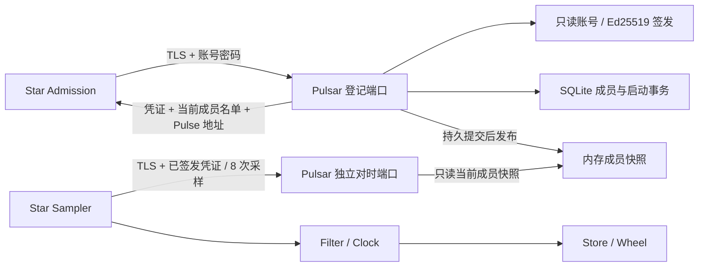

# Pulsar: 登记与连续纪元时间

本文维护当前部署、四时间戳采样、连续时间与恢复边界. [SQLite 成员库](#sqlite) 及角色/目录扩展已接入实现与回归. 实际配置、源码身份和故障注入边界见 [验证记录](../../testkit/validation.md), 后续未验证改动不继承该结果; 首版不导入旧 journal.

## 职责与调用链

Pulsar 是独立的 C++ 控制服务, 当前负责账号登录、成员凭证签发、持久登记和时间参考.
Star 自己完成采样、过滤、时钟质量判断和动态数据期限换算. Pulsar 不处理 Almanac/Catalog/Ephemeris 业务数据.

Pulsar 不向 Comet 开放任何接口. 已确认为 Polaris 与 Astrolabe 增加独立 Orbit 角色, 沿用内部准入签发, 完整边界见 [Astrolabe](../astrolabe/README.md#管理准入). 两种新角色的签发、校验和目录隔离已编写, 不将普通 SDK 加入基础设施角色. 不保留架构级 standalone 免准入分支, 单机部署与集群遵守同一 [初始化链路](../../docs/architecture.md#启动与运行).

目录已按角色区分: Star/Polaris 取得 Star 与 Polaris, Astrolabe 取得全部基础设施成员, 既有 Planet 候选保持冻结. 名单不作为进程健康或数据库就绪证明, 也不赋予 Polaris/Astrolabe 对等数据节点身份; 角色过滤与同步方向见 [Polaris 接入](../../proto/README.md#polaris-stream). 登记后采用 [只读名单查询](../../proto/README.md#directory), 不实现成员变更长流; Star 首次登记后改用 List 刷新, 不重复提交账号密码, 撤销凭证与控制面暂时失联分别处理.



登记复用 `proto.orbit.v1.Admission/Register`, 没有另造一套空的 Issuer 协议.
`RegistrationResponse.pulse_endpoint` 告知对时端口; 返回空值时,
Star 仍可完成原有准入, 但不能接受依赖全局截止的新有限租约. Pulsar 正常返回该地址.

`proto.pulsar.v1.Pulse/Bounce` 是短生命周期双向流. 只允许当前有效的 Star 凭证,
每条流验签一次, 不重复执行密码 KDF. Planet 暂不接入对时线程, 其既有准入和候选规则保留.

## 启动与已有材料

生产目标仍为 Linux / 项目内 GCC 16.2.0. 示例仅说明已构建程序的参数, 使用前须已有匹配身份材料:

```bash
pulsar --listen=192.168.0.119:7440 --pulse-listen=192.168.0.119:7441 \
    --galaxy=alpha --identity=build/deployment/pulsar \
    --state=build/state/pulsar.db

star --listen=192.168.0.119:7442 --super=192.168.0.119:7440 \
    --galaxy=alpha --identity=build/deployment/star-a
```

示例为正常恢复. 新群组首次初始化须在已存在且由部署独占的目录中使用未占用的状态文件, 额外显式传入 `--init=true`; 成功后重启去掉该参数. 缺库不自动创建, 初始化不覆盖现有库或恢复 sidecar. 不把旧群组清空后原地重建.

两个监听 IP 必须具体且匹配证书 IP SAN. 允许 `:0` 为测试分配端口, 日志输出实际地址.
禁用 `SO_REUSEPORT`, 防止同一端点背后运行不同的身份/账本/时间参考.
正常部署使用固定端口. `--help` / `--version` 不加载材料或开启服务.

| 所有者 | 文件 | 格式与用途 |
| --- | --- | --- |
| Pulsar | `ca.pem`, `cert.pem`, `key.pem` | 现有 TLS 格式, 同时覆盖两个端点的证书地址 |
| Pulsar | `admission.key`, `admission.pub` | PKCS#8 Ed25519 私钥、32 字节原始公钥, 启动核对密钥配对 |
| Pulsar | `accounts.json` | 1..64 个账号的数组, 字段为 username/salt/hash/roles |
| Star | `ca.pem`, `cert.pem`, `key.pem`, `admission.pub`, `login.json` | 原有节点身份格式, 密码不进入 CLI 或日志 |

账号摘要沿用 Go 的 PBKDF2-HMAC-SHA256、600000 次迭代、16 字节盐和32 字节摘要.
已有账号文件可复用, 也可由原有离线账号生成工具产生. Pulsar 运行不依赖 Go 进程,
当前不增加在线账号管理或热更新接口; 修改账号后需受控重启.

TLS、Ed25519、随机数、摘要和 KDF 均使用现有 gRPC 配套的 BoringSSL, CMake 显式链接 `gRPC::Crypto`.
BoringSSL 的兼容头文件仍叫 `<openssl/...>`. 这不表示引入了独立 OpenSSL 包;
没有新增 `find_package(OpenSSL)`、系统库查找、安装或下载步骤.

## 登记与恢复

沿用原有身份规则: 部署摘要由账号、Galaxy 和规范端点组成. 每次新启动提交32 字节随机幂等键,
服务签发独立的不透明 ID. 同部署的新启动推进成员代次; 同一次启动重试保留 ID 和代次,
同时返回最新成员名单, 不缓存旧应答. 已被替换的启动请求不能重新取得成功凭证.

`Ledger` 在登记锁下准备新成员快照、启动索引节点和完整应答, 再原子提交 SQLite 的当前成员与启动绑定. 只有 COMMIT 成功才发布准备好的内存状态; 确认之后不再分配容器节点. Pulse 与 List 读取原子共享快照, 不等待 SQL 写锁, 不声称 atomic shared_ptr 在所有实现中无锁.

默认每角色 64 个当前成员、累计 65536 次启动, 可配置到 4096 和 1000000. 达限显式拒绝, 不自动删除成员或遗忘旧启动请求. 数据库错误后停止登记, 保留旧内存视图供读取并显式回滚实际活动事务, 必须重启确认持久状态. 不将任意 COMMIT 失败解释为一定未写入.

<a id="sqlite"></a>
## SQLite 成员持久化

当前源码已用 SQLite 替换自定义追加日志的写入与恢复, 保留上述身份、代次、启动幂等、容量和持久确认语义. C++ 直接使用 SQLite C API、预编译语句和少量 RAII 所有权封装, 不引入 ORM、通用数据库适配层或第二套准入协议. Polaris 的 Almanac 库完全独立, Astrolabe 不拥有管理库, Star 不因此引入 SQLite.

持久状态只需覆盖以下三类, 不存 Almanac/Catalog/Ephemeris、登录会话、私钥或每次 Ping/Pong 样本. Pulsar 的 accounts.json 仍是现有账号来源, 本次不迁移账号管理:

| 数据 | 必须保留的关系 |
| --- | --- |
| 元信息 | Schema 版本、Galaxy、签发公钥摘要, 防止错误数据库被当作新群组使用 |
| 当前成员 | 部署摘要对应当前 Member; 不透明 ID、角色、端点、分组和代次完整恢复 |
| 启动记录 | 32 字节 request_id 唯一绑定部署与当时代次; 被替换的旧启动仍能明确拒绝 |

代次仍为非零 uint64, 不能在存储映射时截成 SQLite 的有符号 INTEGER 或转为 REAL. 使用固定 8 字节大端 BLOB 保存需要独立索引的代次值, 在 C++ 检查递增与溢出; 若成员正文继续使用 Protobuf 字节, 必须校验它与索引字段一致. 不为数据库引入第二个业务代次, SQLite 的 [存储类型](https://www.sqlite.org/datatype3.html#storage_classes_and_datatypes) 不改变协议取值范围.

登记继续单写者串行处理. 先准备候选成员快照、启动索引节点和完整应答, 再在一个事务中写入成员与启动记录; 元信息初始化也必须原子完成. 持久 COMMIT 成功后才能发布已准备好的内存状态并确认登记, 不能先应答再异步保存. 同启动重试返回原身份与当前名单, 不重复递增或插入, 不将旧响应整体存入数据库.

只读名单查询直接复用这份已发布的不可变成员快照, 不进入登记写事务或 KDF 限额, 自身仍有验签、并发和响应字节预算. 取快照后在锁外编码, 慢客户端只持有有界引用; 查询不得刷新启动记录或制造成员活动时间写入. 进程恢复完成前不返回临时空名单.

当前成员槽位按部署摘要保留, 不是自动过期的在线租约, 进程停止不自动释放端点或移除候选. Polaris 首版采用 [固定部署与同库重启](../polaris/README.md#deployment), 不提供地址/账号迁移或成员退役流程, 不擅自裁剪成员或旧启动拒绝证据.

首版使用本机文件、单个写连接及进程独占, Pulse 继续只读取原子发布的内存成员快照. SQLite 自身允许多个进程打开数据库不代表可以并行运行两个签发者; 必须保留服务级独占约束. 首版采用回滚日志 DELETE 与 synchronous=EXTRA, 读取确认配置生效, 不为这条低频登记路径先增加 WAL 检查点调度. 该同步级别包含删除回滚日志后的目录同步, 持久性仍依赖文件系统和设备正确执行同步, 参见 [SQLite 同步设置](https://www.sqlite.org/pragma.html#pragma_synchronous).

SQLITE_BUSY 的等待及重试有界, 不能阻塞 Pulse 或绕过 RPC 期限. COMMIT 返回错误不一律表示事务已回滚; 处理真实事务状态并释放语句/事务, 明确回滚成功才能按未提交处理. I/O 或提交结果无法确认时停止新登记, 由重启恢复实际持久状态, 不继续使用可能失配的成员索引签发新身份. 成功提交后丢失应答仍由原 request_id 恢复, 见 [SQLite 事务与错误语义](https://www.sqlite.org/lang_transaction.html).

启动从数据库恢复当前成员和有界启动索引, 校验身份绑定、字段、关系与容量后再开放登记. 未知 Schema、非法关系或数据库损坏均拒绝启动, 不删除文件重建空库. 数据库事务负责提交原子性, 不提供防篡改或防备份回滚保证; 不能因换用 SQLite 就绕过存储校验、文件权限和恢复边界.

已确认首版只支持显式初始化新群组及正常恢复这一群组的 SQLite 库, 不提供 journal 或 Go bbolt 导入、双格式读取或自动迁移. 已有群组的文件保持原样, 继续运行旧版本或另行设计迁移, 不能通过改扩展名使新服务接受旧文件.

初始化与正常启动分开: 初始化使用明确的新群组/新信任边界和未占用的状态目标, 已存在文件时拒绝覆盖; 正常启动缺库、错误格式或身份绑定不符时失败, 不自动创建空库. 不在原信任域内清空成员代次和启动幂等索引后重新签发. 初始化 schema/元信息原子完成, 中断不能把半成品当作合法空群组; CLI 为 `--init=true|false`, 默认 false; 父目录必须已存在, 该实现不授权重建已有部署.

同一 SQLite 库的正常重启继续恢复全部当前成员和启动绑定, 旧请求的拒绝证据不因本次裁剪兼容范围而删除. 旧备份不能直接覆盖正在运行的签发者状态, SQLite 文件也不提供防回滚保证.

Schema 1 成员正文的 principal 固定为 64 字符小写十六进制, 必须与 members 主键一致. 线上 Member 使用 32 字节摘要, Ledger 在持久化/恢复边界转换, 不让线协议的 string/bytes 优化改变既有磁盘格式. 正常恢复不重写数据库、不重置成员代次, 也不接受正文与主键不匹配的记录.

SQLite 不保存一个用于重启续接的物理时钟计数器. 重启时间仍按下文从受系统对时约束的 Unix 时间重新建立参考, 不能用最后落盘的时间推断停机时长. 实现固定 SQLite 3.53.4 与 Schema 1, CMake 仅消费已存在的官方 amalgamation, 核对压缩包及 C/头文件 SHA256; 不查找系统库或隐式下载. 独立 `.lock` 使用 flock 保持整个进程生命周期的服务独占. 恢复核对当前成员和从 1 到当前代次的全部启动绑定, 历史受已确认容量限制. 新增依赖仍需明确下载授权. 存储验收要求见 [管理与成员存储](../../testkit/comet.md#管理与成员存储), 实际结果见 [验证记录](../../testkit/validation.md).

## 对时算法与资源隔离

所有采样字段单位均为纳秒, 有效范围 `0..INT64_MAX`. T0/T3 来自 Star 的 BOOTTIME,
T1/T2 来自 Pulsar 连续 Unix 绝对时间. 采用四时间戳公式:

```text
offset = midpoint(T1 - T0, T2 - T3)
delay = max((T3 - T0) - (T2 - T1), local_precision)
dispersion = local_precision + remote_precision + drift_budget(T3 - T0)
observed_unix_time_at_T3 = T3 + offset
```

按用户确认, 保留 gRPC 并采用 [RFC 5905 的四时间戳估计与 delay 精度下限](https://datatracker.ietf.org/doc/html/rfc5905#section-8).
本文 T0/T1/T2/T3 分别对应 RFC 的 T1/T2/T3/T4; 服务端仍必须给出接收和发送两个时刻,
客户端发送时刻原样回显用于匹配, 收包时刻由客户端本地记录. 只给一个服务端时间会混入处理耗时.
这不是可与 chrony/ntpd 互通的 UDP NTPv4 服务, 不包含多时源选择或系统时钟驯服; POSIX/Unix 时间尺度由宿主对时服务维持, 不自建闰秒表.

本机 rho 取系统报告分辨率、纳秒表示单位和实际跳变的最小正增量中的较大值.
标定目标收集32 次跳变, 相同读数不算样本. Linux 的非阻塞 `timerfd(CLOCK_BOOTTIME)`
提供200 ms 观察窗口, 每128 次读钟检查到期与取消, 不再限制总读取次数.
因此快 CPU 不会仅因更早耗尽循环次数而拒绝15.6 ms 粗时钟. 预算内至少需三个正增量;
样本不足或时间反序仍显式失败, 不用虚假的精度继续对时.
内核定时器不依赖被测的用户态读数来结束循环, 但不是独立硬件时钟, 也不承诺内核失效或系统暂停下的墙钟上限.
相关语义见 [Linux timerfd](https://man7.org/linux/man-pages/man2/timerfd_create.2.html).
对端在 Pong.precision_ns 返回 rho.
合法范围1 ns..20 ms, 这个单位为纳秒的字段不能被解释为纳秒精度保证; 错误硬件的虚假报告不在保证范围内.
每批8 个串行采样, 至少3 个通过检查. 在双方精度及频率漂移预算内允许处理时长略大于本地 elapsed,
delay 钳到本地 rho, 并把 dispersion 带入最终误差. 仍保留项目的200 ms 往返/处理边界和异常样本过滤.
有效样本按最小 delay 筛选, 相等时取新样本; 最小 delay 不表示 dispersion 为零.

Star 在独立 jthread 内标定与收发, 不用 Runtime 的10 ms 轮询时刻充当采样边界.
本机标定失败会降低同步质量并退避重试, 不通过构造异常终止 Star 控制循环; 停止令牌也可取消标定. 已完成首次校准的 Star 只要本地计时正常, 仍可创建和续租; 本地读取本身失败不伪造时间.
Pulsar 在独立 Source 线程标定并采样, 未就绪时 Pulse 返回 UNAVAILABLE, 登记仍可运行.
复用 TLS Channel, 每条采样流总截止2 秒, 批内间隔5 ms, 正常批间约1 秒且带抖动.
失败退避100 ms 起, 上限5 秒再加抖动. 流内同时只有一个在途 Ping.
批内5 ms 间隔与批间退避共用支持 stop_token 的条件变量等待, 不保留不可取消的硬休眠.

Pulsar 的登记与对时使用独立监听、Server 和 ResourceQuota. 登记最多4 个并发 KDF,
超载返回 RESOURCE_EXHAUSTED; Pulse 使用 Callback API, 最多64 条活动流, 等待网络不占同步工作线程.
服务端以 GPR_CLOCK_MONOTONIC Alarm 自行限制三秒流寿命, 即使客户端不给截止或给出超长截止也会取消.
不再用 `context.deadline() - system_clock::now()` 判断客户端预算, 因而避免这段墙钟比较受到 NTP step 影响.
Star 发起 Pulse/Admission 和两端服务关闭的截止也直接用 gRPC 单调时间表示.
Reactor 交替 Read/Write, 只在完成回调提交下一操作; 取消通过唯一在途操作完成后 Finish,
配额在 OnDone 归还. Alarm 只持有独立的上下文寿命保护对象, OnDone 清空它后才释放 Reactor.
复用 Pong 前执行 Clear, 且必定在上一次 Write 完成之后; T1 在清空前采样, 清空耗时包含在处理时间内.
Star 的复用 Ping 同样在 Write 完成后、T0 采样前清空. 这为未来条件字段补强边界, 当前标量均已完整赋值, 没有已证实的字段泄露.
资源预算隔离可降低登记计算和文件提交对采样的干扰,
但共享 CPU、网络和 gRPC 底层设施, **不保证严格优先级或硬实时延迟**.
64 条有效慢流仍可暂时占满应用配额, 当前实现消除的是按流占用阻塞线程, 不声称无限并发或完备抗 DoS.
参见 [gRPC ResourceQuota](https://grpc.github.io/grpc/cpp/classgrpc_1_1_resource_quota.html)
及 [SO_REUSEPORT 参数](https://github.com/grpc/grpc/blob/master/include/grpc/impl/channel_arg_names.h).

## 物理时间基准与重启

部署负责让 chrony 等系统服务维持可信 CLOCK_REALTIME, 整机启动先完成必要的大偏差校准.
仅 Pulsar 进程重启不会重启系统时钟或对时服务; 整机断电时 RTC 只提供粗略起点,
重新达到质量门槛后才能提供可信对时.

Source 每秒只读 adjtimex(modes=0) 和 CLOCK_REALTIME, 拒绝 TIME_ERROR、STA_UNSYNC、
STA_CLOCKERR、非法时间、过长读取窗口和超过 500 ms 的误差估计.
maxerror/esterror 固定为微秒, offset 依据 STA_NANO 换算, 再计入采样窗口和实测 rho.
不安装/配置服务, 不修改系统时间, 不在每个 RPC 回调里查询系统校准状态.

内核状态和误差估计不是准确度证明, 也不包含 chrony 的源选择详情.
部署仍需核对实际时间源、剩余校正和 root dispersion/root delay.
chronyc tracking/waitsync 是运维检查, 程序不会自动执行, 也不以进程存活代替质量达标.
waitsync 的剩余校正阈值不是完整 UTC 误差界限; 对时守护程序重启后的 step 策略需部署协调.
参考 [chrony](https://chrony-project.org/doc/4.7/chrony.conf.html)
和 [chronyc tracking](https://chrony-project.org/doc/4.7/chronyc.html#tracking).

Clock 首次只接受质量达标的 Unix 锚点, 之后不跳时或停走.
Pulsar 最大额外调速 500 ppm; Star 为 1000 ppm, 为跟踪上游调速预留余量.
四时间戳使用 1500 ppm 相对频差预算, 观测年龄使用 2000 ppm 保守漂移预算.
这些是待测的工程参数, 不是实际硬件精度. 总误差包括上游估计和本机未消化偏差.
观测超过 5 s、参考失效或总误差超过 500 ms 时 synchronized=false, 表示同步质量降级; 已初始化且本地计时正常的读数仍为 ready=true, 不因参考失联拒绝新注册和续租. 5 s 仍用于质量告警和拒绝消费过旧的新样本, 不再是租约受理期限.

Pulsar 重启重新锚定同一 Unix 物理基准, 不生成业务 era 或时间专用日志.
持续运行的 Star 平滑吸收新估计, 不重置数据或时钟.
若重启前尚有大偏差, 新旧进程输出可能不同; 保证针对运行中连续,
不承诺任意崩溃前后绝对无反序, 也不凭持久化一个数值推测断电时长.
BOOTTIME 计入内核支持的 suspend, 不保证虚拟机快照回滚后的历史连续性.


<a id="clock"></a>
## 连续业务时间与调速

Clock::Time 是固定 Unix 起点的非负 int64 纳秒时间. 本地 CLOCK_BOOTTIME 用于经过时间及采样; Star 的本地经过时间不直接作为跨机器业务截止传播.
一个持续运行的 Clock 在初始化后对非重叠读取单调不减, 允许分辨率内相邻值相同. 初始化仅接受质量达标样本, 后续校正不能跳时、停走或替换业务原点.

Reading::ready 表示本次本地纪元计时可用, Reading::synchronized 表示当前参考样本仍满足质量条件. Clock::now 未初始化或本地反序/计数耗尽时返回空, 内核读取失败抛出异常; 默认构造的 Reading 没有 ready 资格. deadline_after 只检查本地 ready、非负 TTL 及可表示范围, 不把 synchronized 当成租约开关. 读数仅供本次处理使用, 不长期缓存为下一次业务请求的当前时间.

Pulsar 的 Pulse 服务继续要求 synchronized 才发送可信新样本, 不能把自身离线外推的时间反复标为新鲜参考, 掩盖全链路的同步降级. 已校准 Star 无需这些新样本也能继续本地计时, 新进程仍等待首次可信校准. 长期离线不承诺与 UTC 或其他 Star 保持固定误差上限, 误差估计持续用于诊断.

每次读取或接收样本先补齐本地经过时间. 简化后的推进公式为:

```text
d = 当前本地经过时间 - 上次锚点
budget = d * slew_ppm / 1_000_000, 保留整数舍入余数
correction = clamp(待消化偏差, -budget, +budget)
epoch_now += d + correction
待消化偏差 -= correction
```

slew_ppm 必须小于 1_000_000, 保证向后修正也不会停止正常走时.
偏差消化完成后恢复正常速率, 不储存空闲时未使用的校正额度以便日后突然跳时.
频繁读取应与一次等量经过时间的推进保持相同结果; 必须保留小数余量, 不让高调用频率吃掉校正预算.
乘法与差值采用足够宽的中间类型并检查边界, 不用可能溢出的 int64 乘法或静默饱和冻结时间.

新样本对应本地接收时刻 B, 发布样本时在锁内取得当前经过时间 C, 先把现有模型推进到 C.
将样本的目标纪元值按 C - B 外推到 C, 并把这段年龄的误差计入质量, 再计算“目标纪元值 - 当前输出”.
它替换旧的残余偏差估计, 不把每批重复看到的同一误差不断累加.
样本顺序与最后接受的观测比较, 不与最近一次 read() 比较: 并发读取已经推进过 B 不代表样本无效.
超过有效年龄、相对上次观测反序的样本和停止后的 RPC 完成结果不修改模型.

首版采用一个短锁保护该模型, 读取不分配、不写盘、不调用 Store 或 RPC.
不先引入无锁高水位、每 CPU 时钟或多套校正控制器. 这是进程级固定成本,
Store 每轮/批读取一次, 不在到期循环中为每个 Key 重新采样时钟.

限速调整参考 [RFC 5905 的 Steady-Adjust Process](https://www.rfc-editor.org/rfc/rfc5905.html#section-12),
但这里只实现项目需要的时间模型, 不声称实现完整 NTPv4 时钟驯服算法或修改宿主系统时间.


## TTL 与恢复

Entry/Delta 只保存可选绝对 deadline, 空表示永久, 不保存 era 或另一份本地截止. Store 及 Wheel 的具体提交与推进规则见 [Store](../common/README.md).

| 状态 | 已有数据 | 新有限期限 |
| --- | --- | --- |
| 未初始化 | 等待公共锚点, 不猜测是否到期 | 拒绝 |
| 时间新鲜且质量达标 | 正常推进 | 通过 deadline_after 校验后可受理 |
| 失联、过时或误差超限, 本地计时正常 | 按本地经过时间继续走时和到期, 报告同步降级 | 继续受理, 不要求 Pulsar 在线 |
| 对时恢复 | 平滑校正, deadline 不改写, 已过期数据不复活 | 持续可受理, 不重新获得完整 TTL |
| 本地读取失败、计数反序或耗尽 | 报告计时故障, 不伪造推进或到期结论 | 拒绝 |

无期限状态、显式删除和连接管理不因单纯对时失效而停止. 对时就绪仍不代表当前已开放业务 RPC.
clock_status 的 ready 只表示本地计时可用, synchronized 单独表示同步质量; 两者均为布尔值. 失联后应观察到 ready=true/synchronized=false 及继续递增的时间, 不能仅凭 ready=true 判断参考已经恢复. 质量降级记录 clock_holdover, 尚无可用读数时为 clock_unavailable.
Pulsar 重启不为数据发放新纪元或重新续满 TTL; 运行中的 Star 平滑吸收新估计. 跨进程重启前后绝对不反序不在当前保证内.

Star 的 Catalog/Ephemeris 仍为内存状态, 不从本地磁盘恢复租约; Polaris 的持久 Almanac 不使用 TTL. 如果以后增加租约持久恢复, 必须保留原 deadline, 先建立可信公共时间, 清理已过期项并核对检查点时间水位; 不恢复成 now + 原 TTL.
全群断电后没有可信外部参考或可靠计时就无法知道离线时长. VM 快照回滚也不等于正常重启, 单独保存旧时间不能提供跨历史单调保证.

本地 Steady/gRPC 单调时间继续用于 RPC 截止、退避、历史保留及测量, 不与业务时间混用. 跨 Star 时钟仍有误差, 不承诺同纳秒过期或用时间替代业务版本.

## 验证和未覆盖范围

Clock/Store 确定性、物理参考故障、成员持久化、TLS/Pulse、慢流取消、Pulsar 与两台 Star 真实进程恢复均有用例. 真实进程场景只读宿主时源质量, 不设置生产测试后门.
SQLite 初始化/拒绝覆盖、身份恢复、角色与启动容量、并发幂等、忙锁下内存读取、事务回滚及 VFS 写入/同步故障用例已纳入回归.
失联超过 5 s 后新建/续租、周级离线后的短期限、参考质量与本地计时独立、Pulse 不传播劣质新样本及恢复不续满旧期限也有用例. 最新执行证据统一见 [验证记录](../../testkit/validation.md), 时间推进模拟不冒充真实挂起设备测试.
宿主未同步或误差超限时应明确失败; 不通过继续放宽门槛或跳过用例冒充通过. 当前质量门槛为已批准的 500 ms, 与 200 ms 的 RTT/处理边界不同.
物理断电、真实 suspend、负载下 Pulse 尾延迟和长期精度尚无本轮专项结果. 不自动修改系统时间、安装时源服务或挂起 VM.
测试与下载授权分别遵循 [AGENTS.md](../../AGENTS.md).
