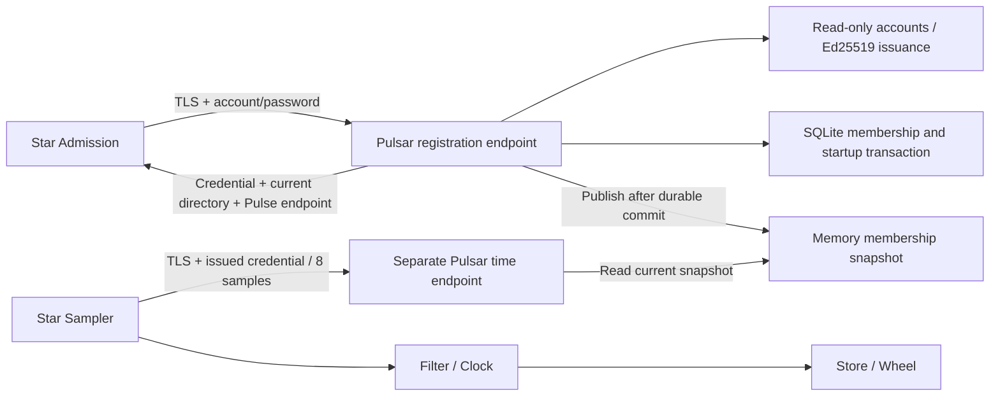

# Pulsar: registration and continuous epoch time

[English](README.md) | [简体中文](README_CN.md)

This page defines deployment, four-timestamp sampling, continuous time, and recovery boundaries. [SQLite membership storage](#sqlite) and role/directory extensions are implemented and covered by regression cases. [Validation](../docs/validation.md) records actual configuration, source identity, and fault-injection scope; later unverified changes do not inherit those results. The first version does not import old journals.

## Responsibilities and call chain

Pulsar is an independent C++ control service for account login, member credential issuance, durable registration, and time reference. Star performs sampling, filtering, quality assessment, and dynamic-data deadline conversion. Pulsar handles no Almanac/Catalog/Ephemeris business data and exposes no interface to Comet.

Polaris and Astrolabe have distinct Orbit roles using internal admission issuance; see [Astrolabe admission](../astrolabe/README.md#management-admission). Issuance, verification, and directory isolation are implemented. Ordinary SDKs do not become infrastructure roles. No architectural standalone admission bypass remains; single-machine and cluster deployments share the [startup chain](../docs/architecture.md#startup-and-operation).

Directory filtering gives Star/Polaris the Star and Polaris members, Astrolabe all infrastructure members, and preserves frozen Planet candidates. Membership proves neither process health nor database readiness, and gives Polaris/Astrolabe no peer-data-node role. See [Polaris integration](../proto/README.md#polaris-stream). After registration, [read-only List](../proto/README.md#directory) refreshes membership without a long-lived membership stream or repeated account/password submission. Revoked credentials differ from temporary control-plane disconnection.


```mermaid
flowchart LR
    S[Star Admission] -->|TLS + account/password| I[Pulsar registration endpoint]
    I --> A[Read-only accounts / Ed25519 issuance]
    I --> L[SQLite membership and startup transaction]
    I -->|Publish after durable commit| V[Memory membership snapshot]
    I -->|Credential + current directory + Pulse endpoint| S
    C[Star Sampler] -->|TLS + issued credential / 8 samples| P[Separate Pulsar time endpoint]
    P -->|Read current snapshot| V
    C --> F[Filter / Clock]
    F --> T[Store / Wheel]
```

Registration reuses `proto.orbit.v1.Admission/Register`, not a new empty Issuer protocol. `RegistrationResponse.pulse_endpoint` supplies the time endpoint. An empty value allows admission but prevents accepting new finite leases requiring global deadlines; normal Pulsar returns it.

`proto.pulsar.v1.Pulse/Bounce` is a short-lived bidirectional stream for currently valid Star credentials only. Signature verification happens once per stream without another password KDF. Planet currently has no time-sampling thread; its admission/candidate rules remain unchanged.

## Startup and existing materials

Production targets Linux with project GCC 16.2.0. These examples describe already-built programs and require matching identity materials:

```bash
pulsar --listen=192.168.0.119:7440 --pulse-listen=192.168.0.119:7441 \
    --galaxy=alpha --identity=build/deployment/pulsar \
    --state=build/state/pulsar.db

star --listen=192.168.0.119:7442 --super=192.168.0.119:7440 \
    --galaxy=alpha --identity=build/deployment/star-a
```

This is normal recovery. Explicit new-cluster initialization additionally needs `--init=true`, an unused state file, and an existing deployment-exclusive directory. Remove that flag after successful initialization. Missing databases are not automatically created; initialization overwrites neither databases nor recovery sidecars. Do not clear/recreate an old cluster in place.

Both listening IPs must be concrete and match certificate IP SANs. Tests may use `:0`; logs show actual endpoints. `SO_REUSEPORT` is disabled to prevent different identities/ledgers/time references behind one endpoint. Normal deployments use fixed ports. `--help`/`--version` neither load materials nor start services.

| Owner | Files | Format/purpose |
| --- | --- | --- |
| Pulsar | `ca.pem`, `cert.pem`, `key.pem` | Existing TLS format, certificate addresses covering both endpoints |
| Pulsar | `admission.key`, `admission.pub` | PKCS#8 Ed25519 private key, raw 32-byte public key; startup checks the pair |
| Pulsar | `accounts.json` | Array of 1..64 accounts: username/salt/hash/roles |
| Star | `ca.pem`, `cert.pem`, `key.pem`, `admission.pub`, `login.json` | Existing node identity format; passwords never enter CLI/logs |

Account hashes retain Go's PBKDF2-HMAC-SHA256, 600000 iterations, 16-byte salt, and 32-byte digest. Existing account files/offline generation tools remain usable. Pulsar needs no running Go process and adds no online account management/hot reload; account changes require controlled restart.

TLS, Ed25519, randomness, hashes, and KDF use existing gRPC BoringSSL, explicitly linked as `gRPC::Crypto`. Its compatibility headers remain `<openssl/...>`; this does not add standalone OpenSSL, `find_package(OpenSSL)`, system-library discovery, installation, or downloads.

## Registration and recovery

Deployment digests retain account, Galaxy, and canonical endpoint. Each new startup submits a random 32-byte idempotency key and receives an independent opaque ID. New startup at the same deployment advances member generation; retrying the same startup retains ID/generation but returns the current directory, not a cached response. A replaced startup request cannot regain successful credentials.

Under the registration lock, `Ledger` prepares the new snapshot, startup-index nodes, and complete response, then atomically commits current membership/startup bindings to SQLite. Only successful COMMIT publishes prepared memory state; no container-node allocation follows acknowledgment. Pulse/List read atomic shared snapshots without waiting on SQL writes; atomic shared_ptr is not claimed lock-free on every implementation.

Defaults allow 64 current members per role and 65536 cumulative startups, configurable up to 4096 and 1000000. Exhaustion explicitly rejects without deleting members/forgetting startup requests. Database errors stop registration, retain the old readable memory snapshot, and explicitly roll back an actually active transaction. Restart must reconcile durable state. Arbitrary COMMIT failure does not prove nothing was written.

<a id="sqlite"></a>

## SQLite membership persistence

SQLite replaces custom append-log write/recovery while preserving identity, generation, startup idempotency, capacity, and durability semantics. C++ uses SQLite's C API, prepared statements, and small RAII owners, without ORM, generic database adapters, or another admission protocol. Polaris's Almanac database is independent; Astrolabe has no management database and Star acquires no SQLite dependency.

Only these durable relationships are needed; do not persist business domains, sessions, private keys, or Ping/Pong samples. `accounts.json` remains the account source.

| Data | Required relationship |
| --- | --- |
| Metadata | Schema version, Galaxy, issuing-public-key digest, preventing the wrong database from appearing as a new cluster |
| Current members | Deployment digest → current Member, restoring opaque ID, role, endpoint, group, generation |
| Startup records | Unique 32-byte request_id → deployment and issued generation, including explicit rejection of replaced startups |

Generation remains nonzero uint64, never truncated to signed SQLite INTEGER or REAL. Independently indexed generations use fixed 8-byte big-endian BLOBs; C++ checks increment/overflow. Protobuf member bodies must agree with index fields. Storage adds no second business generation; [SQLite types](https://www.sqlite.org/datatype3.html#storage_classes_and_datatypes) do not change wire ranges.

Registration remains a serialized single writer. Prepare candidate snapshot/index/response first, then write member/startup rows in one transaction; metadata initialization is also atomic. Durable COMMIT precedes publication/receipt, never async persistence after success. Same-startup retry returns original identity/current directory without another increment/insert or storing a whole old response.

List reuses the published immutable snapshot outside registration transactions/KDF quotas, while retaining its own signature, concurrency, and response-byte budgets. Encoding occurs outside the lock; slow clients hold bounded references. Reads update neither startup rows nor member-activity timestamps. Recovery must finish before returning a directory; no temporary empty list.

Member slots persist by deployment digest, not expiring online leases. Process exit releases neither endpoint nor candidate. Polaris supports [fixed deployment/same-database restart](../polaris/README.md#deployment), without address/account migration or retirement. Do not trim members or old-startup rejection evidence. Any advertised-address change currently changes the digest and consumes another slot, so frequently changing Pod IPs are not stable deployment identities. One account may legitimately host several nodes; never merge/delete by account. Dynamic endpoints need explicit deployment identity and migration/retirement contracts. Raising capacity or deleting storage cannot replace that lifecycle design.

The first version uses a local file, one write connection, and process exclusivity; Pulse keeps reading atomic memory snapshots. SQLite allowing multiple processes does not permit multiple issuers. Use rollback journal DELETE and `synchronous=EXTRA`, reading settings back to verify them, without adding WAL checkpoint scheduling to this infrequent path. EXTRA includes directory sync after journal deletion, still dependent on filesystem/device behavior. See [SQLite synchronous](https://www.sqlite.org/pragma.html#pragma_synchronous).

SQLITE_BUSY waits/retries are bounded and cannot block Pulse or evade RPC deadlines. COMMIT error does not always mean rollback: inspect actual transaction state, release statements/transactions, and classify uncommitted only after confirmed rollback. I/O/uncertain commit stops new registration; restart recovers real durability rather than issuing from possibly divergent indexes. A lost response after success is recovered by original request_id. See [transaction/error semantics](https://www.sqlite.org/lang_transaction.html).

Startup restores members/bounded startup indexes and validates identity bindings, fields, relationships, and capacity before opening registration. Unknown schema, invalid relationships, or corruption fail startup without deleting/recreating files. Transactions provide atomicity, not tamper resistance or backup rollback protection; storage validation, permissions, and recovery boundaries remain necessary.

Only explicit initialization of a new cluster and normal recovery of its SQLite database are supported. No journal/Go-bbolt import, dual-format reader, or automatic migration exists. Preserve existing-cluster files and use the old version or separately design migration; renaming extensions does not convert formats. Initialization uses a new cluster/trust boundary and unused target, refusing existing files. Normal startup rejects missing/wrong-format/mismatched databases instead of creating empty state. Never clear generations/idempotency indexes and reissue within the old trust domain. Atomic schema/metadata creation prevents interrupted partial files from becoming valid empty clusters. CLI is `--init=true|false`, default false; parent directory must exist. This implementation does not authorize rebuilding deployments.

Normal restart restores all current members/startup bindings, including old-request rejection evidence. Old backups cannot overwrite an active issuer; SQLite itself gives no anti-rollback guarantee. Schema 1 persists principal as 64 lowercase hexadecimal characters matching the members primary key. Wire Member uses a 32-byte digest, converted at Ledger persistence/recovery boundaries. Wire string/bytes optimization does not change disk format. Recovery neither rewrites databases nor resets generations, and rejects body/key mismatches.

SQLite stores no restart-continuity physical clock counter. Restart reanchors from system-synchronized Unix time; the last persisted number cannot reveal downtime. Implementation pins SQLite 3.53.4/Schema 1. CMake consumes an existing official amalgamation and checks archive/C/header SHA256, without system-library fallback or implicit download. A separate `.lock` uses flock for lifetime service exclusivity. Recovery verifies current members and every startup binding from generation 1 through current, within approved capacity. New dependency downloads require explicit approval. See [storage acceptance](../docs/comet.md#management-and-membership-storage) and [results](../docs/validation.md).

## Time sampling and resource isolation

All sample fields use nanoseconds in `0..INT64_MAX`. T0/T3 are Star BOOTTIME; T1/T2 are Pulsar continuous absolute Unix time:

```text
offset = midpoint(T1 - T0, T2 - T3)
delay = max((T3 - T0) - (T2 - T1), local_precision)
dispersion = local_precision + remote_precision + drift_budget(T3 - T0)
observed_unix_time_at_T3 = T3 + offset
```

The approved design retains gRPC and [RFC 5905's four-timestamp estimate/delay precision floor](https://datatracker.ietf.org/doc/html/rfc5905#section-8). Here T0/T1/T2/T3 correspond to RFC T1/T2/T3/T4. Servers supply receive/send times, echo the client's send time for matching, and clients record receipt locally. A single server timestamp would mix in processing delay. This is not a chrony/ntpd-compatible UDP NTPv4 service, implements neither multiple-source selection nor host-clock discipline, and relies on the host's POSIX/Unix timescale without its own leap-second table.

Local rho is the maximum of reported system resolution, nanosecond representation unit, and minimum observed positive increment. Calibration targets 32 changes, excluding equal readings. Nonblocking Linux `timerfd(CLOCK_BOOTTIME)` provides a 200 ms observation window; expiration/cancellation is checked every 128 clock reads without a total-read-count limit. Fast CPUs therefore do not reject a coarse 15.6 ms clock merely by exhausting iterations early. At least three positive increments are required; insufficient samples/reversed time fail explicitly rather than inventing precision. The kernel timer does not rely on the measured user-space readings to stop, but is not independent hardware and promises no wall-time bound under kernel failure/suspend. See [timerfd](https://man7.org/linux/man-pages/man2/timerfd_create.2.html).

Pong.precision_ns returns peer rho, valid from 1 ns to 20 ms. Nanosecond units do not guarantee nanosecond accuracy, and falsely reporting hardware is outside the guarantee. Each batch has eight serial samples with at least three valid. Processing may slightly exceed local elapsed within precision/frequency-drift budgets; delay clamps to local rho and final error includes dispersion. The 200 ms RTT/processing bounds and outlier filtering remain. Minimum delay wins, newest on ties; minimum delay does not imply zero dispersion.

Star calibrates/sends/receives in a separate jthread, not Runtime's 10 ms polling boundaries. Local calibration failure downgrades synchronization and retries with backoff instead of throwing out of the control loop; stop_token can cancel it. Once initially calibrated, a Star with working local time still creates/renews leases. Local read failure never fabricates time. Pulsar calibrates/samples in an independent Source thread; unready Pulse returns UNAVAILABLE while registration may continue.

Reuse the TLS Channel. Each sample stream has a two-second total deadline, 5 ms intrabatch spacing, and roughly one-second jittered normal interbatch spacing. Failure backoff starts at 100 ms, caps at five seconds plus jitter. Only one Ping is in flight per stream. Both 5 ms spacing and backoff use stop_token-aware condition-variable waits, not uncancellable sleeps.

Registration/Pulse use separate listeners, Servers, and ResourceQuotas. Registration permits four concurrent KDFs, returning RESOURCE_EXHAUSTED on overload. Pulse uses Callback API with at most 64 active streams, so waiting for networking occupies no synchronous worker. Server GPR_CLOCK_MONOTONIC Alarm caps stream lifetime at three seconds even without a reasonable client deadline. It avoids `context.deadline() - system_clock::now()` and NTP-step-sensitive wall comparison. Star Pulse/Admission and both service shutdown deadlines also use gRPC monotonic time directly.

Reactors alternate Read/Write and submit the next operation only from completion callbacks. Cancellation finishes after the sole in-flight operation completes; OnDone returns quota. Alarm holds an independent context-lifetime guard, cleared by OnDone before Reactor destruction. Reused Pong is Cleared only after the preceding Write completes; T1 is sampled before Clear so its cost belongs to processing. Reused Star Ping is likewise cleared after Write and before T0. This protects future conditional fields; current scalars are fully assigned and no field leak is established.

Separate budgets reduce KDF/file-commit interference but share CPU, network, and gRPC infrastructure: **no strict priority or hard real-time guarantee**. Sixty-four valid slow streams can still fill application quota temporarily. The implementation removes blocking workers per stream, not all concurrency limits or DoS risks. See [ResourceQuota](https://grpc.github.io/grpc/cpp/classgrpc_1_1_resource_quota.html) and [SO_REUSEPORT](https://github.com/grpc/grpc/blob/master/include/grpc/impl/channel_arg_names.h).

## Physical reference and restart

Deployment uses chrony or equivalent to maintain trusted CLOCK_REALTIME, completing necessary large corrections after host boot. Restarting Pulsar alone does not restart system time/synchronization. After power loss, RTC supplies only a rough start; quality must recover before trustworthy samples are served.

Once per second Source reads `adjtimex(modes=0)` and CLOCK_REALTIME, rejecting TIME_ERROR, STA_UNSYNC, STA_CLOCKERR, invalid time, excessive read windows, and estimated error above 500 ms. maxerror/esterror are microseconds; offset conversion follows STA_NANO, adding the sampling window/measured rho. It neither installs/configures services nor changes host time, and does not query calibration in every RPC callback.

Kernel state/error estimates do not prove accuracy or expose chrony source selection. Deployment still checks actual sources, remaining correction, root dispersion/root delay. `chronyc tracking/waitsync` are operational checks, never automatically executed or replaced by process liveness. waitsync's remaining-correction threshold is not a full UTC error bound; daemon-restart step policy needs deployment coordination. See [chrony](https://chrony-project.org/doc/4.7/chrony.conf.html) and [tracking](https://chrony-project.org/doc/4.7/chronyc.html#tracking).

Clock first accepts only a qualified Unix anchor, then never steps/stops. Pulsar maximum extra slew is 500 ppm; Star uses 1000 ppm to track upstream slew. Four-timestamp relative-frequency budget is 1500 ppm; observation-age drift budget is a conservative 2000 ppm. These are engineering parameters to measure, not hardware accuracy. Total error includes upstream estimate and unabsorbed local offset.

Observation older than 5 s, invalid reference, or total error above 500 ms sets synchronized=false. An initialized Clock with healthy local timing remains ready=true and continues new registrations/renewals despite reference loss. Five seconds governs quality alarms and stale new-sample rejection, not lease admission.

Restart reanchors Pulsar to the same Unix reference without a business era/time journal. Running Stars absorb new estimates smoothly without resetting data/clocks. A large pre-restart offset can make old/new process outputs differ: continuity applies within a running instance, not arbitrary crash boundaries. Persisting one number cannot infer power-off duration. BOOTTIME includes supported suspend, but not history continuity after VM snapshot rollback.

<a id="clock"></a>

## Continuous business time and slew

Clock::Time is nonnegative int64 nanoseconds from a fixed Unix origin. Local CLOCK_BOOTTIME measures elapsed time/samples; raw local elapsed values are not propagated as cross-machine deadlines. After initialization, nonoverlapping reads of one running Clock are nondecreasing, allowing equal values within resolution. Subsequent corrections cannot step, stop, or replace the business origin.

Reading::ready means local epoch timing is usable now; Reading::synchronized means reference quality currently qualifies. Clock::now returns empty before initialization or after local reversal/counter exhaustion; kernel-read failure throws. Default Reading is not ready. deadline_after checks ready, nonnegative TTL, and representability, not synchronized as an admission switch. A reading belongs to current processing, not a cached “now” for later requests.

Pulse still requires synchronized before serving a trustworthy new sample; it cannot repeatedly label offline extrapolation fresh and hide chain-wide degradation. Calibrated Stars can continue locally without new samples; new processes still await a first trusted anchor. Extended offline operation guarantees no fixed UTC/cross-Star error bound; estimates remain diagnostic.

Each read/sample first advances local elapsed time:

```text
d = current local elapsed time - previous anchor
budget = d * slew_ppm / 1_000_000, retaining integer rounding remainder
correction = clamp(pending offset, -budget, +budget)
epoch_now += d + correction
pending offset -= correction
```

slew_ppm is below 1_000_000 so negative correction cannot stop ordinary progression. Once corrected, normal rate resumes; unused idle correction budget is not banked for future jumps. Frequent reads must equal one advance over the same elapsed interval; preserve fractional remainder. Wide intermediate arithmetic/checks prevent overflowing int64 multiplication or silently saturating/frozen time.

A new sample refers to local receipt B. While publishing under lock, read current elapsed C and advance the existing model to C. Extrapolate the sample target by C−B, include age error, then compute target minus current output. Replace residual offset rather than repeatedly adding the same observed error. Compare ordering with the last accepted observation, not latest read(): a concurrent read advancing beyond B does not invalidate the sample. Over-age, observation-reversed, and post-stop RPC completions leave the model unchanged.

One short lock protects the model. Reads allocate nothing, write no disk, and call neither Store nor RPC. No lock-free high-water scheme, per-CPU clocks, or competing correction controllers are introduced. This is fixed process-level cost: Store reads once per round/batch, not once per key in expiration loops. Slew follows the idea of [RFC 5905 Steady-Adjust](https://www.rfc-editor.org/rfc/rfc5905.html#section-12), without claiming full NTPv4 discipline or changing host time.

## TTL and recovery

Entry/Delta carry only optional absolute deadline; empty means permanent. There is no era or second local deadline. See [Store](../common/README.md) for commit/advance rules.

| State | Existing data | New finite deadlines |
| --- | --- | --- |
| Uninitialized | Await shared anchor, do not guess expiry | Reject |
| Fresh qualified time | Normal advancement | Accept after deadline_after checks |
| Reference lost/stale/error excessive, local timing healthy | Continue elapsed time/expiry, report degraded synchronization | Continue without requiring Pulsar online |
| Reference recovers | Smooth correction, unchanged deadlines, no resurrection | Continue without restarting full TTL |
| Local read failure/reversal/exhaustion | Report timing fault, fabricate neither advancement nor expiry | Reject |

Permanent state, explicit deletion, and connection management do not stop solely because synchronization degrades. Time readiness does not itself mean public RPC readiness. Boolean clock_status ready/synchronized are separate. Holdover should show ready=true/synchronized=false and advancing time; ready alone does not prove reference recovery. Degraded quality records clock_holdover; no usable reading records clock_unavailable. Pulsar restart issues neither a new data era nor full renewed TTL; running Stars absorb estimates smoothly. Absolute nonreversal across processes is not guaranteed.

Star Catalog/Ephemeris remain memory-only, with no disk lease recovery; persistent Polaris Almanac has no TTL. Future durable lease recovery must preserve original deadlines, first establish trusted shared time, expire old entries, and check checkpoint-time watermarks, never restore `now + original TTL`. Without trusted reference/reliable timing after whole-cluster power loss, downtime is unknowable. VM rollback is not normal restart; a saved old time cannot guarantee monotonicity across histories.

Local Steady/gRPC monotonic time continues to govern RPC deadlines, backoff, history retention, and measurement, separately from business time. Cross-Star clocks retain error; no same-nanosecond expiry or substitution of time for business versions is promised.

## Validation and uncovered scope

Cases cover deterministic Clock/Store behavior, physical-reference faults, membership durability, TLS/Pulse, slow-stream cancellation, and real Pulsar/two-Star process recovery. Process cases only read host time-source quality, without production test backdoors. SQLite cases cover explicit initialization/no overwrite, identity restore, role/startup capacity, concurrent idempotency, memory reads under busy SQL locks, transaction rollback, and VFS write/sync faults.

Cases also cover create/renew after more than 5 s disconnection, short deadlines after week-long offline time, independent reference/local quality, Pulse rejecting bad new samples, and recovery without restoring full old TTL. [Validation](../docs/validation.md) contains actual execution; simulated time is not physical device suspend. Unsynchronized hosts/excessive error must fail explicitly, not pass by weakening thresholds or skipping cases. Approved quality threshold is 500 ms, distinct from 200 ms RTT/processing bounds. Power loss, actual suspend, loaded Pulse tails, and long-term precision lack dedicated current results. Do not automatically modify system time, install time services, or suspend VMs. Test/download authorization follows [AGENTS.md](../AGENTS.md).

## Identity and clock limitations

Pulsar principal binds account, Galaxy, and endpoint. Address changes consume new slots; old entries are not automatically reclaimed, and capacity exhaustion rejects explicitly. Multiple nodes per account prohibit account-based merging/deletion. Dynamic migration requires stable deployment identity, retirement, and old-generation rejection contracts, not database clearing.

A formal soak previously failed at a new Star's first trusted clock anchor; [validation](../docs/validation.md) retains the failure/diagnostics. Continued timing in a calibrated instance and first-anchor acquisition are different conditions. Kernel maxerror is a conservative bound, not measured wall-clock drift; esterror or rereading an old observation cannot replace fresh calibration.

Clock probes expose quality rejection, four timestamps, and model corrections, without proving the cause fixed. Do not automatically change Chrony, system time, or quality thresholds. Parse probes only after every owning process exits; see [clock diagnostics](../docs/profile.md#clock-offset-diagnosis).
