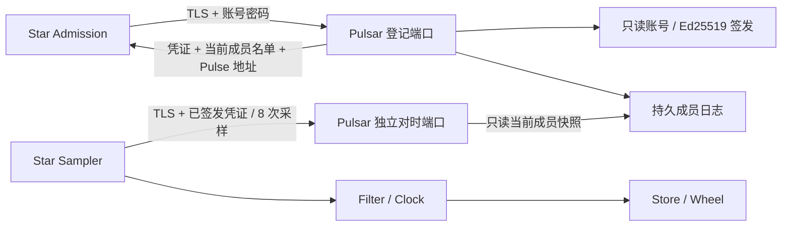

# Pulsar 与 Star 对时实现

状态: 源码及测试用例已补齐, 本轮尚未编译或运行测试. 本文描述当前代码, 不代表生产验收通过.

2026-09-18 已落实固定 Unix 纳秒时间、连续校正、系统物理参考质量检查和单一期限 Store.
详细契约见 [连续纪元时钟与单时间轴 TTL](epoch-clock-design.md).

## 职责与调用链

Pulsar 是独立的 C++ 控制服务, 当前负责账号登录、成员凭证签发、持久登记和时间参考.
Star 自己完成采样、过滤、时钟质量判断和 Store 期限换算. Pulsar 不处理 Catalog/Registry 业务数据.



登记复用 `proto.orbit.v1.Admission/Register`, 没有另造一套空的 Issuer 协议.
`RegistrationResponse.pulse_endpoint` 告知对时端口; 旧 Go Supervisor 返回空值时,
Star 仍可完成原有准入, 但不能接受依赖全局截止的新有限租约.

`proto.pulsar.v1.Pulse/Bounce` 是短生命周期双向流. 只允许当前有效的 Star 凭证,
每条流验签一次, 不重复执行密码 KDF. Planet 暂不接入对时线程, 其既有准入和候选规则保留.

## 启动与已有材料

生产目标仍为 Linux / 项目内 GCC 16.2.0. 示例仅说明已构建程序的参数, 本轮没有执行:

```bash
pulsar --listen=192.168.0.119:7440 --pulse-listen=192.168.0.119:7441 \
    --galaxy=alpha --identity=build/deployment/pulsar \
    --state=build/state/pulsar.journal

star --listen=192.168.0.119:7442 --super=192.168.0.119:7440 \
    --galaxy=alpha --identity=build/deployment/star-a
```

两个监听 IP 必须具体且匹配证书 IP SAN. 允许 `:0` 为测试分配端口, 日志输出实际地址.
禁用 `SO_REUSEPORT`, 防止同一端点背后运行不同的身份/账本/时间参考.
正常部署使用固定端口. `--help` / `--version` 不加载材料或开启服务.

| 所有者 | 文件 | 格式与用途 |
| --- | --- | --- |
| Pulsar | `ca.pem`, `cert.pem`, `key.pem` | 现有 TLS 格式, 同时覆盖两个端点的证书地址 |
| Pulsar | `admission.key`, `admission.pub` | PKCS#8 Ed25519 私钥、32 字节原始公钥, 启动核对密钥配对 |
| Pulsar | `accounts.json` | 1..64 个账号的数组, 字段为 username/salt/hash/roles |
| Star | `ca.pem`, `cert.pem`, `key.pem`, `admission.pub`, `login.json` | 原有节点身份格式, 密码不进入 CLI 或日志 |

账号摘要沿用 Go 的 PBKDF2-HMAC-SHA256、600000 次迭代、16 字节盐和32 字节摘要.
已有账号文件可复用, 也可由原有离线账号生成工具产生. Pulsar 运行不依赖 Go 进程,
当前不增加在线账号管理或热更新接口; 修改账号后需受控重启.

TLS、Ed25519、随机数、摘要和 KDF 均使用现有 gRPC 配套的 BoringSSL, CMake 显式链接 `gRPC::Crypto`.
BoringSSL 的兼容头文件仍叫 `<openssl/...>`. 这不表示引入了独立 OpenSSL 包;
没有新增 `find_package(OpenSSL)`、系统库查找、安装或下载步骤.

## 登记与恢复

沿用原有身份规则: 部署摘要由账号、Galaxy 和规范端点组成. 每次新启动提交32 字节随机幂等键,
服务签发独立的不透明 ID. 同部署的新启动推进成员代次; 同一次启动重试保留 ID 和代次,
同时返回最新成员名单, 不缓存旧应答. 已被替换的启动请求不能重新取得成功凭证.

`Ledger` 将成员与启动幂等键写在同一条记录中:

1. 在登记锁下检查角色、端点、容量和重试关系.
2. 准备成员快照、历史索引节点和完整签名应答; 分配失败不写盘.
3. 追加 `[长度:uint32 大端][链式 SHA256:32 字节][RegistrationRecord]`.
4. `fdatasync` 成功后发布不可变成员快照, 才能返回登记成功.

Pulse 读取原子发布的成员快照, 不获取登记写锁或等待日志落盘. 原子 shared_ptr 管理快照寿命,
不声称它在所有标准库中无锁. 默认每角色64 个当前成员、累计65536 次启动;
分别可配置到4096 和1000000. 达到上限显式拒绝, 不自动遗忘旧启动请求.

日志被进程独占, 头部绑定格式、Galaxy 和签发公钥摘要. 恢复只截断物理不完整的末尾记录;
完整记录校验失败、错误身份、非法代次或容量不匹配均拒绝启动. 完整末条记录即使来自丢失应答也保留,
客户端用原幂等键重试. 写入结果不确定后停止接收登记, 需重启回放实际文件确认状态.

该文件不是 Go 的 bbolt 数据库, **不能直接替换旧 Supervisor 的数据库路径**.
当前没有 bbolt 导入和在线日志压缩. 已有运行群组不能在丢弃历史后原地切换签发者;
迁移应单独设计离线导入, 或在明确的新群组/新信任身份下重新登记.
文件提交依赖操作系统和存储设备遵守 fsync 语义, 不是多副本控制面共识.

## 对时算法与资源隔离

所有采样字段单位均为纳秒, 有效范围 `0..INT64_MAX`. T0/T3 来自 Star 的 BOOTTIME,
T1/T2 来自 Pulsar 连续 Unix 绝对时间. 采用四时间戳公式:

```text
offset = midpoint(T1 - T0, T2 - T3)
delay = max((T3 - T0) - (T2 - T1), local_precision)
dispersion = local_precision + remote_precision + drift_budget(T3 - T0)
observed_unix_time_at_T3 = T3 + offset
```

按用户确认, 保留 gRPC 并采用 [RFC 5905 的四时间戳估计与 delay 精度下限](https://datatracker.ietf.org/doc/html/rfc5905#section-8).
本文 T0/T1/T2/T3 分别对应 RFC 的 T1/T2/T3/T4; 服务端仍必须给出接收和发送两个时刻,
客户端发送时刻原样回显用于匹配, 收包时刻由客户端本地记录. 只给一个服务端时间会混入处理耗时.
这不是可与 chrony/ntpd 互通的 UDP NTPv4 服务, 不包含多时源选择或系统时钟驯服; POSIX/Unix 时间尺度由宿主对时服务维持, 不自建闰秒表.

本机 rho 取系统报告分辨率、纳秒表示单位和实际跳变的最小正增量中的较大值.
标定目标收集32 次跳变, 相同读数不算样本. Linux 的非阻塞 `timerfd(CLOCK_BOOTTIME)`
提供200 ms 观察窗口, 每128 次读钟检查到期与取消, 不再限制总读取次数.
因此快 CPU 不会仅因更早耗尽循环次数而拒绝15.6 ms 粗时钟. 预算内至少需三个正增量;
样本不足或时间反序仍显式失败, 不用虚假的精度继续对时.
内核定时器不依赖被测的用户态读数来结束循环, 但不是独立硬件时钟, 也不承诺内核失效或系统暂停下的墙钟上限.
相关语义见 [Linux timerfd](https://man7.org/linux/man-pages/man2/timerfd_create.2.html).
对端在 Pong.precision_ns 返回 rho.
合法范围1 ns..20 ms, 这个单位为纳秒的字段不能被解释为纳秒精度保证; 错误硬件的虚假报告不在保证范围内.
每批8 个串行采样, 至少3 个通过检查. 在双方精度及频率漂移预算内允许处理时长略大于本地 elapsed,
delay 钳到本地 rho, 并把 dispersion 带入最终误差. 仍保留项目的200 ms 往返/处理边界和异常样本过滤.
有效样本按最小 delay 筛选, 相等时取新样本; 最小 delay 不表示 dispersion 为零.

Star 在独立 jthread 内标定与收发, 不用 Runtime 的10 ms 轮询时刻充当采样边界.
本机标定失败会撤销新租约资格并退避重试, 不通过构造异常终止 Star 控制循环; 停止令牌也可取消标定.
Pulsar 在独立 Source 线程标定并采样, 未就绪时 Pulse 返回 UNAVAILABLE, 登记仍可运行.
复用 TLS Channel, 每条采样流总截止2 秒, 批内间隔5 ms, 正常批间约1 秒且带抖动.
失败退避100 ms 起, 上限5 秒再加抖动. 流内同时只有一个在途 Ping.
批内5 ms 间隔与批间退避共用支持 stop_token 的条件变量等待, 不保留不可取消的硬休眠.

Pulsar 的登记与对时使用独立监听、Server 和 ResourceQuota. 登记最多4 个并发 KDF,
超载返回 RESOURCE_EXHAUSTED; Pulse 使用 Callback API, 最多64 条活动流, 等待网络不占同步工作线程.
服务端以 GPR_CLOCK_MONOTONIC Alarm 自行限制三秒流寿命, 即使客户端不给截止或给出超长截止也会取消.
不再用 `context.deadline() - system_clock::now()` 判断客户端预算, 因而避免这段墙钟比较受到 NTP step 影响.
Star 发起 Pulse/Admission 和两端服务关闭的截止也直接用 gRPC 单调时间表示.
Reactor 交替 Read/Write, 只在完成回调提交下一操作; 取消通过唯一在途操作完成后 Finish,
配额在 OnDone 归还. Alarm 只持有独立的上下文寿命保护对象, OnDone 清空它后才释放 Reactor.
复用 Pong 前执行 Clear, 且必定在上一次 Write 完成之后; T1 在清空前采样, 清空耗时包含在处理时间内.
Star 的复用 Ping 同样在 Write 完成后、T0 采样前清空. 这为未来条件字段补强边界, 当前标量均已完整赋值, 没有已证实的字段泄露.
资源预算隔离可降低登记计算和文件提交对采样的干扰,
但共享 CPU、网络和 gRPC 底层设施, **不保证严格优先级或硬实时延迟**.
64 条有效慢流仍可暂时占满应用配额, 本轮改进消除的是按流占用阻塞线程, 不声称无限并发或完备抗 DoS.
参见 [gRPC ResourceQuota](https://grpc.github.io/grpc/cpp/classgrpc_1_1_resource_quota.html)
及 [SO_REUSEPORT 参数](https://github.com/grpc/grpc/blob/master/include/grpc/impl/channel_arg_names.h).

## 物理时间基准与重启

部署负责让 chrony 等系统服务维持可信 CLOCK_REALTIME, 整机启动先完成必要的大偏差校准.
仅 Pulsar 进程重启不会重启系统时钟或对时服务; 整机断电时 RTC 只提供粗略起点,
重新达到质量门槛后才能提供可信对时.

Source 每秒只读 adjtimex(modes=0) 和 CLOCK_REALTIME, 拒绝 TIME_ERROR、STA_UNSYNC、
STA_CLOCKERR、非法时间、过长读取窗口和超过 500 ms 的误差估计.
maxerror/esterror 固定为微秒, offset 依据 STA_NANO 换算, 再计入采样窗口和实测 rho.
不安装/配置服务, 不修改系统时间, 不在每个 RPC 回调里查询系统校准状态.

内核状态和误差估计不是准确度证明, 也不包含 chrony 的源选择详情.
部署仍需核对实际时间源、剩余校正和 root dispersion/root delay.
chronyc tracking/waitsync 是运维检查, 程序不会自动执行, 也不以进程存活代替质量达标.
waitsync 的剩余校正阈值不是完整 UTC 误差界限; 对时守护程序重启后的 step 策略需部署协调.
参考 [chrony](https://chrony-project.org/doc/4.7/chrony.conf.html)
和 [chronyc tracking](https://chrony-project.org/doc/4.7/chronyc.html#tracking).

Clock 首次只接受质量达标的 Unix 锚点, 之后不跳时或停走.
Pulsar 最大额外调速 500 ppm; Star 为 1000 ppm, 为跟踪上游调速预留余量.
四时间戳使用 1500 ppm 相对频差预算, 观测年龄使用 2000 ppm 保守漂移预算.
这些是待测的工程参数, 不是实际硬件精度. 总误差包括上游估计和本机未消化偏差.
观测超过 5 s、参考失效或总误差超过 500 ms 时 ready=false; 已初始化的时钟仍继续走时.

Pulsar 重启重新锚定同一 Unix 物理基准, 不生成业务 era 或时间专用日志.
持续运行的 Star 平滑吸收新估计, 不重置数据或时钟.
若重启前尚有大偏差, 新旧进程输出可能不同; 保证针对运行中连续,
不承诺任意崩溃前后绝对无反序, 也不凭持久化一个数值推测断电时长.
BOOTTIME 计入内核支持的 suspend, 不保证虚拟机快照回滚后的历史连续性.

## Store 的单一期限

Store 不拥有时钟或校正控制器. Runtime 获取一次 Clock::Reading, 调用 tick(reading.time),
再处理该批业务写入. 首次 tick 直接建立 Unix 拍边界, 不从 1970 年补拍.
未初始化可存永久值, 不能先受理有限截止; 后续参考校正不扫描或重排全表.

put(key, value, optional<Clock::Time>) 只保存非负绝对期限, 空表示永久.
业务入口必须检查 Clock::Reading::deadline_after(ttl) 的 expected 结果再提交.
质量不足、负 TTL 和溢出返回独立错误, 不能隐式变成永久值.
内部 Store 不代替业务层鉴权或时钟质量校验, put 也不隐式提交过期删除.
Delta 和 Index::Record 均保存同一 deadline; 最大整数也是有限截止, 不作永久哨兵.

失联时已有期限继续走时, 恢复不续满, 过期记录不复活.
默认 10 ms 拍间隔, 追赶不截断, 亚拍余量保留; Wheel 只认识相对拍索引,
不认识 Unix 起点或时源. 历史保留、RPC 截止和退避仍按本地经过时间计算.
分配失败保留完整数据/历史/版本, 重排已摘节点, 不发布部分到期结果.

extract 默认以 32 MiB 限制 Delta 数组与 Key 复制, 超限抛 length_error, 不截断批次.
Value 继续共享, 该预算不是 RSS/编码硬上限, bad_alloc 仍须由未来 RPC 适配层处理.
唯一构造入口验证正 interval、非负 retention 和非负可选初始 Unix 时间.

业务写入/删除扩散和持久业务恢复尚未接入 RPC. 本次补齐时间和期限元数据,
不将独立节点估计误差误认为同纳秒到期或全局共识.

## Store 快照的并发边界

`Store::snapshot()` 返回 `version + unordered_map<Key, Record>`, Record 包含共享 value 和可选绝对 deadline.
状态锁内只捕获版本和共享根, 工作量为 O(1); 全表遍历、桶分配、Key 复制和最终视图回收在锁外进行.
构建者由另一把锁串行化, 写入、删除和 TTL 不获取这把构建锁.
返回值对应调用期间捕获的完整版本, 即使构建期间已有新写入也可以返回, 不无限重试追赶.
只有捕获版本仍是当前版本时才缓存结果. 旧缓存失效后继续在状态锁外释放.

内部 `Index` 仅承担稳定的只读视图, 不代替可变 Key 查找或时间轮:

- 可变 `unordered_map<string, Entry>` 保留时间轮节点的稳定地址, Entry 记录对应的视图槽号.
- 叶页64 项, 分支页16 个链接. 每项共享不可变 Key/Value 并保留绝对 deadline, 页深度最多15.
- 捕获视图使页面保持共享. 写入仅复制被读者共享的修改路径, 未共享页原地提交; 覆盖不复制 Key 字节.
- 新 Key 优先复用空槽, 子树计数和叶位图定位空位; 删除回收空页, 不按累计历史更新次数扩展索引.
- `prepare` 先完成可能失败的页面分配, 再与历史批次一起提交值、槽占用量和版本.
  失败保留原内容, 已从时间轮摘出的 TTL 节点重新调度. 部分准备出的私有页不表示部分数据提交.
- 读者完成遍历后, 成功和异常路径都经过状态锁建立读完成的同步边界, 再在锁外释放 View.
  `shared_ptr::use_count()` 只帮助判断页面是否独占, 不能单独作为线程同步屏障.

这个实现没有引入第三方持久化容器, 但有明确成本: 每个有效 Key 多一份共享字符串和页索引,
写入增加树路径访问, 快照期间写入可能复制固定大小页面. 旧视图存活时会延迟相关页面和值的回收.
完整快照仍有 O(N) 的时间和额外 Map 内存, 序列化也不会变成 O(1); 分配失败仍由调用方处理.
本轮移除的是全表快照复制占用状态锁的路径, 不把 TTL 大批提交、历史淘汰或内存分配器争用宣称为无延迟.
实际内存增量、写入吞吐和尾延迟需要后续测量, 当前没有新的性能结论.

### 内存布局与空表回收

Delta 已删除重复本地期限和 era, 只保存 optional<Clock::Time>.
不采用非标准打包压缩标准库对象. 真实尺寸和分配成本未作专项测量.

`Index` 保留统一的16 路 Branch. 第15 层根页的后12 个槽不可达;
在16 字节 shared_ptr 的布局下占192 字节, 空 shared_ptr 不另行分配控制块.
不为只在极端槽号出现的顶层页增加特殊节点类型或虚函数.

`unordered_map::erase` 回收节点不等于桶容量收缩. 本轮仅在 `tick()` 完成历史清理后,
当 `entries_` 真正为空且 `bucket_count() > 4096` 时, 将其与局部空表交换, 解锁后销毁旧桶表.
交换在编译期约束为 noexcept; 不移动有效 Entry、推进版本、裁剪额外历史或使完整快照失效.
空表维护的零分配行为由当前目标标准库对应的故障注入用例约束, 不依靠一次 `rehash(0)` 在提交后尝试分配.
4096 桶是内部回收阈值, 用于避免小表反复扩容, 不是容量限制或协议参数.

保留墓碑时必须等其历史淘汰, 不能用“有效值为零”替代容器为空的检查.
非空低负载表继续保留桶容量, 不在热路径引入全表重排或额外的收缩状态机.
因此这项修改只覆盖突发后彻底清空的场景, 没有解决长期保留少量条目时的全部高水位内存.
释放到分配器也不保证进程 RSS 立即下降; 旧桶析构可能有清零/回收成本, 只是移出了状态锁.

## 生成源码、审查和验证范围

`proto/pulsar.proto` 由已有 protoc 36.1 / grpc_cpp_plugin 1.84.0 生成 C++ 源码,
随仓库保存在 `common/src/generated`. `astra/build.py generate/check-generated` 纳入该协议.
Go 的 Orbit 生成源码同步增加 `pulse_endpoint`. 旧 Go MessageID 生成器显式排除 C++ 专用 Pulsar schema,
避免把不同协议的 Ping/Pong 填进同一个 Go 包; 不分配旧帧协议的 MessageID.

下列用例在 500 ms 门槛的 Debug/Release 均通过, 见 [当前回归报告](regression-20260918-500ms.md).
此前 200 ms 的 ASan/UBSan 和 TSan 结果见 [历史回归报告](regression-20260918.md), 不算作本轮 Sanitizer 验证:

| CTest 名称 | 场景 |
| --- | --- |
| `cpp_clock` | 独立时间预算、2 ns 读取成本与15.6 ms 粗时钟组合、停滞/反序/取消、四时间戳、最小 delay、频率差负 delay、dispersion、溢出、正负限速校正、舍入余数、过期资格、并发连续读取 |
| `cpp_store` | 复制预算边界、64/1024 槽边界与根扩展、多代视图、覆盖/删除/空槽复用、索引销毁后视图寿命、并发快照版本一致性 |
| `cpp_store_fault` | 准备/提交分配失败、共享页复制失败、快照期间并发写入/删除/TTL、大空表桶释放、小表及非空表保留、墓碑延迟回收、无分配维护及重新写入 |
| `cpp_store_clock` | 不同本机起点映射同一 Unix 截止、正负校正不改记录、失联到期、恢复不续满、快照期限一致 |
| `cpp_pulsar_clock` | 参考未就绪、异常、误差超限、墙钟跳变、恢复和固定 Unix 重启 |
| `cpp_pulsar_ledger` | 真正文件提交、最新名单重试、实例替换、容量、分配失败、并发重试、内核短写、排他锁、残尾与损坏恢复 |
| `cpp_pulsar_rpc` | 真实 TLS/账号登录、角色、错误请求、旧/伪造 Pulse 凭证、配置、端口冲突、无/超长客户端截止、慢流并存与取消、Star 采样和重启重连 |
| `cpp_pulsar_process` | Pulsar + 两台真实 Star、互联、失联失效、固定 Unix 参考恢复、SIGTERM 与进程组清理 |
| `cpp_pulsar_harness` | 旧日志不能冒充恢复、连续时间及锚点校验、Sanitizer 诊断识别、失败日志尾部保留 |

现有 `cpp_admission` 增加非法 Pulse 地址与旧控制面空地址覆盖. 静态复核同时检查了
Go Supervisor 的账号/KDF、候选顺序、启动重试及 C++ Star/Planet 共用的监听路径.
Go 未实现这套时钟, Rust/旧 SDK 不受新时钟逻辑影响. C++ 账号 JSON 对重复字段更严格;
Go 的现有解析仍沿用自己的行为, 不能声称所有畸形配置的接受集合完全一致.
Go 的运行时定时器/取消机制无需为 C++ 的 sleep_for 和 gRPC 墙钟换算做同样修改;
旧 Rust 角色不包含新 Pulse 算法. C++ Star/Planet 共用的登记与关闭路径已一并收敛为单调截止.
本轮再审查了 Go/C++ 候选轮转: 两端都是确定性散列分散入口, 不承担密码学随机抽样, 保留同样的取模规则.
现有 Star/Planet 心跳逐包创建消息, Go 登记逐次构建应答, 未发现与 Pulse 条件发送字段复用相同的路径.
现有 Store 用例补入复制预算边界/长 Key/整批拒绝, TTL 用例保留唯一构造的零/负 interval; 均已执行.
本次快照改动检查了 Store 的全部修改入口: 单一期限写入、显式删除、TTL 批次和历史淘汰.
Pulsar 的成员表继续使用其独立的不可变快照, 不经过业务 Store; Go Supervisor 和冻结的 Rust/SDK
没有复用本次 C++ 精度探测器或快照索引, 没有按语言机械引入相同实现.
暂停分配用例检查另一个线程能否在构建完成之前提交, 不用数据量或机器速度假定“足够慢”的快照,
也不把该功能检查当作百万 Key 下的延迟基准.
桶回收复核涵盖共用 Store 的角色路径. Go Supervisor 的成员存储使用 bbolt,
账号表与连接表另有容量/并发预算, 不把 C++ unordered_map 的回收方式套到这些容器或冻结的旧 SDK.

完整 Debug/Release 回归及 ASan/UBSan、TSan 已执行; 完整配置包含核心用例, 不另行声称 core-only 配置得到本轮独立验证.
当前没有精度测量、负载下 Pulse 尾延迟、物理断电耐久性或长时稳定性的新结果.
24 条慢流并存用例仅检查功能推进和取消清理, 不保证在极慢环境中全部流同时存活, 不作为线程数或吞吐测量.
本轮没有修改宿主系统时间来模拟 NTP step; 服务端预算不读取墙钟这一点来自代码路径检查.
进程脚本的场景等待预算90 秒, CTest 另留清理余量; SIGKILL/宿主掉电无法依靠 Python finally 保证清理.
按 [AGENTS.md](../../AGENTS.md), 未取得本轮授权不执行测试或其前置构建.

部署说明: Linux 进程用例直接消费宿主系统质量, 不开启生产测试后门.
若宿主未同步或内核误差估计超过门槛, 它应以明确失败结束; 恢复时源质量后在授权范围内复测并保留首次失败记录.
纯时钟/Store 及 RPC 用例注入参考观测, 不依赖公网 NTP, 不修改系统时钟.
