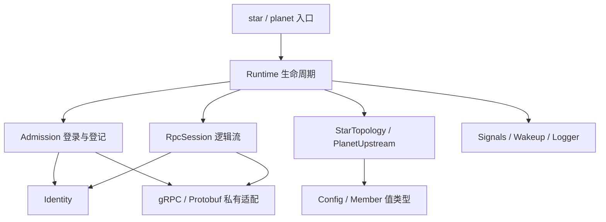

# 维护 C++26 Star / Planet

从仓库根目录操作. 项目约定见 [coding.md](../coding.md), 协议与范围见
[骨架设计](../cluster/cpp26-skeleton-design.md). 此目录生产目标为 Linux x64 / GCC 16.2.0,
Supervisor 使用 Go, 旧 Rust Star 已废弃; 当前准入见[身份契约](../cluster/identity-contract.md).

## 代码归属

| 位置 | 职责 | 修改时应保持的边界 |
| --- | --- | --- |
| `common/include/verdandi/cluster` | 配置、成员值、角色接口、进程入口 | 仅标准库和 Verdandi 类型, 不暴露 gRPC 或密码材料 |
| `common/src/options.hpp`, `config.cpp` | C++26 配置注解、解析、帮助与跨字段校验 | 一个选项声明生成解析和帮助, 外部输入仍显式验证 |
| `common/src/identity.*` | TLS 材料和准入验签 | 启动后只读, 原始凭证字节验签后才转换为成员值 |
| `common/src/admission.*` | Supervisor 登录和登记 | 持有上下文、请求和响应, 不修改角色索引 |
| `common/src/grpc_session.*` | 逻辑流、读写交接、Hello 与 Ping/Pong | 回调发布完成, 控制循环推进协议 |
| `common/src/rpc_status.hpp` | 稳定 gRPC 错误分类 | 只依据状态码, 不把远端 message/details 写入日志 |
| `common/src/process.*` | 信号、唤醒和 JSON 日志 | 私有进程设施, 有明确所有者和恢复路径 |
| `common/src/runtime.cpp` | 生命周期协调 | 按会话、准入、拨号、诊断的次序推进, 退出时等待完成 |
| `common/src/sync_store.*` | 内部状态、批次历史和只读快照 | 先准备分配再提交, 不混入业务鉴权或跨实例游标判断 |
| `star/src`, `planet/src` | 两个具体角色策略和各自入口 | 只维护内存索引, 不直接联网或在锁中取消 RPC |
| `common/tests` | 单元与真实 RPC 夹具 | `check.hpp` 的断言在 Release 也生效, `fixture.hpp` 只读取公开测试身份 |
| `bench` | 隔离的推流对照与存储微基准 | 不链接进服务, 不用实验消息扩充生产协议 |
| `build.py`, `test_*.py` | 离线构建及分层验证 | shell 仅选择已有 Python, 共享进程清理由 `testkit` 持有 |

保持当前三个角色目录. 通用代码只因两个真实使用者共享行为而抽取, 不为未来数据层预建类层次.
测试夹具不进入生产 include 目录; 生成源码不手工编辑.

`Id` 是不透明字符串, `Principal` 是固定部署摘要, `MemberEpoch` 与 `SessionGeneration` 分别表达远端实例和本地会话代次.
不再提供 `HexId<N>` 或 `DialTarget` 包装. `Policy::due(now)` 返回一个可选的 `Member`,
Runtime 统一控制拨号间隔和并发预算; 策略只标记目标归属. 单用途转换的实现放在 `.cpp`, 不预建通用模板.
会话的首次关闭原因同时表示关闭阶段, 上游是否存在从 `active_member` 推导, 不维护两份可分歧状态.



## 文件职责与注释

手写源码的文件头说明当前功能、职责与边界, 不逐文件重复仓库许可证声明.
根目录 `LICENSE`、分发授权文本和第三方原有版权/许可证声明继续保留, 生成文件不手工修改.

- 每个配置字段分别说明用途、单位、默认值、有效范围、零值或空值的含义以及相关字段的约束.
  明确哪些由 CLI 校验, 哪些是内部预算或调用方必须满足的前置条件, 不把注释写成不存在的校验.
- 每个枚举元素上方都写注释, 包括私有状态和测试场景. 说明含义、触发条件或处理边界;
  若数值用于协议、数组下标或位标志, 必须注明依赖, 不因排版修改数值或顺序.
- 每个函数声明说明参数、返回值、错误、所有权和适用的线程/生命周期约束.
  默认、删除、构造、析构和重载函数也说明其具体约束. 公共契约写在头文件, 局部函数写在定义前.
- 函数内部在校验、状态提交、资源交接、锁与回调边界、重试和关闭等逻辑块前解释原因及不变量.
  简单转发或取值由声明契约覆盖, 不逐行复述语句, 不在实现处复制整段头文件说明.
- 按维护者的阅读偏好, 新增和整理的成员变量、局部变量也注明用途、含义及必要的生命周期约束.
  循环变量和 lambda 借用对象在所在代码块说明. 函数签名与左花括号保持同一行,
  遵循现有 `BreakBeforeBraces: Attach`; 不使用 Allman 排版或把非空函数体压成一行.

当前使用中文和 ASCII 标点, 注释放在对应声明或逻辑块上方, 不堆成长行尾注释.
可参考 [Config](common/include/verdandi/cluster/config.hpp)、[基础枚举](common/include/verdandi/cluster/types.hpp)
和 [准入阶段](common/src/admission.hpp). 这些注释描述当前实现, 未实施的设计提案放在设计文档中.

## 生命周期审查

`Runtime` 的单控制循环拥有 `sessions_`, 推进准入和策略. 服务 handler 只在短锁内登记
`incoming_`; 控制循环通过 `collect` 接管. gRPC 自己管理 I/O worker.

`RpcSession` 的接收对象必须经历 `StartRead -> OnReadDone -> 控制循环消费 -> StartRead`.
`read_inflight_` 和 `read_ready_` 分别表示 gRPC 与控制循环拥有缓冲区, 再提交读取时必须同时检查两者.
写消息直到 `OnWriteDone` 才可复用. 不嵌套持有策略锁和会话锁, 不在回调里处理角色或签名校验.

`cancel` 只提出关闭请求. 控制循环继续推进 Finish / RemoveHold, 收到 OnDone 后才能回收 reactor.
`completed` 发布 done 之后不能再访问成员, 回调只使用独立持有的 `Wakeup`.
`Admission` 禁止搬移, 因为 gRPC 借用了它的请求地址. 退出先停止接纳、取消并排空 RPC, 再关闭服务器.

控制流只承载 Hello/Ping/Pong. 保持读取以接收心跳, 四槽发送队列超限时显式关闭;
不要将尚未实现的业务流背压套用到此控制流. 存储的分配失败测试为独立可执行文件,
其替换型 new 不得链接到服务或其他测试进程.

`Signals` 和 `Logger` 由入口/Runtime 唯一持有, 禁止复制, 析构恢复处理器或描述符状态.
日志管道背压丢弃诊断, 不阻塞协议推进. 这些设施保持私有, 不形成公开平台适配框架.

## 修改后的验证

先完成整理与格式化, 再按实际改动选择验证. 不以删除注释、错误分支或测试来减少行数.

```bash
# 已安装工具, 不下载依赖.
clang-format -i cluster-cpp/common/src/runtime.cpp
python3 -m black --config testkit/pyproject.toml cluster-cpp
bash cluster-cpp/build.sh test --core-only
bash cluster-cpp/build.sh regression --profile debug
```

格式化时选择实际修改的文件. 格式化器暂不理解的反射语法
仅局部使用 `clang-format off/on`. 当前 clang-tidy 不能解析这套 GCC 反射扩展, 不把编译成功称为 tidy 通过.

| 改动 | 必要的针对性检查 |
| --- | --- |
| 仅注释与格式 | clang-format 检查, 对照修改前工作副本核对非注释 token 与枚举顺序, 检查配置/枚举注释覆盖 |
| 构建入口或环境选择 | `python3 -B cluster-cpp/test_build.py`, 相关配置实际执行 |
| 配置描述、成员和策略 | `test --core-only`, 涉及联网语义再执行进程回归 |
| 生命周期、并发、TLS/RPC | Debug/Release 回归, ASan/UBSan, 完整 TSan; 退出变化增加短故障循环 |
| 生产 `.proto` 或生成工具约束 | `generate`, `check-generated`, 当前 Go/C++ 互通回归 |
| `bench` 调度或采样 | 历史实验当前缺少可用比较接收器, 恢复前不以它作为生产性能门槛 |
| 准备或发布二进制 | 核对锁定来源、许可证、实际动态运行库和安装树, 在目标环境运行 |

`test`, `regression`, `soak`, `scale` 先运行 CTest. 入口重新启用
`BUILD_TESTING` 并拒绝零测试成功. 直接用 CMake 时仍可设置 `BUILD_TESTING=OFF` 构建纯服务,
但这种产物不能作为通过回归的证据. 不兼容的 core-only、分配测量和 sanitizer 组合直接失败.

发现缺陷时检查 C++ Star/Planet、Go Supervisor 及相关共享夹具的同类路径,
记录适用性; SDK 只有受共享问题影响时才扩展检查. 历史报告保留原始代码指纹和失败样本,
修改后的结果另记, 不把此前的一小时长测或性能排名自动转记给新产物.

## 依赖和交付

`dependencies.lock.json` 是来源、版本与校验值的唯一清单. 普通构建、生成检查和测试都不下载.
依赖准备需要针对具体项目的授权, 不因缺少包而自动运行 fetch/install.
子进程工具路径和缓存留在项目下, 不修改用户或系统配置.

安装目标复制 `star`, `planet`, 根许可证和第三方授权文本. 开发构建的 GCC RPATH 不进入安装树.
交付时仍需提供匹配的 libstdc++ 与其他实际动态依赖, 并在目标发行版验收. 本连接骨架的源码组织
和测试门槛不等同于数据层或生产部署已经完成.
