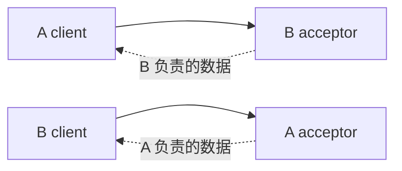

# Astra 基础 Star 设计草案

> 当前实现以 [Orbit/Astra/Comet v1](../protocol-v1.md) 和 [身份契约](identity-contract.md) 为准. 下文保留设计演进记录, 不作为旧协议兼容要求.

> 2026-09-12: 旧 Rust 服务已废弃, 当前仅维护 C++ Star/Planet + Go Supervisor. 协议 v5、Supervisor 签发不透明 id 和重试规则以[身份与准入契约](identity-contract.md)为准. 下文旧 UUID/v4/Rust 对照描述保留为设计演进记录, 不再是当前实现要求.

> 2026-09-12 同步方向：见[按 Key 对账与流式同步](key-stream-sync-design.md)。SDK 以每 Key 的发布者版本恢复，
> 不把本文来源 Star 分区作为 SDK 游标；历史不足时恢复相关 Key。本文 StateStore / 复制部分仍待审核与实现。

> 当前连接实现已扩展到协议 v3 和 `common/star/planet` workspace, 见 [基础连接规则](connection-rules.md).
> Planet 单上游和候选换绑不代表下文业务重新登记或 StateStore 已实现.

> 结构修订见 [星图架构](../galaxy-architecture.md): Star 恒星形成 Galaxy, Relay 行星全量缓存授权状态,
> 业务卫星可直连 Star 或经 Relay 接入. Relay 不加入 Star full mesh; 本文业务复制草案不因此成为已实现功能.
> Star 接纳请求并同步至其他 Star/所属 Planet, Planet 写请求只转发给当前 Star.
> 本文固定 owner 与 `owner == sender` 草案须结合该文第 7 节重新审核, 不直接用于 Planet 转发及 Registry 换绑.

> 2026-09-10 实现更新: Supervisor 登记, 持久成员表, 进程 UUID, TLS/签名准入和双连接 mesh 已接入,
> 旧 Discover 已删除. 当前可执行契约以 [Star README](README.md), [协议](../proto/README.md) 为准.
> 下文未实施的 StateStore, 数据复制, Publisher/SDK 和持久业务恢复仍是设计内容.
> 新测试执行状态见 [验证计划](../service-admission-test-plan.md); 历史状态说明不代表当前代码.

状态：基础网络骨架已开始实施，状态复制仍是当前设计焦点。日期：2026-09-09。

本文设计一组 Rust Star 如何从 Supervisor 取得完整名单后互联、建立定向复制会话、交换当前状态并最终收敛。它是完整 [Star 设计](design.md) 的第一实现层。只有本层通过三节点故障验证后，才继续设计和实现 SDK Binding、Catalog、Registration、租约、业务持久化与生产安全。

用户已授权并实现不决定 State 语义的监听、连接、保活与有界自动发现。当前代码及离线运行方式见 [Star README](README.md)；剩余 Core 决策仍须关闭后才能实现状态复制。

最新存储选择允许 Star/Planet 使用内存或落盘, 同一 Galaxy 的 Star 可以混用. 持久部署保留从有效磁盘副本
恢复 Catalog 的目标, 全内存部署不承诺全群副本丢失后的恢复; 内存 StateStore 测试不构成持久性证据.
混合模式的 durable 确认成员和入口规则仍需设计. 新 Star/Planet 进程均等待 Supervisor 鉴权,
这替代早期恢复本地成员信息便可离线启动的设想. 已运行 Planet 可凭仍有效的已有授权离线换绑.
Supervisor 可以兼任普通 Catalog Publisher, 见 [Supervisor 设计](supervisor-design.md).

最新启动与身份约束为 CORE-012: `star --listen=IP[:PORT] --super=HOST[:PORT] --cluster=ID`, Star ID 每次进程启动生成新 UUID. 这替代手填并跨重启复用 Star ID 的方向. 第 4 节记录目标接口; 二进制名称 `star`、等号参数和进程生命周期已落实, Supervisor 登记、进程 UUID 和认证 Hello 已实现, 业务所有权迁移尚未实现. 下文将稳定 Star ID 直接作为 owner 的草案须先解决进程重启与持久所有权的分离, 不能直接据此实施状态复制.

## 1. 结论

基础 Star 是一个按来源 Star 分区的领域无关内存状态复制器：

- 启动时向 Supervisor 登记并取得完整名单, 然后主动连接全部已知 Star; 旧 Star 握手后记录新节点并反向连接;
- 逐步形成有上限的 full mesh，每两个 Star 建立两条镜像 TCP 会话；
- 每条会话由 client 拨号，远端 acceptor 只主动推送自己负责的数据正文；
- 每个 Star 只为自己的分区产生新状态，其他 Star 保存完整副本；
- 副本平时不广播他人数据，只响应显式 ReplicaRepair，避免负责 Star 重启后丢失最新状态；
- 保存 `StateKey -> Arc<StateRecord>` 的完整当前集合；
- 通过 Owner State head、按需完整正文、per-Key dirty 合并和周期对账传播状态；
- 断线期间不保存操作日志，重连直接比较双方当前状态；
- 按每 Key 的全序 Version 和正文 hash 幂等合并；
- 在写入停止、网络恢复且资源充足后保证所有健康 Star 最终收敛；
- 实现语言冻结为 Rust；应用层拷贝目标是每个 StateVersion 最多编码一次，向多个会话只复制不可变缓冲区引用；
- 第一阶段仅提供进程内测试注入接口，不接受 Publisher 或 Subscriber SDK。



图中的 TCP 会话仍是全双工：client 向 acceptor 发送握手、数据同步请求、确认和流控；完整 State 正文只由 acceptor 发向 client。A 与 B 各拨一次，因此一个无序 Star pair 恰好有两条物理连接。

## 2. 本层边界

### 2.1 本层必须完成

- Star 身份、cluster 校验、自身可达地址和 Supervisor 入口加载;
- Supervisor 幂等登记、持久成员表与有界完整名单; Star 取全名单后互联, 通过直接握手学习新节点;
- 每个 Star pair 两条镜像会话及其重复/过期连接处理；
- 连接退避、心跳、断线检测和干净关闭；
- 长度前缀 Protobuf framing；
- 带 current owner star ID 的 StateRecord、纯 merge 函数和内存 StateStore；
- owner 分区的实时最新状态推送；
- 新 Star、空 Star 和重连 Star 的 owner 分区对账；
- owner 不可用或重启时的显式 ReplicaRepair；
- 周期 owner 对账和降级修复；
- 所有帧、正文、队列、dirty 集合、任务和重试上限；
- 三节点故障矩阵与最终收敛断言。

### 2.2 本层明确不做

- SDK Root Client、Bind、Subscriber、Selector 或 Publisher；
- Catalog、Registration、Registry、Desired、ACK 和 Zone 配置语义；
- Patch、租约、owner 接管和业务鉴权；
- 多数 durable 写入确认；
- 磁盘数据库、WAL、备份和 tombstone 回收；
- 通过一致性协议变更成员、自动扩缩容、重新分片或共识；
- 自动移除 Star 或在线地址变更；
- 生产 TLS、证书和 token；
- 跨语言生成物。

Supervisor 的登记名单定义本层加入范围, Star 只从完整名单或当前连接对端学习成员, 不交换第三方列表. 取全名单是正常节点初始化门槛, 不等于无认证 Hello 能证明生产准入. 成员删除、身份安全和业务多数集合另行定义. 本层仍保留通用 `terminal` State 验证较低 live State 不会复活; 业务内存原型不回收 terminal, Supervisor 成员登记的持久保存不受此内存边界排除.

### 2.3 当前已实现的网络底座

- 独立 Rust crate 和只对子进程设置项目内缓存的 PowerShell/Bash 入口, 对外程序为 `astra.exe` / `astra`.
- 从 `.proto` 生成消息类型及稳定 MessageID. 帧为 `[MessageID:uint16][PayloadLength:uint32][Payload]`, 不使用统一 Protobuf envelope.
- 可取消 Hello, 默认 Ping/Pong 保活, 有界发现分页, 周期性从头查询和自动反向连接.
- 短锁保护的已验证会话和候选表, 地址/Star ID 去重, 启动实例与 generation 替换保护.
- 64 节点和 128 候选上限, 每节点 250 ms 拨号节拍, 最多 4 个并发 connect, 封顶仍保持抖动的退避.
- 根取消令牌、完整任务回收和 Drop 兜底; Windows 与原生 Ubuntu 各通过 31 项测试和 Release 构建.

当前事实和精确协议边界以 [Star README](README.md)、[协议说明](../proto/README.md) 和
[验证记录](protobuf-network-validation-20260909.md) 为准. StateStore、OwnerPush、ReplicaRepair 和领域同步仍未实现.

## 3. 分层接口

```text
Future domain layer
  allocate/validate Key and Version
  encode canonical payload
  authorize mutation
           |
           v
Core Star local apply API
  apply complete StateRecord whose current owner is self
           |
           v
StateStore <-> OwnerPublisher <-> AcceptorSession <-> TCP/Protobuf <-> ClientSession
     ^               ReplicaRepair serves retained replicas                |
     +--------------------------------------------------------------------+
```

Core 不生成业务 Version，不理解 payload 字段，也不根据缺失推断删除。未来领域层只能向 Core 提交一个 `owner_id == self_id`、已经完整编码和验证的 StateRecord。其他 Star 只能复制该状态，不能为这个 owner 分区产生新 Version。owner 是 State 的一部分，不是 Key 的一部分；以后可以用更高 owner epoch 接管同一业务 Key，而不会制造第二个 Key。Core 只执行比较，不授权接管。Core 返回 Installed、Duplicate、Stale、Conflict、WrongOwner 或 Capacity。

上述 `owner_id == self_id` 是原稳定 Star 身份下的接口草案. CORE-012 之后, 进程 UUID 只识别运行实例和连接, 不得自动成为持久业务版本或写者权威. 旧数据重新加载时保留其 Key、版本和删除状态; 新进程如何接续复制责任仍需审核, 不能把全部旧 State 的 owner 改成新 UUID 来绕过恢复校验.

## 4. Star 身份与配置

目标命令行使用 `--name=value` 形式:

```bash
star --listen=192.168.0.119:7443 --super=192.168.0.25:7442 --cluster=alpha
```

将用户示例中的本机地址参数 `--xxx` 命名为 `--listen`. `--super` 指向 Supervisor, `--cluster` 指定 Star 群组; 本次不增加 `--zone`, 业务 Zone 与群组标识继续分开. 目标程序名为 `star` / `star.exe`, 不要求填写 `--id`, 也不以 `--seed` 替代 Supervisor 登记.

地址允许省略端口的方向按用户示例保留; 建议 Star 和 Supervisor 分别使用 7443、7442 作为默认端口, 具体默认值尚未冻结. IPv6 带端口使用 `[IPv6]:PORT`. 普通同网部署可用具体 listen 地址作为公布地址; 通配监听、多网卡、NAT 的公布地址覆盖仍须保留, 不能向其他 Star 公布 `0.0.0.0`.

Star ID 生命周期:

- 每次启动 Star 进程时生成一个 UUID, 同一进程的注册重试、拨号和重连均复用它;
- 进程重新启动后生成新 UUID, 不从数据目录恢复旧 Star ID, 不用 IP、PID 或启动时间代替 UUID;
- 进程 UUID 不参与业务版本排序, 不重置持久 State 或删除标记, 也不是认证凭据;
- connection generation 继续区分同一进程内的不同连接. 旧 `id + boot_id` 双字段需随 Hello 改造审核, 不再要求两个独立的进程身份;
- UUID 生成与规范编码在实现时验证, 不能把当前基于时间/PID/序号的 `next_boot_id` 当作已实现的 UUID 生成器.

以下是内部完整配置示意, 不是要求每个部署者手写全部字段:

```json
{
  "cluster_id": "alpha",
  "listen": "0.0.0.0:7443",
  "advertise": "10.0.0.1:7443",
  "supervisor": "10.0.0.2:7442",
  "limits": {
    "max_members": 16,
    "max_keys": 100000,
    "max_key_bytes": 256,
    "max_payload_bytes": 4194304,
    "max_store_bytes": 536870912,
    "max_frame_bytes": 1048576,
    "max_dirty_keys_per_session": 100000,
    "max_inflight_state_bytes_per_session": 8388608,
    "max_snapshot_refs": 300000
  }
}
```

数值只是用于验证设计是否有完整上限的候选值，尚未冻结。配置必须满足：

- star ID 使用规范 UUID, 仅在本次进程生命周期内稳定;
- `advertise` 必须是其他 Star 实际可达的地址，不能使用通配监听地址；
- 新启动节点配置 Supervisor 入口, 包括群组的第一个节点; 取得完整名单后才启用群组通信;
- 群组创建与注册权限由 Supervisor 负责, 不把普通 Star seed 作为替代注册入口;
- 同一 cluster 内所有 Star 使用字节完全相同的 cluster ID 和协议 major；
- 直接握手成功的 `(id, advertise)` 才进入 verified star 集合；
- 同进程 UUID 的冲突描述不能覆盖既有连接. 相同地址出现新 UUID 时, 必须区分合法重启与并发占用, 不直接按地址视为同一身份; 替换规则待审核;
- verified star 集合不得超过 `max_members`；
- 当前原型 Star 描述只增加; 新 UUID 重启后的旧实例退出和记录回收需要补充, 不能让每次重启永久消耗一个成员名额;
- `id` 只负责进程识别和连接关联, 不表示权重或持久数据的所有者;
- 目标以进程 UUID 区分启动实例, 保留连接 generation, 不让任一启动标识进入 State 排序.

成员记录来源仍是 Supervisor 完整名单及新连接自身的 Hello. 已运行进程在 Supervisor 离线时保留当前 UUID 及名单继续通信. 重启后 UUID 已变化, 不能直接宣称继承旧进程登记. Supervisor 同时离线时如何恢复既有部署资格仍需与持久成员信息联合设计; 本次不暗中添加第二个固定 Star ID, 也不把本地文件或相同 IP 当作身份凭据, 见 [Supervisor 设计](supervisor-design.md).

## 5. 生命周期与任务所有权

```text
Created -> Recovering -> Listening -> Registering -> Connecting -> Reconciling -> Ready
                                          |              |             |          |
                                          +------------> Degraded <----+----------+
                                                            |
                                                            v
                                                      Stopping -> Closed
```

内存原型没有磁盘恢复，但保留 Recovering 状态用于 owner 从 ReplicaRepair 恢复。Star 根对象拥有：

- 一个 TCP listener task；
- 一个有界 Supervisor 注册与完整名单获取任务;
- 每个已知远端 Star 一个 outbound client supervisor;
- 一个按远端 star ID 管理的 inbound acceptor session registry；
- 每条活动会话一个 read task、一个 write task 和一个 session state machine；
- 一个 StateStore；
- 一个只发布 self-owned State 的 OwnerPublisher；
- 一个 ReplicaRepair coordinator；
- 一个周期 owner 对账调度器；
- 一个统一 shutdown token 和所有任务 join handles。

任务只能由其 owner 创建和等待。任何后台任务失败都会回报 supervisor；不得 detach 后静默退出。发现新 Star 时创建对应 client supervisor；相同 Star 的新入站 generation 原子替换旧 acceptor session。Stopping 停止发现、新连接与本地 apply，关闭全部会话，等待所有任务并在期限内进入 Closed。

三节点 Core 中, 一个 Star 在取得完整名单、与所有已知 Star 的两个方向都完成同步、自己的 owner 分区不处于恢复冲突时进入 Ready. 新增成员、任一方向断开、恢复未完成或资源不足都会进入 Degraded; Core 测试 local apply 只在 Ready 时开放. Supervisor 管理连接离线单独记录, 不因此停止已就绪群组通信.

## 6. 自动互联

### 6.0 已接受的发现与监督边界, 2026-09-09

最新目标为 CORE-011: 新节点向 Supervisor 登记并取得完整 Star 名单后主动连接, 旧 Star 握手后添加新节点并建立反向连接. 取消 Star 间初始、重连及周期拓扑对账, 不转发第三方名单; 不要求 Supervisor 全群推送或独立准入票据.

Supervisor 离线时, 已取全名单的节点继续通信及尚未完成的加入, 接收方允许旧名单中没有的新节点通过握手进入. 未取全名单的节点等待. 并发注册按 Supervisor 的登记/快照顺序处理, 后登记者知道先登记者, 不要求按序启动. ID/地址冲突、资源上限与身份策略仍适用.

完整流程、并发推理、失效与 3D UI 见 [Supervisor 设计](supervisor-design.md). 这替代此前 CORE-001 的 seed 发现与 CORE-010 的双方对账/观察者补漏方向. 以下周期 Discover 仍是当前代码, 后续随替代路径一起改造并验证. 业务数据的周期对账不受影响.

### 6.1 当前种子发现实现, 待按 6.0 调整

Star 先启动 listener，再执行以下有界遍历：

1. 把配置的 seed 地址加入 candidate queue；显式 bootstrap 节点可以从空 queue 开始；
2. 对尚未验证的 candidate 建立 outbound client 会话并交换 Hello；
3. cluster、协议和描述校验成功后，把该远端登记为 verified；
4. client 发送 DiscoverRequest，acceptor 分页返回它自身以及它直接验证过的 StarDescriptor；
5. 本地检查数量、ID、地址和冲突，把新地址加入 candidate queue；
6. 对每个新 verified Star 创建独立 client supervisor；该 Star 从入站 Hello 得知本地描述后，也会建立反向 client 会话；
7. 对每个新验证的出站连接完成一轮有界 Discover, 不把某个邻居的列表视为全局完整成员集合;
8. 周期性重做轻量 Discover，以修复初次连接期间错过的新增 Star。

StarDescriptor 只包含稳定 star ID、advertise 地址和必要协议能力，不携带“删除其他 Star”或权重。远端返回的描述先是 candidate，只有本机直接握手成功后才可信为“当前可连接”。没有 TLS 的 Core 只能验证协议一致性，不能提供生产身份安全。

只要初始 seed 图连通且各地址最终可达，这个递归过程会让每个 Star 发现其他 Star 并逐步形成 full mesh。它不要求所有进程预先携带相同完整清单。当前不引入 descriptor-set hash、全局 revision 或成员一致性证明. 落后列表只用于合并候选, 缺失项不能删除已知节点.

### 6.2 两条镜像会话

2026-09-09 已补充 [单连接与双连接审核](connection-model-review-20260909.md): 基于最新加入流程推荐重新考虑单连接, 但尚未选择, 以下双连接约束仍是当前已接受方案.

对于 Star A 和 B：

```text
A client  --dial--> B acceptor  --B-owned State--> A client
B client  --dial--> A acceptor  --A-owned State--> B client
```

每个 Star 都主动连接每个已发现的其他 Star，因此一个无序 pair 恰好有两个 TCP 会话。会话中的控制消息可以双向传输，但普通完整 State 正文只从 acceptor 发向 client：

- acceptor 主动同步并实时推送 `owner_id == self_id` 的 State；
- client 提交本地已有 heads、请求正文并安装为 replica；
- acceptor 只有收到显式 ReplicaRepair 时，才可以发送其他 owner 的 retained replica；
- client 永远不通过这条会话主动发送完整 State 正文。

三节点形成 6 条会话，N 节点形成 `N × (N - 1)` 条会话，所以 `max_members` 是硬边界。该模型用连接数换取单向数据所有权，避免在同一状态流内同时承担两个 owner 的发布状态机。

每个 client supervisor 独立维护：

- 当前 connection generation；
- 连续失败次数；
- 下一允许尝试时间；
- 最近一次握手与 Live 时间；
- 带抖动的有界指数退避；
- 当前 read/write/session task 的拥有句柄。

一个远端失败不能阻塞其他远端连接。所有网络操作都有 deadline。稳定 Live 一段时间后才清零失败次数，避免连接抖动时持续快速重试。同一个 supervisor 不并发创建两条到同一 star ID 的 client 会话。

### 6.3 Hello 与 generation 替换

本节字段及“相同 star ID, 不同 boot ID”替换流程对应当前实现. CORE-012 目标改用进程 UUID 后, 重启会产生不同 star ID, 下述流程不能直接承担跨进程替换. 新协议需同时覆盖正常重连、新进程登记、同址冲突与旧连接迟到, 再决定 boot_id 字段的退出方式; 不复用已退出的字段编号.

Hello 是连接级握手消息，每条新 TCP 连接双方各发送一次，包括重连。它让接收方把 socket 关联到节点描述、启动实例和协议能力；对端 TCP 源端口通常不是其监听端口，因此必须显式交换 advertise。

Hello 的字段由 [proto/cluster.proto](../proto/cluster.proto) 生成, 直接使用自己的 MessageID 和 Protobuf payload. TCP 头部为 2 字节大端 MessageID 加 4 字节大端 payload 长度. Hello 只传连接元信息, 不装入 Catalog、Registry 或同步正文, 也不能单独证明身份真实.

TCP 建立后，双方在固定握手期限内交换：

```text
Hello {
  protocol_major
  protocol_minor
  cluster_id
  id
  boot_id
  advertise
  max_frame_bytes
}
```

握手完成前只能收发 Hello 或 ProtocolError。双方校验 cluster、协议、star ID、自连接、已知描述冲突和资源上限，并协商双方限制的较小值。TCP 来源地址不能代替 advertise，也不能作为生产身份认证。

同一 Star ID/方向只保留一条活跃连接. 同一启动实例的重复连接被拒绝, 已确认指向该 ID 的地址别名暂停拨号.
直接 Hello 确认新启动实例时, 先使旧会话登记失效并请求取消, 再登记新 generation; 旧任务仍由所属任务树回收.
更早建立的 socket 迟到提交旧 Hello, 或旧 lease 延迟退出, 不能取消或删除已经登记的新连接.
同一启动实例声明冲突地址会被拒绝, 第三方发现列表没有会话替换权限.

### 6.4 心跳

握手成功后默认每 10 秒发起一轮 Ping, 从开始写入到匹配 Pong 的总期限为 5 秒.
每个方向最多一个未完成探测, 只有准确匹配的 Pong 才开始下一轮间隔.
普通流量、对端 Ping 或过期 Pong 不延长期限. 发现分页有独立整轮期限, 也不能被正常 PONG 掩盖.
所有控制写入都受尚未结束的保活和发现期限约束. 心跳只判断连接活性, State 一致性仍由后续复制层负责.

## 7. Core StateRecord

候选逻辑结构：

```rust
struct StateKey {
    namespace: u32,
    key: Bytes,
}

struct StateVersion {
    epoch: u64,
    sequence: u64,
}

struct StateRecord {
    key: StateKey,
    owner_id: Id,
    version: StateVersion,
    terminal: bool,
    payload_hash: [u8; 32],
    payload: Bytes,
}
```

Core 原型使用 current owner star ID、opaque namespace/key 和完整 payload。`owner_id` 把当前 State 划入一个 Star 负责的分区；未来领域层可以替换 Key 构造和 payload 编码，但不改变 Core merge 规则。owner 只能随严格更高的 `epoch` 改变；同一 epoch 内改变 owner 是 Conflict。谁有权提升 epoch 不属于 Core。

基础约束：

- namespace、epoch 和 sequence 不能为零，key 不能为空；
- local apply 只接受 `owner_id == self_id`；同一 Key 已属于其他 owner 时，还必须提供严格更高 epoch；
- OwnerPush 只接受 `owner_id == 远端 acceptor star ID`；
- ReplicaRepair 可以由任一 Star 提供 retained replica，但返回记录的 owner 必须等于请求的 owner；
- key 与 payload 在分配前检查配置上限；
- terminal 的 payload 必须为空；
- payload hash 使用 SHA-256 计算规范内容：固定 domain separator、terminal 字节、payload 长度和 payload；
- hash 不直接使用任意 Protobuf 消息的序列化字节；
- 接收端重新计算 hash，不能信任发送方声明；
- StateRecord 是完整状态，不存在 partial、Patch 或隐式字段合并。

## 8. 唯一 Merge 规则

Merge 是无 I/O 的纯函数：

```text
current absent
    -> Installed

incoming.owner != current.owner
    and incoming.epoch < current.epoch
    -> Stale，保持 current

incoming.owner != current.owner
    and incoming.epoch == current.epoch
    -> Conflict，保持 current，标记同 epoch 多 owner

incoming.owner != current.owner
    and incoming.epoch > current.epoch
    -> Installed，完整替换 current 与 owner

incoming.owner == current.owner
    and incoming.version < current.version
    -> Stale，保持 current

incoming.owner == current.owner
    and incoming.version == current.version
    and terminal/hash 相同
    -> Duplicate，保持 current

incoming.owner == current.owner
    and incoming.version == current.version
    and terminal/hash 任一不同
    -> Conflict，保持 current，标记该 Key 的当前 Version 冲突

incoming.owner == current.owner
    and incoming.version > current.version
    -> Installed，完整替换 current
```

Version 按 `(epoch, sequence)` 字典序比较。owner 只允许在 epoch 严格增加时改变，同一 owner/epoch 内 sequence 严格增加。高 Version 的 terminal 可以删除低 Version live State；低 Version live State 永远不能复活 terminal。Conflict 不得随机选一个正文，也不能以 star ID 打破平局，否则不同到达顺序可能产生永久分歧。冲突 Version 不能回复 HaveSame 或进入 Ready；后续更高 epoch 的合法 State 可以安装，并清除该 Key 的 owner 冲突；同 owner 下严格更高 Version 可以清除正文冲突。

每个 Key 的最终收敛证明依赖四点：每个 epoch 只有一个合法 owner、合法 StateVersion 是全序、相同 Version 内容唯一、传播或修复最终可达。同 epoch 多 owner 或同 Version 不同内容违反 Core 输入契约；如果没有更高合法 State，系统会持续暴露 Conflict，而不会伪造收敛。谁分配合法 owner/Version 属于未来领域层；Core 测试通过受控 local apply 注入。

## 9. 内存 StateStore

第一阶段使用一个简单的 `RwLock<HashMap<StateKey, Arc<StateRecord>>>`，不预先分片。StateRecord 携带 current owner，因此同一个 Map 同时保存 self-owned State 和其他 Star 的 replica，并可按 owner 过滤快照。安装入口分为：

- `LocalOwned`：只接受 owner 为 self 的新状态；Installed 后通知 OwnerPublisher；
- `OwnerPush(remote)`：只接受 owner 为该远端 acceptor 的状态；Installed 后仅保存 replica；
- `ReplicaRepair(remote, requested_owner)`：远端可以提供所请求 owner 的 retained replica；Installed 后仍不普通广播。

统一更新流程为：

1. 在锁外完成 frame、Key、payload、hash 和容量校验；
2. 按入口类型验证 owner；owner 变化必须伴随严格更高 epoch；
3. 取得短写锁，调用唯一 merge 函数；
4. Installed 时替换一个 Arc，增加该 owner 分区的 `store_cursor`，记录真实键数以及 key/payload 的实际 capacity；
5. 释放锁；
6. 只有 LocalOwned 或完成 owner 恢复后的 self-owned State 才交给 OwnerPublisher；
7. OwnerPublisher 无法登记时，把相关 acceptor session 标记为 `needs_reconcile`，当前完整 State 仍留在 Store。

任何锁都不能跨 `.await`、网络写、Protobuf 编码、hash 计算或日志调用。快照在短读锁内复制 Arc 引用和 cursor，释放锁后排序、分页和编码。只有基准证明单锁成为瓶颈后才引入 shard；这避免基础版本先承担多锁快照和迁移复杂度。

StateStore 同时维护保守的资源账本。安装前按替换前后的 key、payload、StateRecord 和索引成本核算 `max_keys` 与 `max_store_bytes`，超限即返回 Capacity；不能先写入再依赖 OOM 或后台清理。dirty、快照 Arc、编码帧和在途正文使用各自预算，不能把它们漏算为 Store 外的“临时内存”。

## 10. 实时最新状态扩散

每条 Live acceptor session 维护一个有界 `dirty: HashMap<StateKey, StateVersion>` 和一个容量为一的 wake signal，其中只能出现 `owner_id == self_id` 的 Key。local apply 安装更高 self-owned State 后：

1. OwnerPublisher 对每条远端 Live acceptor session 执行非阻塞 `mark_dirty`；
2. 同 Key 已 dirty 时只保留更高 Version；
3. session worker 被唤醒后取一个有界批次，从 StateStore 读取当前 Arc；若当前 owner 已不是 self，则删除旧 dirty，不发送；
4. 先发送 StateHead；小正文可按配置内联；
5. 远端 client 比较本地 replica，返回 HaveSame、NeedState、HaveHigher、Superseded 或 Conflict；
6. NeedState 取得当前完整正文，必要时分 chunk；
7. owner 收到 HaveHigher 时进入 OwnerRecovering，并通过自己到报告 Star 的 client 会话发起 ReplicaRepair；
8. 对方确认已持有相同或更高 Version 后，只有 dirty 条目仍等于已确认 Version 时才删除；期间出现的新 Version 保留；
9. client 安装 replica 后不继续普通广播，防止每个副本都成为主动发布者。

```text
StateHead(key, owner, version, terminal, hash, payload_size)
    local lower/absent -> NeedState
    local equal        -> HaveSame or Conflict
    same owner higher  -> HaveHigher(current head)
    higher owner epoch -> Superseded(current head)
```

会话 Down/Reconnecting 时不为其累计每次变化。重新连通后重新比较这个 acceptor 的 owner 分区。Live session 的 dirty 集合溢出时也不丢正确性：标记 `needs_reconcile`、停止普通增量并启动新一轮 owner 对账。

普通路径不做 A→B→C 主动中继。若 C 到 owner A 的 client 会话不可用，C 可以向 B 发起 `ReplicaRepair(owner=A)`，由 B 的 acceptor 按请求返回 retained replica；这条降级路径不会让 B 开始持续广播 A 的数据。Core 不保存 message ID、hop count、已见消息缓存或逐操作确认历史。

## 11. 初始同步、重连与修复

### 11.1 Owner 分区同步

以 `A client -> B acceptor` 为例, 节点已取全名单且 Hello 完成后, 这条会话只同步 owner B 的分区:

1. A client 捕获本地保存的 B-owned replica heads，发送 `SyncBegin(mode=OwnerPush, owner=B)`；
2. B acceptor 验证请求，先登记同步期间的 owner dirty，再捕获 B-owned Arc 快照和 `snapshot_cursor`，然后确认同一 `sync_id`；
3. 收到确认后双方开始发送 heads；
4. 双方只交换 B-owned 的有界 StateHeadPage；
5. A 缺失或版本落后时发送 NeedState，B acceptor 返回完整 State；
6. A 拥有同 owner 的更高版本，或 B 的完整 Store 确实缺少 A 已知的 B-owned Key 时返回 HaveHigher，B 转入 OwnerRecovering；
7. B 的 Store 若已有更高 epoch 的其他 owner State，则返回 Superseded，不恢复已被接管的旧 B-owned State；
8. 没有恢复提示时，B 发送 SyncFence，并补发快照后的 owner dirty；
9. A 原子发布 replica 视图并确认 SyncEnd，此会话进入 Live；
10. 有 overflow、Conflict 或 owner 恢复提示时，本轮不能进入 Live，必须 Reset 或先执行 ReplicaRepair。

heads 控制信息双向交换，但完整正文始终由 B acceptor 发给 A client。中间 Version 不需要传输；当前最高完整 State 足以修复。

每个方向只允许一个有界 head page 在途；接收方通过带 page ID 的 StateStatus 批量确认比较结果后，发送方才推进下一页。这样双方同步不会先把整个 Key 集合塞进 write queue，正文请求也受独立字节窗口限制。

### 11.2 ReplicaRepair

ReplicaRepair 是普通 owner 推送的受控例外，但仍保持正文 `acceptor -> client`：

1. requester 通过自己的 outbound client 会话向某个健康 Star 的 acceptor 发送 `SyncBegin(mode=ReplicaRepair, owner=X)`；
2. acceptor 只读取自己保存的 X-owned replicas，不产生新 Version；
3. 双方比较 X 分区 heads，acceptor 仅返回 requester 缺失或落后的完整 State；
4. requester 幂等安装最高合法 State，不把它作为普通 owner 更新转播；
5. 若 requester 就是 owner X，恢复完成后重新执行对所有 client 的 OwnerPush 对账。

一条 session 同时只运行一个同步 mode。进入 ReplicaRepair 前暂停这条 session 的 OwnerPush，把期间的 self-owned 更新合并进有界 dirty；Repair 结束后重新做一次 owner fence 再回到 Live。Core 不为并发 repair 引入 stream multiplexing。

owner 重启为空、收到 HaveHigher 或发现自己缺失 self-owned Key 时, 必须在完成成员初始化后向所有当前已知 Star 完成一轮 ReplicaRepair. 仍有已知 Star 不可达时保持 Degraded, 并禁止 Core local apply; 这避免 owner 未看到已知副本中的更高 Version 就产生新状态.

Supervisor 名单提供登记范围, 但某次旧快照加本地握手记录仍不能单独证明 owner 恢复看到了全部最高业务版本. 内存 Core 的恢复完成只支持受控故障测试, 生产层仍需 durable owner state、受控业务成员视图或更强恢复协议.

非 owner 在 owner 会话不可用时，可以按 owner 为单位轮询其他健康 Star 做 ReplicaRepair。副本修复只提高本地版本，不改变 owner，也不会建立第二个主动发布源。

### 11.3 同步期间并发更新

OwnerPush 先登记 dirty，再捕获 owner 分区快照。更新若出现在捕获前，会进入快照；出现在捕获后，会进入 dirty；两者都出现只产生幂等重复。若 dirty 登记失败或资源上限溢出，本轮不能发送成功 SyncEnd，必须 Reset 并重开对账。

`snapshot_cursor` 只属于本 Star 当前 boot，不进入业务 Version，也不能跨 Star 或重启复用。

### 11.4 周期对账

Live 不是永久“已同步”证明。每条 client 会话按抖动周期重新与远端 acceptor 对账其 owner 分区，或按确定的 Key range 分轮扫描。owner 不可用时，ReplicaRepair coordinator 对该 owner 从其他健康 Star 做有界修复。第一阶段可以扫描完整分区；只有数据规模证明确有需要时才引入 Merkle tree。

对账发现：

- client 低版本：从 owner acceptor 请求当前 State；
- owner 对同 owner State 版本更低或确实缺失：报告 HaveHigher，owner 进入恢复流程；
- 当前 State 已属于更高 epoch 的其他 owner：报告 Superseded，不复活旧 owner State；
- 同版本同 hash：跳过；
- 同版本不同 hash：Conflict；
- client 缺少 owner terminal：请求 terminal；
- 任一侧普通缺失都不能推断删除。

## 12. Core Protobuf 消息

当前实际消息为 Hello、Ping、Pong、ProtocolError、DiscoverRequest 和 DiscoverResponse,
以 [proto/cluster.proto](../proto/cluster.proto) 为定义源. 顶层 MessageID 由生成器自动追加到
[message-ids.lock](../proto/message-ids.lock), 不手写重复枚举, 不以声明顺序重算旧 ID.

TCP 格式为 `[MessageID:uint16][PayloadLength:uint32][Payload]`, 前两个字段为大端.
Payload 直接编码具体消息. 请求关联字段只放入需要它的消息, 没有公共 envelope 或公共 request_id.
发现使用排序游标和明确的末页标识, 不加入 DiscoverEnd 或 descriptor-set hash.

后续状态复制暂保留下列消息族草案, 尚未加入 `.proto` 或实现:

- SyncBegin、StateHeadPage、HeadsEnd: 启动指定 owner 的同步并遍历版本清单.
- NeedState、StateChunk、StateStatus: 请求正文, 传输有界分块和确认明确状态.
- SyncFence、SyncEnd、ResetRequired: 确认边界, 完成同步或要求重置.

Core 会话只有一套复制状态机, 不预先加入多路业务 stream. 需要 request_id 的控制消息在各自字段内定义关联规则.
StateChunk 不携带每连接的 sync_id 或请求编号, 由
`(StateKey, owner_id, StateVersion, terminal, payload_hash, total_length, offset)` 标识内容,
使同一已编码正文可以供多个 acceptor session 复用. 只有当前 generation 和同步状态中存在完全匹配的未完成 Need 才能安装正文.

SyncBegin 后续仍需区分 request/accepted 以及 OwnerPush/ReplicaRepair.
StateStatus 后续仍需区分 HaveSame、HaveHigher、Superseded、Conflict 和 Rejected, 避免把 Key 级冲突扩大为连接错误.
这些字段与状态规则在对应功能实施前另行冻结. 分块必须有界, 范围无重叠和空洞, 完成后校验 hash;
中断或旧 generation 的内容不能产生部分 State.

本层当前不包含 Bind、Publish、Subscriber 或领域消息, 也不把未来复制状态机描述为已经实现.

## 13. 背压与资源上限

一条连接只有一个 socket write task，使用三个有界优先级：

1. Hello、错误、Ping/Pong、Status、Reset 和 shutdown；
2. 实时 StateHead、NeedState 和小正文；
3. OwnerPush 对账、ReplicaRepair 页面和大正文 chunk。

调度器只在帧/chunk 边界切换。所有队列同时限制条目和编码后字节。控制队列也有限，满时关闭链路，不能无限保留“重要”消息。

必须显式限制：

- 连接数和每 Star 每 pair 连接数；
- candidate、verified star 和发现页面中的 StarDescriptor 数；
- frame、key、payload、head page、Need batch 和 chunk 大小；
- 每 session dirty Key 数和内存；
- 每 session 在途请求数与正文总字节；
- 全局 State key 数、payload capacity 和快照 Arc 数；
- 同步并发数、周期对账频率、拨号频率和后台任务数；
- shutdown 等待时间。

慢 Star 只拖慢自己的会话。dirty 超限转为 owner reconcile，reconcile 仍超限则关闭并退避；不能阻塞其他 Star 或本地 StateStore。ReplicaRepair 按 owner 串行或受全局小并发限制，不能因一个失联 owner 对所有副本同时形成扇出风暴。

### 13.1 Rust 与拷贝预算

基础 Star 选择 Rust。Rust 和 C++ 都能共享不可变缓冲区、使用分散聚集 I/O，也都可以做到无 GC；C++ 没有独有的网络零拷贝优势。这个系统更大的实现风险来自异步连接、重连 generation、取消、队列和共享正文的生命周期。Rust 的所有权以及 `Send`/`Sync` 约束能把其中一部分错误变成编译期错误，且仓库已经有 Tokio/Rust 工具链和严格 lint 基线，因此不为理论上相同的吞吐改用 C++。

首版优化目标是“正文组帧一次、N 路引用广播”，不是绝对零拷贝：

```text
canonical payload Bytes
        -> Arc<StateRecord>
        -> lazy immutable wire frame Bytes (每个 StateVersion 至多一次)
        -> N 个有界 session queue 中的 Bytes 引用
        -> 每连接 socket/TLS 发送
```

- `payload` 使用不可变 `bytes::Bytes`；Prost 的 `bytes` 字段配置为 `Bytes`，避免解码后再转成 `Vec<u8>`。`Bytes` 的 clone 和 slice 共享同一后备存储。[bytes::Bytes](https://docs.rs/bytes/latest/bytes/struct.Bytes.html)、[prost-build bytes 配置](https://docs.rs/prost-build/latest/prost_build/struct.Config.html)
- 每个已安装 StateVersion 只计算一次规范 hash，并按需生成一次稳定正文帧。小正文缓存一个完整的长度前缀帧；大正文缓存有界的不可变 chunk 引用。编码缓存、旧 Arc 和所有在途引用都计入独立内存预算。
- per-session dirty 只保存 Key/Version，真正排队发送时放入 `Bytes` 引用。每条连接只有一个 writer task，负责部分写、取消和 generation 检查；正文不能因订阅者数量增加而重复 Protobuf 编码或复制 payload。
- 对预计小于 1 KiB 的常见正文，每条 State 默认先构成一个连续帧，不把其内部小字段拆成许多 `IoSlice`。writer 可以把多个已经完整编码的帧组成有界 vectored-write 批次以减少系统调用；只有当前 transport 支持且基准证明有收益时启用，并正确推进部分写后的 frame/slice 位置。大正文仍使用稳定 chunk。[Tokio AsyncWriteExt](https://docs.rs/tokio/latest/tokio/io/trait.AsyncWriteExt.html)
- TLS 加密、内核 socket 缓冲区和不同连接各自的传输仍会执行连接相关处理；Core 不承诺端到端零拷贝。验收指标是同一 StateVersion 的应用层编码次数不随 fan-out 增长，且 session 队列不复制正文。
- 首版不加入全局对象池或自定义 allocator。只有 allocations/op、复制字节和 RSS 基准显示明确瓶颈时，才增加有界 size-class buffer pool；池保留的空闲内存也必须计入资源上限。

## 14. 故障语义

| 故障 | 基础行为 |
| --- | --- |
| TCP 连接失败/断开 | 当前 generation 失效，对应 client supervisor 独立退避；下次连接重做 owner 对账 |
| Hello cluster/star 描述冲突 | 稳定 Protocol/Contract 错误，隔离候选，不快速重试 |
| 发现结果超过上限 | 拒绝新增 candidate，进入 Degraded 并报告 Capacity |
| 帧截断、超长或非法 Protobuf | 关闭链接并记录有界诊断 |
| State 超容量 | 不安装，回复 Rejected/Capacity，链接 Degraded/Reset |
| 低 Version | Stale/HaveHigher，不改状态 |
| 同 Version 同 hash | Duplicate/HaveSame，不改状态 |
| 同 Version 不同内容 | Conflict，隔离 Key，不任选一份 |
| dirty/tail 溢出 | 标记 needs_reconcile；无法完成则 Reset 会话 |
| owner 会话不可用 | 保留现有 replica，按 owner 对其他健康 Star 做有界 ReplicaRepair |
| Star 进程重启 | 新 boot ID，所有旧 generation 失效；禁止 local apply，先从其他 Star 修复 self-owned 分区 |
| 所有 Star 同时重启 | 本层内存状态丢失; 最终产品必须从 Star 持久副本恢复 Catalog, 不等待 Publisher, 此能力尚未实现 |

最终一致性保证的前提是网络最终恢复、写入最终静默、每个 epoch 只有一个合法 owner、每个 Version 对应唯一规范内容、至少一个健康 Star 保留最高 State、OwnerPush 或 ReplicaRepair 最终访问该副本，且所有节点有足够容量。基础层不会把无法满足前提的状态伪装成 Ready。

## 15. 可观测性

基础指标至少包括：

- candidate/verified star 数、描述冲突和发现遍历进度；
- 每远端两个 session state、重连次数和 backoff；
- Hello 拒绝原因；
- State key 数、payload/Arc 估算字节；
- merge 的 Installed/Duplicate/Stale/Conflict/Capacity；
- 每 acceptor session 的 owner dirty Key/字节、inflight、head/full/chunk 字节；
- 每 StateVersion 的正文编码次数、应用层复制字节、共享帧 fan-out 引用数和编码缓存字节；
- OwnerPush/ReplicaRepair 的开始、完成、reset、页面数、差异数和耗时；
- 每 owner 的直接同步与 replica 修复数；
- Ping RTT、读写 idle 和任务数；
- shutdown 耗时。

Key、payload、地址原文和随机 boot ID 不作为无限指标标签。日志使用稳定事件名、star ID、connection generation、sync ID 和有限错误码；payload 不进入日志。

## 16. 验证计划

### 16.1 纯状态测试

- Version 全序、所有 merge 分支和 terminal 支配；
- owner 只能由更高 epoch 接管，同 epoch 多 owner 必须 Conflict；
- LocalOwned、OwnerPush 与 ReplicaRepair 的 owner 来源校验；
- 任意排列、重复和子集传递得到相同最高 State；
- 同 Version 不同 hash 永远 Conflict；
- SHA-256 规范输入测试向量；
- key、payload、count、byte 边界及整数溢出；
- dirty 新版本不能被旧 HaveSame 删除。

### 16.2 协议测试

- 长度前缀空帧、截断、超限、未知字段和非法 chunk；
- Hello cluster/cluster/advertise/boot 校验；
- 注册重试、完整名单门槛、并发登记顺序、直接握手学习、ID/地址冲突和 `max_members`;
- 普通 State 正文只能 acceptor→client，错误方向稳定拒绝；
- 旧 connection generation 的迟到 read/write 不影响新链接；
- page、Need、HaveHigher、Superseded、Fence、Reset 的乱序和重复；
- 正文帧 `request_id == 0`、内容身份匹配、无对应 Need、范围重叠/空洞和跨 generation 迟到；
- 控制帧不会被大正文永久饿死。

### 16.3 三 Star 场景

1. A/B/C 向 Supervisor 登记取得完整名单, 后登记者连接先登记者, 旧 Star 通过 Hello 添加新节点, 最终形成 6 条会话且无 Star 列表交换;
2. 三个 Star 各 local apply 自己 owner 分区的 Key，最终每个 Store 都形成完整并集；
3. 普通更新只从 owner acceptor 推送，client 安装 replica 后不产生持续二次广播；
4. C 到 owner A 的会话断开时，C 通过 B 的 ReplicaRepair 取得 A 的最高 State，B 不成为 A 的普通发布源；
5. C 完全隔离、A/B 更新，恢复后 C 自动追赶各 owner 分区；
6. C 重启为空后禁止 local apply，从 A/B 修复 C-owned State，再恢复对外 OwnerPush；
7. owner 收到 replica 的 HaveHigher 后进入恢复，不用较低版本覆盖；
8. 一个 Key 连续更新大量版本，慢 client session 只保留最新 dirty；
9. OwnerPush 同步期间持续更新，不漏掉 snapshot fence 后的 State；
10. dirty/queue/chunk 人为超限后 Reset，重连仍收敛；
11. 冲突 StarDescriptor、超出 `max_members` 和离线候选不会导致任务、连接或重试无界增长；
12. 停止写入并恢复网络后，逐 Key 的 owner、Version、terminal、hash 和 payload 完全相同；
13. 同一 StateVersion 向多个 Star 扇出时只生成一次正文帧，各 session 排队共享同一后备缓冲区；
14. 任一 Star shutdown 后没有遗留监听端口、任务或增长中的队列。
15. Supervisor 在新节点取全名单后离线, 加入仍可完成; 取全之前离线则该节点等待, 已稳定群组继续通信;
16. 并发注册、响应丢失与 Supervisor 持久恢复满足 [监督设计验证项](supervisor-design.md#6-实施顺序与验证).

测试使用可控本地 TCP fault proxy 或测试 transport 注入断开、延迟、重排和限速。第一阶段不需要 Redis、数据库、Docker 或四语言 SDK。

## 17. 实现顺序

只有本文决策关闭后才进入实现：

1. Rust crate、项目内 Cargo wrapper、StateKey、带 owner 的 StateRecord、纯 merge 和 StateStore；
2. 有界 framing、内容寻址正文帧、Hello、read/write task 和 generation fencing；
3. Supervisor 持久登记/完整名单, Star 初始化门槛及直接握手学习, 替换递归 Discover;
4. 每 pair 两条 client/acceptor 会话及自动 full mesh；
5. OwnerPush 的 Head/Need/Full、per-Key dirty 与 snapshot/dirty fence；
6. ReplicaRepair、owner restart 恢复和 owner 不可用的降级修复；
7. 周期 owner 对账、Reset 和全部资源上限；
8. 三 Star 故障矩阵、长时连接抖动和内存稳定性；
9. 通过 Core gate 后回到完整设计，依次推进 SDK 会话、Catalog、Registration、持久化和安全。

每一步先完成纯单元测试和单进程边界测试，再增加多进程场景。不得通过暂时无界 channel、sleep 猜测同步完成或忽略 join 来换取原型速度。

## 18. 当前基础决策

| ID | 状态 | 推荐 |
| --- | --- | --- |
| CORE-001 | 已被 CORE-011 替代 | 原 seed 递归发现方向; 仍是当前代码的一部分, 不再作为目标实现 |
| CORE-002 | 已确认方向 | 每个无序 Star pair 建立两条镜像 TCP 会话；普通 State 正文只从 acceptor 发给 client |
| CORE-003 | 已确认方向 | 每个 Star 主动同步自己的 owner 分区；其他 Star 保存 replica，但不普通广播他人数据 |
| CORE-004 | 推荐待确认 | replica 可以响应显式 ReplicaRepair；owner 重启或不可用时按需恢复，但 replica 不变成持续发布源 |
| CORE-005 | 推荐待确认 | Core 使用 owner + opaque Key、`(epoch, sequence)`、terminal、SHA-256 和完整 payload |
| CORE-006 | 推荐待确认 | 内存单 `RwLock<HashMap<..., Arc<State>>>` 起步，锁外编码/hash/I/O |
| CORE-007 | 推荐待确认 | OwnerPush 使用 per-Key dirty + Head/Need/Full；断线不保存事件历史，重连分页对账并周期校验 |
| CORE-008 | 第一阶段草案, 存储模式由 GQ-003/GQ-004 扩展 | 第一阶段内存 local apply 不证明持久性; 最终 Star/Planet 可选存储, 持久部署须恢复 Catalog; Supervisor 成员表持久化另行处理 |
| CORE-009 | 推荐待确认 | Star 使用 Rust；每个 StateVersion 至多编码一次，广播共享不可变 `Bytes`，不承诺 TLS/内核端到端零拷贝 |
| CORE-010 | 已被 CORE-011 替代 | 原双方拓扑对账与 Supervisor 异常补漏方向, 不再作为目标实现 |
| CORE-011 | 已确认方向 | 新节点向 Supervisor 登记取全名单后主动连接; 旧节点握手添加新成员并反向连接. Supervisor 离线允许已取全名单者继续加入, 无 Star 名单对账 |
| CORE-012 | 已确认方向 | 目标入口 `star --listen=... --super=... --cluster=...`; ID 每进程启动生成 UUID, 同进程重连复用, 不跨进程恢复; 持久 owner 与成员替换需配套审核 |

替代方向及影响：

- CORE-011 的登记及本地成员集合首版只增加; 自动删除、地址覆盖、身份授权与业务 quorum 变更需另行定义;
- CORE-002 每 pair 两条会话会把连接数增至 `N × (N - 1)`，因此必须限制 Star 数；它换来了明确的数据方向；
- CORE-003 若让 replica 也主动广播，会重新出现多源传播、重复流量和责任模糊；
- CORE-004 若完全禁止 replica 提供修复，owner 内存重启就无法取回只存在于副本的最高状态，违反最终一致性；
- CORE-005 若没有全序 Version 或强 hash，Core 无法确定地收敛同一内容；
- CORE-006 预先分片会增加一致快照和锁顺序复杂度，当前没有基准依据；
- CORE-007 保存事件日志会引入 event ID、去重、截断和 replay，本层不需要；只依赖实时推送又会在漏通知后永久分歧；
- CORE-008 直接叠加 Catalog/SDK 会扩大首轮故障定位范围，无法单独证明 Star 层正确；
- CORE-009 改用 C++ 不会自动减少 TLS 或 socket 拷贝，却会把异步 buffer 生命周期更多地交给人工约束；过早加入对象池也可能增加常驻内存和故障面。

## 19. Core 完成门槛

基础 Star 只有同时满足以下条件才允许进入下一层：

- 所有未被替代的 Core 决策确认并落实, 包括 CORE-011 的加入与 Supervisor 失效验证;
- CORE-012 的进程 UUID、重启登记、旧实例回收、持久 owner 分离及 Supervisor 离线恢复边界完成审核和验证;
- 三节点向 Supervisor 登记取全名单后互联, 每个 pair 两个方向共 6 条会话, Star 间不交换名单;
- OwnerPush、ReplicaRepair、空节点恢复和周期对账全部通过；
- replica 安装不会触发普通二次广播，owner 恢复不会覆盖更高 retained replica；
- 写入停止和网络恢复后，所有健康 Star 在测试时限内逐 Key 完全相同；
- 队列、dirty、frame、payload、快照、任务和退避均有硬上限；
- 同一 StateVersion 的正文编码次数不随接收 Star 数增长，session 队列只保存共享缓冲区引用；
- 同版本冲突、容量不足和协议错误不会产生随机收敛；
- graceful shutdown 无残留任务和端口；
- `cargo fmt --check`、严格 Clippy、单元/属性/三进程故障测试全部通过；
- Windows 与 Linux 使用相同协议向量完成三 Star 场景；
- 依赖、工具、版本和项目内缓存位置在下载前另行列出并取得许可。
