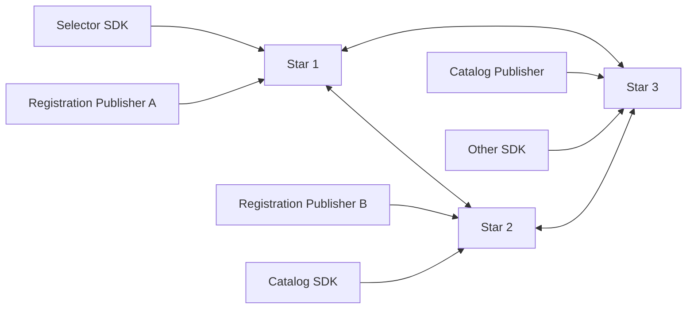
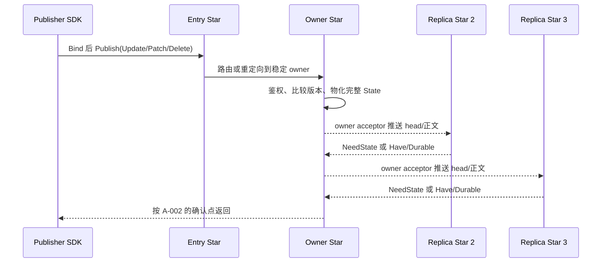

# Astra Star 设计草案

> 当前实现以 [Orbit/Astra/Comet v1](../protocol-v1.md) 和 [身份契约](identity-contract.md) 为准. 下文保留设计演进记录, 不作为旧协议兼容要求.

2026-09-12 同步方向更新：见[按 Key 对账与流式同步](key-stream-sync-design.md)。未来 SDK 按 Key 维护恢复进度，
发布者跨 Star 保留自增版本；每 Key 有界历史不足时恢复该 Key 最新完整状态，删除通过明确依据对账。
下文 SDK 来源游标、固定入口及版本分配草案与新文冲突时，以新文记录的方向为准；业务协议尚未实现。

状态: 分层工作稿, 更新于 2026-09-11. 已实现 gRPC v4 角色准入、保活、Star 双连接组网与 Planet 单上游换绑.
具体网络规则以 [基础连接规则](connection-rules.md) 为准.
业务复制、SDK Binding 和权威持久恢复仍是设计内容. 当前实现与证据见 [Star README](README.md).

最新结构以 [星图架构](../galaxy-architecture.md) 为准: 多个 Star 恒星组成 Galaxy,
Relay 行星缓存 Galaxy 全部授权状态, SDK 卫星可以直连 Star 或经 Relay 接入. 黑洞表示不可用 Star;
跨 Galaxy 的 Catalog 虫洞后置且当前不实现. 本文仅直连 Star 的旧 SDK 图是修订前路径, 不排除 Relay.
Star 接纳 Publisher/Registry 请求后负责同步, Planet 的这些请求只转发当前 Star;
Planet 向 Supervisor 独立鉴权并取得局部 Star. 换绑时向新 Star 重新登记所管理的数据,
由新 Star 同步新归属并使旧归属失效; 此决定替代下文必须经固定 Star 入口处理的旧约束.
业务写者身份和已确认内容仍保留, 代次及恢复确认协议须继续审核,
见 [星图结构第 7 节](../galaxy-architecture.md#7-starplanet-请求方向与重新绑定审核).

最新成员方案为 CORE-011: Supervisor 登记并返回完整名单, 新节点主动互联, 旧节点从对端 Hello 添加成员,
Star 间不交换名单. Discover 已删除, Supervisor 成员表已持久化; 这不表示业务持久化已经实现.

最新存储决定: Star 和 Planet 均可选择内存或落盘模式, 同一 Galaxy 的 Star 允许混用.
持久部署仍须支持 Publisher 离线时从有效磁盘副本恢复 Catalog; 全内存部署不能承诺全部副本丢失后的恢复.
Planet 落盘不自动成为权威确认者, 内存 Star 也不能发出 durable ACK. 下文 A-001/A-002 的持久路径需要明确
混合模式的确认成员及入口规则后才可实施, 不按在线 Star 数量临时改变成功门槛.
Supervisor 可以兼任 Catalog Publisher, 不成为第二份恢复权威. 新 Star/Planet 进程均等待 Supervisor 鉴权;
已运行 Planet 则可在 Supervisor 离线时凭有效已有授权换绑. 详见 [星图决定](../galaxy-architecture.md#8-第一批已确认决定).

最新启动约束为 CORE-012: `star --listen=... --super=... --cluster=...`, ID 为进程级 UUID, 重连复用而进程重启更换. 不增加 `--zone` 启动参数. 本文旧的稳定 owner Star 映射须先与进程身份分离; 不能因新 UUID 重置持久版本、直接接管旧 owner 或绕过 Supervisor 登记, 见 [Core 身份与配置](core-design.md#4-star-身份与配置).

本文定义一组等价 Astra Star 替代 Redis 后的系统边界、数据模型、复制、SDK 同步、传输、持久化、安全、构建和验证方案。它承接[对等状态网络架构审核](../star-network-architecture-review-20260909.md)，但不修改当前 [architecture.md](../architecture.md)、[protocol.md](../protocol.md) 或已实现 SDK 的协议契约。

本文使用以下状态：

- **已确认**：用户已经明确选择，后续设计以此为约束；
- **已确认方向 / 部分已确认方向**：用户已选择总体结构，仍需关闭必要的故障与协议细节；
- **推荐待确认**：已有推荐答案，但会改变产品语义，需要用户确认；
- **未决**：依赖前一批答案，暂不冻结；
- **后续草案**：保留已分析方向，但当前不要求确认，也不能作为实现依据；
- **延后**：首版明确不实现，出现新的必要场景后重新审核。

不决定 State 语义的 listener、Hello、保活与有界拓扑发现已建立。当前协议是自动 MessageID、payload 长度与具体 Protobuf 消息，见 [协议说明](../proto/README.md)。状态复制仍须关闭 Core 的“推荐待确认”和“未决”项目，并通过协议、状态转换和故障矩阵审核后实施。当前完整门槛由 [Core 完成门槛](core-design.md#19-core-完成门槛) 定义；完整产品仍需关闭本文后续决策。

## 1. 设计结论

Astra Star 是独立的 Rust 服务. 所有 Star 运行同一实现、拥有同一能力并能接收 Publisher 或 SDK 连接. 数据通信保持对等, 某次写入连接到的 Star 只是本次操作入口; 成员登记由独立 Supervisor 集中负责, 不经过业务数据通路.

每个逻辑键只有一个授权 Publisher。完整产品层需要把键稳定映射到一个 owner Star；Publisher 可以先连接任意入口，但入口必须路由或重定向到 owner，只有 owner 为该键产生 Star 网络状态。owner Star 通过自己的 acceptor sessions 同步负责数据，replica 只在恢复时按需提供修复。Registry 是有效 Registration 的派生集合，不是一份需要单独写入的状态。SDK 连接一个 Star，取得该 Star 上自洽的快照和后续事件；Star 间复制不进入 Go、Rust、C++ 或 C# SDK。



首版目标是“小型、全量复制、每键单写者、最终收敛”。动态分片、跨键事务、通用 CRDT、无限事件历史和自动 Publisher 选主均不属于基础版本。

## 2. 决策登记

| ID | 状态 | 决策 |
| --- | --- | --- |
| P-001 | 已确认, 由 CORE-011 明确边界 | 一组能力等价的 Star 替代 Redis, 数据通信对等; 成员登记由 Supervisor 集中负责 |
| P-002 | 已确认 | 每个 Registration 和每个 Catalog 值只有一个逻辑 Publisher |
| P-003 | 已确认 | Registry 从仍然有效的 Registration 推导，不作为独立写入值 |
| P-004 | 已确认 | Star 只实现 Rust 版本，其他语言保留客户端 SDK |
| P-005 | 已确认 | TCP 作为传输；生产连接的 TLS 与客户端身份方案留到 D-005 冻结 |
| P-006 | 已确认 | Protobuf 定义跨语言消息，Astra 自行定义 framing、流控和状态语义 |
| P-007 | 已确认 | Star 长期 KV 使用紧凑不可变正文，避免每值 `map<string, bytes>` |
| P-008 | 已确认方向 | 同时保留完整 Update 与严格基线 Patch，完整状态始终是恢复单位 |
| P-009 | 已确认 | Star 必须保证最终一致性：通信恢复且写入静默后，所有健康 Star 自动收敛到每键同一最高合法状态 |
| P-010 | 已由 GQ-003/GQ-004 扩展 | Star/Planet 可选内存或落盘, Star 允许混用; 持久部署保留权威 Catalog 磁盘恢复目标, 全内存部署不承诺全群丢失后的恢复 |
| P-011 | 已确认方向 | Supervisor 可兼任其授权键的 Catalog Publisher, 经普通发布入口写入; Catalog 恢复权威仍在 Star |
| P-012 | 已确认 | 独立 Supervisor 服务使用 Go, Star 服务使用 Rust; 语言选择不改变数据权威与成员登记职责 |
| A-001 | 已确认, 存储模式由 GQ-003/GQ-004 扩展 | Registration/ACK 由 Publisher 恢复; 持久部署的 Catalog/Desired/Zone 配置由 Star 网络持久恢复 |
| A-002 | 持久路径已确认, 混合/内存模式待细化 | Star 权威值采用多数 durable 确认; Publisher 权威租约值采用接纳和重发; 内存 Star 与 Planet 不充当 durable 确认者 |
| A-003 | 已确认 | 分区期间允许本地自洽读取并公开 Degraded；恢复后按 P-009 收敛，SDK 不回退已知版本 |
| A-004 | 已确认 | 持久键首版由管理员隔离旧 Publisher 并提升 owner epoch，自动选主延后 |
| CORE-001 | 已被 CORE-011 替代 | 原种子递归发现, 保留为当前实现历史 |
| CORE-002..CORE-009 | 部分已确认方向 | 双镜像会话、owner 主动同步、replica 按需修复、业务周期对账, 以及 Rust 的引用式广播 |
| CORE-010 | 已被 CORE-011 替代 | 原双方发现对账与 Supervisor 观察补漏方向 |
| CORE-011 | 已确认方向 | Supervisor 登记并返回完整名单, 新节点主动连接, 旧 Star 握手添加新成员并反向连接. 无 Star 名单对账, 见 [监督设计](supervisor-design.md) |
| CORE-012 | 已确认方向 | `star --listen=... --super=... --cluster=...`, 进程级 UUID; 替代手填或跨重启复用 Star ID, 配套恢复及替换规则待审 |
| B-001..B-006 | 后续草案 | 完整副本、SDK 会话与领域自动同步流程；等待 Core gate |
| C-001..C-005 | 后续草案 | 键、版本、租约、删除和 Patch 的精确领域模型 |
| D-001..D-005 | 后续草案 | 生产 TCP、Protobuf 生成物、TLS 身份和授权 |
| E-001..E-005 | 后续草案 | 本地存储、Star 成员、恢复、备份和运维 |
| F-001..F-004 | 后续草案 | SDK API、版本兼容、迁移和 Redis 退场 |

## 3. 目标与边界

### 3.1 目标

- 把复制、反熵、租约、删除传播和同步栅栏集中到一个 Rust Star 实现；
- 让任一健康 Star 都能接受 SDK 连接，并把写入路由或重定向到稳定 owner；
- 保证每键单写者状态在消息乱序、重复、断线和 Star 重启后最终收敛；
- 让 SDK 只维护一个受控连接和一个本地不可变视图；
- 保留完整 Update 与 Patch 的显式语义；
- 让 Registration 继续是租约状态，让 Catalog/Desired/Zone 配置按确定的持久性语义恢复；
- 同时支持 Windows 和 Linux Star，生产资格以 Linux 为主要性能环境；
- 对所有输入、分配、队列、任务、磁盘和重试建立可验证上限。

### 3.2 首版不包含

- 业务 SDK 或业务服务参与 Star 复制；
- 任意规模 Star 网络和自动数据分片；
- 同一键的多个并发 Publisher；
- 跨键原子事务或全局写入顺序；
- 字段 revision、向量时钟或通用 CRDT；
- 动态自动扩缩容和无人值守成员变更；
- Publisher 自动选主；
- 对无限历史、审计日志或 exactly-once 副作用的承诺；
- Star 数据面的 UDP、QUIC 或 WebSocket 替代传输; 独立 Supervisor 的浏览器管理接口另行设计。

需要原子更新的多个业务字段应组成同一个完整值，由一个 Publisher 发布。需要跨值事务的功能必须重新审核，不能通过调用顺序暗示原子性。

## 4. 角色和信任边界

### 4.1 Star

Star 接受 Publisher、Subscriber 和其他 Star 的 TCP 连接，按 D-005 冻结的安全方案验证身份和权限，保存最新状态，执行复制与反熵，并向 SDK 提供快照加事件尾流。

所有 Ready Star 具有同样能力。启动同步中的 Star 可以暂时拒绝写入或完整 SDK 同步，这是一种生命周期状态，不是永久角色或权重差异。

### 4.2 Publisher

Publisher 是一个逻辑所有者。一个进程可以同时拥有多个键，但每个键在一个 owner epoch 中只能有一个有效写者。Publisher 负责：

- 构造完整合法状态；
- 在自己的 epoch 内单调增加 sequence；
- 对 Patch 提供精确 base version；
- 在返回 ambiguous 后先对账，再决定重发或发布更高版本；
- Registration 连接恢复后重发完整当前状态。

Publisher 不连接所有 Star，也不自行执行副本协调。它选择一个可用入口 Star；入口怎样确定稳定 owner 并路由或重定向属于 Core 通过后的领域决策。

同一 Publisher Binding 对一个 Key 最多保留一个在途 Publish。后续本地修改先合并到该 Key 的最新 desired State，前一结果确认或完成 ambiguous 对账后再分配下一版本；不同 Key 可以并行。

### 4.3 SDK Subscriber / Selector

SDK 配置同一集群的多个 Star 地址，一次只使用一个活动连接。SDK 负责本地版本水位、容量验证、不可变视图发布、选择逻辑和语言原生类型转换。它不处理 Star 成员协议、磁盘状态或副本间冲突。

### 4.4 Administrator

Administrator 管理 cluster ID、Star 成员清单、证书与权限、每键 Publisher 所有权、owner epoch 接管、共享资源上限和备份恢复。管理操作必须与普通数据连接分权。

### 4.5 Supervisor 内置 Publisher

Supervisor 服务使用 Go 实现, Star 服务使用 Rust 实现. 此处 Supervisor 指独立的群组管理服务, 不指 Rust Star 内部的连接任务管理模块.

Supervisor 可以同时承担成员登记、观测和 Catalog Publisher 职责. 一个 Publisher 模块可以管理多个被授权的键, 每键仍只有一个逻辑写者. 它从 Star 对齐当前 Catalog 后发布修改, 无需再维护第二份独立的 Catalog 权威库. 成员登记和自身管理身份仍需持久保存, Publisher 角色不使 Supervisor 成为普通 SDK 订阅流量的中转点. 具体流程见 [Supervisor 设计](supervisor-design.md#7-supervisor-兼任-catalog-publisher).

## 5. 端到端数据流

本节保存 Core 通过后的完整产品流程草案，当前不冻结 SDK、Catalog 或 Registration 行为。基础 Star 的可实现流程以 [基础 Star 设计](core-design.md) 为准。

### 5.1 Star 启动与互连

2026-09-09 最新加入方案以 [Core 6.0](core-design.md#60-已接受的发现与监督边界-2026-09-09) 为准: Supervisor 登记取全名单, Star 主动互联并从当前对端 Hello 学习新成员. 当前代码仍周期 Discover; 下文业务数据同步与周期对账不因拓扑对账取消而取消.

Core 用 3 个 Star 验证. 节点配置自身可达地址、Supervisor 入口和 cluster, 向 Supervisor 登记并取得完整名单后主动拨号. 旧 Star 握手后记住新节点, 不向其他 Star 转发名单. 目标 `id` 为每次进程启动的新 UUID; 当前实现仍有手填 ID 与独立 boot ID. 所有数据 Star 权重和能力相同; Supervisor 的成员登记及观察职责与可内置的 Catalog Publisher 分开.

健康集群中，每个无序 Star pair 建立两条镜像会话：

1. listener 先启动, 从 Supervisor 取全名单后开始有界拨号;
2. Hello 校验 protocol major、cluster ID、star ID、boot ID、advertise 和资源上限；
3. 名单目标先登记为待连成员; 直接 Hello 校验对端, 合法的新连接也可补入旧成员表, 不接收第三方描述;
4. A client→B acceptor 会话由 B 推送 B 负责的数据，B client→A acceptor 镜像会话由 A 推送 A 负责的数据；
5. 快速重连产生旧连接残留时，先使旧 connection generation 失效，再发布新连接；
6. 每个远端地址维护独立的有界指数退避和抖动，成功稳定运行后再清零；
7. 每条会话先完成对应 owner 分区对账，随后进入 Live；Live 期间仍周期对账。

3 个 Star 形成 6 条会话, 5 个形成 20 条, 因此 Star 数必须有硬上限. Core 本地成员首版只增加; Supervisor 失效后已取全名单者继续加入与通信, 未取全者等待. 生产身份、离线重启、安全删除、地址迁移与业务多数成员定义另行审核.

```text
Disconnected -> Connecting -> Handshaking -> Reconciling -> Live
      ^                                               |
      +---------------- retry/backoff <---------------+
```

### 5.2 Star 保存什么

本节原有 durable 表项描述持久部署. GQ-003/GQ-004 已扩展为可选存储及混合 Star;
完整状态及版本语义共用, 内存节点不产生 durable ACK, 具体确认集合见第 2 节的待审边界.

每个 Star 保存完整的当前键空间，不做分片：

| 状态 | 内存 | 磁盘 | 说明 |
| --- | --- | --- | --- |
| Catalog/Desired/Zone 配置 | 完整最新 State | 完整最新 State 或 tombstone | Star 网络承担恢复权威 |
| Registration/ACK | 完整最新 State 与租约 | 不要求 durable；可有可丢弃检查点 | Publisher 仍存活时重发，消失后按租约收敛 |
| Registry | 从有效 Registration 派生 | 不单独存储 | 不能与 Registration 形成第二份可冲突真相 |
| Patch | owner 应用时短暂存在 | 不保存历史链 | 验证后物化为完整 State |

逻辑持久记录为 `StateKey -> StoredState`，其中 StoredState 包含 owner、版本、schema/kind、规范 payload、hash、terminal 和必要租约元数据。Star 在内存中建立紧凑 Key 索引并用不可变共享 State 服务快照和 fan-out。具体数据库引擎属于 E-001；这里先固定“不保存每字段历史、不靠事件日志恢复当前值”。

Catalog 的 Patch 只修改 owner 持有的完整当前 State。owner 在锁外构造、校验并编码新完整正文，持久化完整结果，再替换内存引用。Star 重启、Star 间修复和 SDK 全量同步都只需要这一份当前 State。

### 5.3 一次更新如何扩散



消息扩散不采用无条件广播，也不为每次变更保存待发送事件：

1. 入口验证 Bind 并确定稳定 owner；入口不是 owner 时执行路由或重定向，不能把同一 Key 随机归入当前入口；
2. owner 验证 StateKey、版本、正文和容量；Patch 先物化为完整候选 State；
3. Publisher 权威值按 A-002 在 owner 接纳并预留复制容量后确认；Star 权威值先由 owner durable，再等待成员协议定义的多数 durable；
4. owner 安装更高 State 后，把该 Key 标记到各远端 acceptor session 的 `dirty`；同一 Key 连续更新只保留最新待发送版本；
5. acceptor 先发送固定大小的 State head。小正文可以内联，大正文由 client 明确请求并按 chunk 取得；
6. client 版本较低时取得完整 State，版本相同时校验 hash，版本较高时把自己的 head 回告；
7. client 安装 replica 后不普通广播；owner 重启或直连不可用时，Star 才向健康 replica 显式请求修复；
8. `Have/Durable` 直接返回 owner，并按可信 star ID 去重；
9. 会话断开时不积累每次事件，重连直接比较 owner 分区的当前 State。

StateVersion 和 hash 已经承担幂等比较：重复和乱序消息只会得到 `Have`、更高 head 或同版本冲突。因此不需要全局消息 ID 缓存、hop count 或无限去重表。每条 acceptor session 的 dirty 集合最多为 owner 当前每 Key 一个小条目，并同时受 Key 数和字节预算约束。

### 5.4 Star 断线重连和修复

每条 client→acceptor 会话只对账 acceptor 的 owner 分区。双方都交换 head 控制信息，完整 State 正文只由 acceptor 发送：

1. acceptor 先为同步期间的新变化建立有界 per-Key dirty 集合并捕获 owner 快照；
2. client 提交本地已有的该 owner replica heads，acceptor 发送自己的 owner heads；
3. client 落后时请求完整 State；client 拥有更高版本或 owner 缺 Key 时回报 HaveHigher；
4. 同版本同 hash 跳过，同版本不同 hash 报告 `contract` 并隔离该 Key；
5. owner 收到 HaveHigher 后，通过自己到报告 Star 的镜像 client 会话执行 ReplicaRepair，再重开 OwnerPush；
6. 页面结束后交换本轮 fence，并处理步骤 1 之后产生的最新 dirty State；
7. 两侧都越过 fence 后进入 Live；Live 会话周期重新分页或按 Key range 对账。

owner 不可用时，Star 可以从其他健康 Star 的 retained replica 按需修复，但 replica 不会变成持续发布源。同步不保留操作历史，完整当前 State 是唯一修复单位；中间版本可以跳过。一个从旧备份恢复或失去可信持久元数据的 incarnation 必须先修复自己的 owner 分区，不能把较低 self-owned State 推回集群。

### 5.5 SDK 地址、连接和退避

SDK 配置同一 cluster 的多个 Star 地址。开发环境可以只给一个地址；生产配置至少给两个，推荐列出全部 3 或 5 个成员。地址列表是 bootstrap 和故障转移集合，不是客户端参与 Star 成员管理。

一个根 SDK Client 正常只维持一个活动 TCP 会话，在该会话上打开有界数量的逻辑 Binding stream。Catalog Publisher、Catalog Subscriber、Registration Publisher 和 Selector 可以分别拥有自己的 stream 状态；物理连接失败时，根 Client 切换 Star 并重建全部 Binding。

连接选择规则：

- 启动时打乱同优先级地址，避免所有 SDK 集中连接列表第一项；
- 每个地址独立记录失败次数、下一尝试时间和最近稳定成功；
- 连接/握手失败使用带抖动指数退避，遍历其他已到期地址，不因一个地址退避阻塞全部地址；
- 所有地址都在退避时等待最早到期项，不启动无界并行拨号；
- TCP 断开、连接/握手 deadline、Star `unavailable` 或正在关闭可以触发切换；已经准入的写入若返回 operation deadline/`ambiguous`，只能在新 Star 完成版本对账后决定下一步，不能盲目重发；
- `invalid`、`stale`、`contract` 和业务 `capacity` 不通过换 Star 重试；
- authentication、authorization、protocol major 或 cluster ID 不匹配会隔离该地址直到配置/凭据更新，避免重试风暴；
- Star 报告但本地未配置的成员地址不自动信任或连接。

精确初始退避、倍率、上限、抖动和稳定重置时间在 D 批冻结。SDK 不同时维护多个活动 Subscriber 来“投票”，因为那会重复流量并把副本冲突处理重新带回各语言 SDK。

### 5.6 SDK Bind 与自动选择同步模式

TCP/Hello 成功只建立根会话。每个功能必须再提交一个显式 Bind：

```text
Bind = role + zone + typed scope/filter + schema/capabilities
     + optional local snapshot identity
     + paged local State heads
```

本地 State head 只包含 Key、版本、hash 和 terminal 等元数据，不先上传完整正文。它可以来自同进程内存或可选 SDK 检查点；没有本地状态也是合法输入。Star 校验身份、scope 和资源上限后自行选择：

| 模式 | 使用条件 | Star 行为 |
| --- | --- | --- |
| Differential | 本地 heads 可信、协议/schema 兼容且比较成本受限 | 只发送 Star 更新的 State、terminal，或要求 Publisher 提交 Star 缺少的授权 State |
| Full | 没有本地 heads、身份不匹配、检查点过旧、tombstone 已压缩、schema 不兼容或差量成本不再划算 | 发送该 Binding scope 的完整当前 State 和确认 absence 所需的 fence |

首版没有基于事件历史的 Replay 模式。增量同步比较双方“现在持有什么”，不是重放断线期间发生过的每个操作；这直接避免维护 resume log、全局 revision 和日志截断语义。

Star 采用快照加尾流栅栏，防止同步窗口漏更新：

1. 为 Binding 注册有界 per-Key tail dirty 集合；
2. 短锁内捕获本地 State 引用与 connection-local cursor；
3. 发送 `SyncBegin(mode, snapshot_id)`；
4. 分页完成 Full 或 Differential State 交换；
5. 发送 `SyncEnd(cursor)`，再发送快照捕获之后的最新 per-Key 变化；
6. SDK 在 staging view 完整验证后原子发布并进入 Ready/Writable；
7. 之后每个新 State 以增量 Event 推送；客户端 base 不匹配时立即要求该 Key 完整 State；
8. tail 或实时队列超限时 Star 发送 `ResetRequired` 并停止该 stream，SDK 使用现有本地 heads 重新 Bind，而不是继续一个有缺口的流。

Star 是同步模式的最终选择者。SDK 可以报告本地信息和限制，但不能强制 Star 使用无法证明安全的增量。Subscriber 的本地 State 绝不成为 Star 数据来源；当 Subscriber 报告一个 Star 未知的更高版本时，Star 先向其他 Star 定向修复，无法确认则保持 SDK 旧视图并返回 `unavailable`。

### 5.7 Registration 和 Catalog 的具体会话

#### Registration Publisher

Registration 进程生成新 UUID 后 Bind `zone/type/uuid`，提交完整当前 State、content sequence、lease sequence 和 TTL。Star 完成首次对账后 Binding 才进入 Writable。相同进程重连会提交内存中的最新 desired/confirmed heads；Star 若持有一次 ambiguous 写入产生的更高版本，先把该 head 返回 Publisher 对账。进程重启使用新 UUID，不恢复旧 Registration。

Writable 后只发送 Update/Patch/Renew/Unregister。连接切换不改变 UUID 或本进程版本；新入口按相同步骤恢复。所有 Star 根据 Registration State 派生 Registry。

#### Registration Subscriber / Selector

Selector Bind `zone/type` 和过滤条件，并提交当前不可变视图的 heads。Star 选择 Full 或 Differential，SDK 在 staging view 完成后原子替换公开视图。随后 Register/Update/Renew/Unregister 作为增量 State 推送；选择操作始终只读本地视图，不发网络请求。

#### Catalog Publisher

Catalog Publisher Bind 被授权的 Zone/Part/Path scope，并分页提交本地每个 Path 的 head。Catalog 是 Star 权威持久状态，因此同步是双向对账：

- 同版本同 hash：跳过正文；
- Publisher 有更高合法版本：Star 请求 Update/Patch/完整 State 并按 A-002 复制确认；
- Star 有更高版本：把 State 发回 Publisher，Publisher 先更新 confirmed 状态再产生后续版本；
- 同版本不同 hash：`contract`，该 Path 停止写入；
- Publisher 本地缺少某个 Star Path：只表示本地没有缓存，不能推断 Delete；
- 删除必须是带更高版本的显式 Delete，不能通过“完整列表里没有该 Path”表达。

初次对账期间的新本地修改按 Path 合并为最新 desired State，等 SyncEnd 后依次发布。Binding 进入 Writable 后，Replace/Update、严格基线 Patch 和 Delete 都走普通增量发布流程。

#### Catalog Subscriber

Catalog Subscriber 与 Selector 使用同一套只读 Bind/Full/Differential/尾流机制，区别只有 scope 和正文 schema。它先提交本地 Path heads，Star 决定发送完整 Catalog 还是差异；SyncEnd 后只推送发生变化的完整 State、可安全应用的实时 Patch 或 terminal。

因此“Catalog 逻辑类似”成立，但 Publisher 与 Subscriber 的方向不同：Publisher 可以在授权版本更高时向 Star 补状态，也必须接收 Star 已确认的更高状态；Subscriber 只能接收，不能把本地缓存回灌为权威。

### 5.8 流程不变量

- 未成功 Bind 的连接不能读写业务 State；
- 同一 Publisher/Key 只有一个在途 Publish，后续 desired 更新按 Key 合并；
- 任一更新只按 StateVersion/hash 合并，不按消息到达顺序决定胜负；
- Star owner session 和 SDK Binding 都先登记尾流，再捕获快照；
- Full/Differential 的区别只改变传输量，不改变最终 State；
- 任何不连续或超限都重新比较当前状态，不重放无界历史；
- absence 只有 terminal、已验证完整快照或租约到期可以证明，普通缺失不能删除状态；
- SDK 切换 Star 后重新 Bind，不延续旧 Star 的 connection-local cursor；
- 所有队列和 dirty 集合都按条目及字节双重限制。

## 6. 数据类与权威

| 数据类 | 逻辑键 | 写者 | 生命周期 | 默认建议权威 |
| --- | --- | --- | --- | --- |
| Registration | Zone/Type/UUID | 对应服务进程 | 租约；进程重启使用新 UUID | Publisher |
| Registry | Zone/Type | 无 | Registration 的派生视图 | 无独立权威 |
| Catalog | Zone/Part/ID | 绑定的 Catalog Publisher | 显式 Delete 前持久 | Star 网络 |
| Desired | Zone/Target | 绑定的 Desired Publisher | 新版本或显式撤销前持久 | Star 网络 |
| ACK | Target/Registration | 对应 Registration | 租约或目标版本生命周期 | Publisher |
| Zone 配置 | Zone | 管理 Publisher | 持久 | Star 网络 |

上表“默认建议权威”属于 A-001。Publisher 权威表示完整期望状态由运行中 Publisher 保留，Star 丢失后可重建；Star 网络权威表示即使 Publisher 离线，Star 也必须从本地持久副本恢复该状态。

Commands 继续延后。统计、历史和审计由独立消费者接收事件后写入外部系统，不进入 Star 当前状态协议。

## 7. 标识与状态版本

候选键不再拼接成 Redis 字符串，而是 Protobuf 中的结构化字段：

```text
StateKey = cluster_id + zone + kind + scope components
```

现有标识规则先作为兼容基线：Zone 为大小写敏感 `[A-Za-z]{1,32}`；Type、Part、ID 等名称采用大小写敏感 `[A-Za-z][A-Za-z0-9_.-]{0,63}`；Registration UUID 为每进程启动生成的 128 位值。最终二进制表示和 UUID wire 类型属于 C-001。

每个持久逻辑键的候选版本为：

```text
StateVersion = (owner_epoch: u64, sequence: u64)
```

- `owner_id` 是稳定鉴权身份，不参与普通大小比较；
- `owner_epoch` 由受控接管提升，更高 epoch 支配更低 epoch；
- `sequence` 在同一 epoch 中从 1 开始，每次内容变化严格加一；
- 版本相同且规范正文哈希相同表示幂等重复；
- 版本相同而正文不同表示 Publisher 契约冲突；
- 较低版本永远不能覆盖较高版本；
- 数值耗尽必须停止该键写入并要求提升 epoch，禁止回绕。

Registration UUID 已代表一次进程存活期，因此可以固定 owner epoch 或省略其线上表示，只使用 content sequence。是否统一保留一个版本结构属于 C-002；推荐保持统一结构，简化通用 Star 存储和 Protobuf。

## 8. 状态操作

### 8.1 Full Update

完整 Update 携带键、所有权、版本、完整 Meta 和完整正文。它是新值、主动建立基线、反熵修复和跨 Star 恢复的标准单位。接收方可以越过缺失的中间 sequence 安装更高完整版本。

### 8.2 Patch

Patch 携带目标版本、精确 `base_version` 和变化字段。仅当接收 Star 的完整当前版本等于 base 时才能应用。base 不匹配时返回 stale/repair-required，并取得完整状态；不能猜测缺失字段，也不重放无限 Patch 历史。

Registration 小正文默认优先发送完整 Update；高频单字段负载和较大 Catalog 值可使用 Patch。Star 对 SDK 是否转发 Patch 或统一发送完整 State 属于 C-003；推荐只向明确报告匹配 base 的 SDK 发 Patch，其余发送完整状态。

### 8.3 Renew

Renew 只改变租约新鲜度，不改变内容版本。候选模型增加独立 `lease_sequence`，同一 Registration 只接受更高租约序号。期限采用 Star 本地接收时间、Publisher 时间还是有界混合方式属于 C-004。

### 8.4 Delete / Unregister

删除是带版本和正文哈希规则的 terminal State，不是立即忘记键。terminal 状态支配此前 Update、Patch 和 Renew。Star 权威持久键使用 durable tombstone；Publisher 权威 Registration 的 Unregister 只需保留到旧租约和旧连接都不可能复活它。两类回收规则属于 C-005。

### 8.5 跨键语义

每个键独立收敛。两个键先后发布不构成事务，Subscriber 可能观察到其中一个新值和另一个旧值。业务要求同时变化时必须组合为一个值。

## 9. Star 内部状态模型

逻辑模型：

```rust
struct State {
    key: KeyId,
    owner: Owner,
    version: StateVersion,
    lease: Option<LeaseState>,
    terminal: bool,
    schema_id: SchemaId,
    payload: Bytes,
    offsets: Box<[u32]>,
    payload_hash: Digest,
}

type Current = HashMap<KeyId, Arc<State>>;
```

这段代码仅说明所有权，不冻结 Rust API。实现遵循：

- 顶层键索引允许使用 HashMap；每个值内部不长期保存 `HashMap<String, Vec<u8>>`；
- 字段名按 schema 复用或紧凑保存，字段正文位于一块或少数几块连续不可变内存；
- 完整更新构造新 State，通过锁内指针替换发布；
- 快照复制 `Arc<State>` 引用，不复制字段正文；
- 编码后的只读帧可在多个订阅连接间共享；
- 不持有锁执行 `.await`、磁盘 I/O、网络 I/O、Protobuf 编码或调用方逻辑；
- 队列存放有界的共享帧引用，慢消费者溢出后重新同步；
- 资源统计按正文容量而不是仅按 `size_of` 计算。

Rust 的 `bytes::Bytes` 提供廉价克隆和共享连续内存，适合候选正文与 fan-out，但是否作为公开内部类型仍以原型分配数据为准。[Bytes 文档](https://docs.rs/bytes/latest/bytes/struct.Bytes.html)

Star 实现冻结为 Rust。C++ 同样能用 Boost.Asio buffer sequence 和 Protobuf ZeroCopyStream 减少中间复制，因此两种语言的吞吐上限需要基准而不是推断。这个拓扑的主要工程风险是异步发送期间的 buffer 生命周期、重连 generation、取消和跨线程共享：Boost.Asio 要求调用方保证底层内存持续有效直到 completion handler，并自行序列化同一 stream 上的写操作；Rust 的所有权以及 `Send`/`Sync` 把更多约束交给类型系统。[Boost.Asio async_write](https://www.boost.org/doc/libs/latest/doc/html/boost_asio/reference/async_write/overload4.html)、[Protobuf C++ ZeroCopyStream](https://protobuf.dev/reference/cpp/api-docs/google.protobuf.io.zero_copy_stream/)、[Rust Send/Sync](https://doc.rust-lang.org/book/ch16-04-extensible-concurrency-sync-and-send.html)

性能目标冻结为应用层“每个 StateVersion 组帧一次、N 路共享不可变引用”。它不包含 TLS 加密和内核 socket 路径，也不要求为了名称上的零拷贝拆碎小正文。预计小于 1 KiB 的常见 State 各自使用一个连续帧；writer 可以按基准把多个完整帧组成有界 vectored-write 批次，大正文使用稳定 chunk。完整约束见 [Core 的 Rust 与拷贝预算](core-design.md#131-rust-与拷贝预算)。

## 10. Star 拓扑与复制

Core 用 3 个 Star 验证, 每个新节点向 Supervisor 登记并取全成员名单, 再主动连接各目标; 旧 Star 通过 Hello 添加新节点. 所有 Star 保存完整当前数据, 每个无序 pair 建立两条镜像会话, 普通完整 State 正文只由 acceptor 发给 client. N 个 Star 共 `N × (N - 1)` 条会话, 因此网络规模必须有硬上限.

完整产品层把 Key 稳定映射到 owner Star。owner 安装更高状态后，为连接到自己的 client sessions 标记该 Key dirty；每条会话只传播 owner 当前最新 head，并在 client 需要时发送完整 State。client 按 StateVersion/hash 幂等安装 replica，但不主动广播他人数据。owner 重启或直连不可用时，replica 可以响应显式 ReplicaRepair，随后仍由 owner 恢复普通发布。完整流程见第 5 节。

### 10.1 Owner 对账与副本修复

首版使用分页摘要，不引入 Merkle tree：

```text
(StateKey, owner_epoch, sequence, lease_sequence, terminal, payload_hash)
```

owner acceptor 与 client 按确定的 Key 顺序交换该 owner 分区的有界 head 页面，只请求缺失、版本落后或同版本哈希异常的完整 State。每轮带本地 sync ID 和页面边界；连接中断可重开一轮，不依赖保存所有历史事件。

OwnerPush 负责低延迟，周期 owner 对账负责漏通知修复。owner 发现 replica 持有更高状态时，通过反向 client 会话请求 ReplicaRepair；owner 不可用时，其他 Star 也可向健康 replica 请求该 owner 的 retained State，但不会把 replica 提升为持续发布者。Publisher 超时后的结果仍可能是 ambiguous，后续必须查询版本。

### 10.2 最终一致性保证

最终一致性是协议不变量，不属于 A-003 的取舍。对发现集合中的任一逻辑键，如果：

1. 授权 Publisher 在某个时刻后不再产生更高版本；
2. 健康 Star 之间的通信最终恢复并能持续传输；
3. 至少一个可达 Star 保留最高合法 State，OwnerPush 或 ReplicaRepair 最终会访问它；
4. Star 没有持续的磁盘损坏或容量拒绝；

则所有健康 Star 必须通过 OwnerPush、周期对账或 ReplicaRepair 自动收敛到相同的最高合法 `(owner_epoch, sequence, payload_hash, terminal)`。乱序、重复、连接切换和重启不能改变结果；同版本不同哈希必须报告 `contract` 冲突，不能任选一个正文。

Star 权威数据的已确认版本必须在多数副本故障界限内保留并参与收敛。Publisher 权威租约数据在 Publisher 仍存活或重连重发时收敛；若 Publisher 与全部副本同时消失，则各 Star 在租约失效上限内收敛为 absent。删除依靠 tombstone 阻止离线 Star 在恢复后复活旧状态。

A-003 只决定网络仍处于分区时能否服务本地视图。它不能取消分区恢复后的自动追赶，也不能允许 SDK 或 Star 永久停留在较低版本。

### 10.3 Star 增删

Core 首版由 Supervisor 登记新增成员, 本地通过完整名单及对端 Hello 补全记录. 受控删除、地址替换和业务 quorum 变更仍属于 E-002, 不能把一次 Supervisor 登记直接作为安全改变多数写入集合的依据.

## 11. 写入确认和分区语义

候选确认策略：

- Registration、ACK 等 Publisher 权威租约值：稳定 owner Star 验证并接纳后即可确认；运行中的 Publisher 在换入口后仍路由到 owner 并完成对账；
- Catalog、Desired、Zone 配置等 Star 权威持久值：owner 本地 durable commit 且成员协议定义的多数 Star durable commit 后确认；
- 达到确认条件前超时返回 ambiguous，而不是谎报失败；
- 同一版本重试幂等；Publisher 在 ambiguous 后先查询网络最高版本；
- 未确认但已被某个 Star 接纳的合法版本可能在以后扩散，不能把超时解释为未执行。

“owner 接纳”表示身份、所有权、版本、正文和容量验证全部通过，状态已原子安装到 owner 当前视图，并已预留有界复制队列容量；它不表示写入磁盘。无法预留容量时必须在安装前返回 `capacity` 或 `unavailable`。

Star 网络出现分区时，每侧都可以读取自己的自洽当前状态。持久写只有 owner 能到达成员协议定义的多数时才能返回成功；其他入口无法到达 owner 时拒绝或返回 unavailable。分区两侧对存活集合会暂时不同。会话恢复后，OwnerPush、周期对账和 ReplicaRepair 必须让所有健康 Star 自动收敛。

此策略属于 A-002/A-003。它不提供线性一致读取、全局实时 Registry 或跨键总顺序。SDK Ready 表示：已经从一个 Star 完成受栅栏保护的本地快照，并且没有安装低于 SDK 已知水位的状态。

## 12. SDK 同步协议

### 12.1 建立连接

1. SDK 从本地可信地址集合选择一个不在退避期的 Star，完成 TCP 和 D-005 选定的安全握手；
2. 双方交换 Hello，校验协议 major、cluster ID、身份、能力和连接级资源上限；
3. 根会话建立后，各功能分别发送 Bind，声明角色、Zone、typed scope/filter、schema 和分页本地 State heads；
4. Star 校验 Bind 权限和容量，先登记该 stream 的有界 tail dirty 集合，再选择 Full 或 Differential；
5. Binding 进入 Synchronizing，完成栅栏后才成为 Ready 或 Writable。

### 12.2 快照加事件尾流

1. Star 已在接受 Bind 前登记 per-Key tail dirty 集合；
2. 在本地短锁内捕获 connection-local cursor 和目标 `Arc<State>` 引用；
3. 释放锁后发送 `SyncBegin`，按页完成所选 Full 或 Differential 当前状态交换；
4. 发送 `SyncEnd(cursor)`；
5. 丢弃 tail 中已被快照覆盖的版本，按 Key 发送更高的最新 State；
6. SDK 验证 staging view 和 fence 后原子发布视图并进入 Ready/Writable；
7. 实时队列出现缺口或超限时终止该 Binding 并发送 `ResetRequired`，重新比较当前状态。

Star cursor 只排序该 Star 上的一条同步流，不是业务全局 revision。业务状态是否更新仍以每键 StateVersion 判断。

### 12.3 重连和剪枝

SDK 切换 Star 时重新 Hello/Bind，并提交仍持有的每键版本和正文哈希。新 Star 对比后：

- 同版本同哈希：不发送正文；
- 新 Star 更高：发送完整 State；若本次实时 Patch 仍在 tail 且 SDK 精确匹配 base，可以发送该 Patch；
- 新 Star 更低：从其他 Star 追赶，达到 SDK 水位后继续，或返回 unavailable；
- SDK 持有新 Star 不认识的 Key：先做定向 Star 反熵；不能确认 absence 时保留 SDK 旧视图并返回 unavailable；
- 没有本地 heads、schema 不兼容、tombstone 已压缩或差量成本过高：由 Star 选择 Full。

首版不保存 resume event ring。无论断线时长，恢复都比较当前 State；中间事件已经被更高完整 State 覆盖时不需要重放。

## 13. TCP 与 Protobuf

### 13.1 Framing

当前 Star 帧格式已确认并实现:

```text
uint16_be message_id
uint32_be payload_length
payload_length bytes of the concrete Protobuf message
```

读取端先检查固定六字节头和 payload 长度, 再分配并按 MessageID 解码.
Hello 上限为 512 字节, 当前控制消息另有 16 KiB 硬上限. 未来大 Catalog 和快照仍须分块,
不能允许一帧触发接近完整 Catalog 上限的临时分配.

### 13.2 MessageID 与具体消息

不使用统一 Envelope 或 oneof 包装. MessageID 由构建器从顶层消息定义自动分配,
保存到 [proto/message-ids.lock](../proto/message-ids.lock), 并生成语言内类型关联.
旧 ID 不随新增或排序改变, 删除消息保留编号. 详见 [当前协议说明](../proto/README.md).

当前消息为 Hello、Ping、Pong、ProtocolError、DiscoverRequest 和 DiscoverResponse.
Bind、Publish、StateHead、StateChunk 等 SDK 或业务消息仍为后续草案, 应在相应功能实施时新增顶层消息及其专属字段.
需要 stream_id 或 request_id 的消息自己携带这些字段, 不把每条消息都塞入公共包装.

内容型 StateChunk 后续不携带每连接请求编号, 以 Key、owner、Version、hash、总长度和 offset 标识稳定内容,
使同一已编码正文可跨连接共享. 先行控制消息必须将当前会话或 Subscriber stream 绑定到该内容身份,
没有匹配待接收项的正文必须拒绝. 这些状态复制字段尚未实现或冻结.

Protobuf 负责结构及类型生成, 不负责消息优先级、流控、幂等和状态转换.
其序列化字节不是规范化内容, 不能直接作为长期 payload hash;
[Protobuf 官方说明](https://protobuf.dev/programming-guides/serialization-not-canonical/) 区分了 deterministic 与 canonical serialization.

### 13.3 调度与背压

每条连接只有一个写任务。队列保存共享不可变帧引用，并固定三类优先级：

1. Hello/Bind/SyncEnd、错误、Ping/Pong、Renew 和 Ack；
2. Publish、StateHead 与实时 StateEvent；
3. Full/Differential 快照、Star 反熵和 StateChunk。

调度器在 chunk 边界轮转，避免大 Catalog 阻塞租约和连接保活。客户端不能提供可信优先级。所有队列按条目数和总字节双重限制；控制队列也必须有限。溢出时关闭对应同步流并要求 reset，不能无限缓存。

一条连接还是控制/大对象两条连接属于 D-002；推荐首版单连接加小 chunk，只有 head-of-line 基准失败时才拆分。

### 13.4 KV 正文

Protobuf 不直接使用 `map<string, bytes>` 保存热路径正文。候选 `PackedFields` 使用连续 name/value slab 和 packed offsets，固定 Registration schema 可以只传 schema ID 与字段序号。规范哈希按 Astra 规定的字段字节顺序、长度和正文计算。

是否由 `.proto` 完整定义 PackedFields，或由 Protobuf `bytes` 承载一个单独规范化正文，属于 D-003。推荐 Protobuf 定义控制结构，`bytes canonical_payload` 承载 Astra 的简单规范正文；这能让 Star 存储和转发正文而不构造每字段生成对象。

### 13.5 生成物

`.proto` 是唯一协议源。Prost 官方构建流程通常需要 `protoc`，并可把 Protobuf bytes 字段映射为 `Bytes`。[Prost 文档](https://docs.rs/prost/latest/prost/)、[prost-build bytes 配置](https://docs.rs/prost-build/latest/prost_build/struct.Config.html)

普通构建是要求本机安装固定版本 protoc，还是提交 Go/Rust/C++/C# 生成物并单独运行 freshness 检查，属于 D-004。该决定会直接影响工具链、仓库代码量和生成一致性。

## 14. TLS、身份与授权

生产连接的推荐基线是 TLS。最终选择属于 D-005；如果采用该基线，则：

- Star 对 Star 强制双向 TLS，证书身份绑定 cluster ID 和 star ID；
- Publisher 使用可验证身份，并按 Zone/kind/key scope 授权写入；
- Subscriber 按 Zone 和订阅 scope 授权读取；
- Administrator 使用独立证书或管理入口；
- 任何证书、token、私钥和原始鉴权错误不进入日志、指标标签或协议诊断；
- insecure 模式只允许显式测试配置，并在启动输出中清楚标记。

D-005 需要同时冻结生产是否强制 TLS，以及 SDK 使用 mTLS 还是 TLS server authentication 加独立 token。当前 Star/Planet 已选择 TLS 1.3 + gRPC + 账号签发 bearer 凭证, 替代此前 mTLS 建议. SDK 尚未迁移, 其方案不能由此自动冻结. 见 [v4 说明](grpc-implementation.md).

## 15. 租约和时间

Redis 移除后没有统一 RedisClock。Registration 仍需满足：

- content sequence 与 lease sequence 分离；
- 延迟或重复 Renew 不能覆盖更高租约序号；
- Unregister terminal 支配此前所有 Renew；
- 每个 Star 使用单调本地计时器执行本地到期；
- 协议公开最大陈旧窗口，不承诺分区 Star 同时过期；
- 新服务进程生成新 UUID，不继承旧进程租约。

待 C-004 决定的主要方案：

1. **入口时间戳加有界时钟偏差**：入口 Star 写入绝对截止时间，要求 Star 主机时钟同步；传播可准确扣减剩余时间；
2. **接收时相对 TTL**：每个 Star 从收到 Renew 起计算 TTL，简单但延迟消息可能延长陈旧期；
3. **会话代理租约**：入口 Star 代表活动 Publisher 周期发布租约，Star 故障检测与 Registration 存活绑定，复杂度更高。

推荐方案 1，并把允许时钟偏差和最大传播延迟计入保守失效窗口。方案 2 只适用于可接受更长陈旧时间的系统。

## 16. 本地持久化与恢复

持久化范围取决于 A-001。若 Catalog/Desired/Zone 配置由 Star 网络承担权威，每个 Star 至少需要：

- 原子持久化一个完整 State 或 terminal；
- durable 与非 durable 提交的明确区分；
- 崩溃后校验和恢复；
- 有界批提交与 fsync 策略；
- 快照/压缩期间继续服务；
- 损坏检测，不以静默丢键继续 Ready；
- 数据格式版本和向前迁移；
- 备份、恢复及恢复后反熵。

当前 Rust SDK 已依赖 redb 2.6.3 作为可丢弃检查点。[Rust SDK Cargo.toml](../sdk/rust/Cargo.toml) redb 提供事务和崩溃恢复选项，但默认崩溃重开可能执行完整 repair，quick-repair 会改变提交成本；这需要针对 Star 数据量和 fsync 延迟实测，不能沿用客户端检查点结论。[redb WriteTransaction 文档](https://docs.rs/redb/latest/redb/struct.WriteTransaction.html)

E-001 在 redb、独立 append-only WAL 加快照或其他嵌入式存储之间选择。推荐先用当前已采用的 redb 做崩溃原型，同时保留存储 trait 为 crate 内部窄边界；只有证据不满足恢复时间或写入延迟时再考虑自制 WAL。

备份恢复语义、快照保留、磁盘满和损坏处理属于 E-003/E-004。Star 不得在磁盘写失败后继续确认 Star 权威数据。

## 17. 生命周期与可观测性

Star 生命周期候选为：

```text
Starting -> Recovering -> Synchronizing -> Ready
                             |             |
                             v             v
                          Degraded <-------+
                             |
                             v
                          Stopping -> Closed
```

- Recovering 校验本地持久状态；
- Synchronizing 与已配置 Star 做反熵；
- Ready 可以接收全部授权操作；
- Degraded 可提供明确允许的本地读取，但是否接受各类写入由 A-002 决定；
- Stopping 停止准入，完成或标记在途写入 ambiguous，关闭监听并等待所有拥有任务；
- 重复 shutdown 幂等。

基础指标包括连接、握手失败、当前键/字节、每操作计数与延迟、复制积压、Star 版本落后、反熵字节/时间、队列溢出、租约过期、WAL/fsync、快照、GC 不适用但需要 allocator/RSS、任务数和 shutdown 时间。键、UUID、证书主题和未界定业务名称不能作为无限指标标签。

日志使用结构化稳定事件名、Star ID、有限错误码和经过截断/净化的上下文。具体 metrics/logging crate 属于实现选择，不需要产品决策；依赖下载仍需单独授权。

## 18. 错误模型

优先复用当前[语言无关错误注册表](../protocol.md#18-standard-error-registry)：`invalid`、`encoding`、`protocol`、`contract`、`authentication`、`authorization`、`missing`、`stale`、`capacity`、`unavailable`、`deadline`、`ambiguous`、`incomplete`、`shutdown` 和 `corrupt`。

错误使用独立消息, 当前 Star ProtocolError 只包含稳定 code. 后续 SDK 错误消息按自身需要添加请求关联和有界字段诊断, 不恢复统一 envelope; SDK 只能依据稳定 code 分支.

关键映射：

| 场景 | 错误 |
| --- | --- |
| 同版本不同正文 | contract |
| 低 owner epoch/sequence | stale |
| Patch base 不匹配 | stale |
| Publisher 无该键写权 | authorization |
| Star 落后且无法追赶到 SDK 水位 | unavailable |
| 帧/正文超过上限 | capacity |
| 写入超时但可能已接纳 | ambiguous |
| 本地持久状态校验失败 | corrupt |
| 正在关闭 | shutdown |

## 19. 配置草案

SDK 候选配置：

```json
{
  "star": {
    "cluster_id": "alpha",
    "addresses": ["star-a:7443", "star-b:7443", "star-c:7443"],
    "connect_timeout_ms": 5000,
    "connect_backoff_initial_ms": 100,
    "connect_backoff_max_ms": 5000,
    "connect_backoff_jitter_percent": 20,
    "connect_stable_reset_ms": 30000,
    "operation_timeout_ms": 2000,
    "tls": {
      "server_name": "astra.internal",
      "ca_file": "...",
      "cert_file": "...",
      "key_file": "..."
    }
  }
}
```

Star 目标启动入口为 `star --listen=IP[:PORT] --super=HOST[:PORT] --cluster=ID`. Star ID 自动生成且仅在本次进程生命周期内稳定, 不作为用户配置或跨重启恢复字段. 公布地址覆盖、最大成员数、data directory、管理身份、存储参数及资源上限继续由配置层管理, 默认值仍待冻结. Core 注册的进程集合不自动等同于 durable quorum 成员; 换 UUID 也不能把同一磁盘副本计算两次. 当前 CLI 的手填 ID、seed 及程序名仍属待替换实现.

配置文件不得包含示例真实秘密。证书路径与私钥内容分离；命令行只允许覆盖非秘密、明确列出的启动参数。

## 20. Rust 工程和构建草案

候选目录：

```text
cluster/
  Cargo.toml
  Cargo.lock
  rustfmt.toml
  cargo.ps1
  cargo.sh
  design.md
  src/
    main.rs
    config.rs
    server.rs
    connection.rs
    protocol.rs
    state.rs
    store.rs
    replication.rs
    sync.rs
    lease.rs
    auth.rs
  tests/
protocol/cluster/v1/
  cluster.proto
testkit/cluster/
```

模块最终按真实所有权合并或拆分，不按上表机械创建空文件。

普通验证基线：

```text
.\cluster\cargo.ps1 fmt --all --check
.\cluster\cargo.ps1 clippy --locked --offline --all-targets --all-features '--' '-D' warnings
.\cluster\cargo.ps1 test --locked --offline --all-features

bash cluster/cargo.sh fmt --all --check
bash cluster/cargo.sh clippy --locked --offline --all-targets --all-features -- -D warnings
bash cluster/cargo.sh test --locked --offline --all-features
```

包装脚本只为子进程设置：

```text
CARGO_HOME=<project>/build/deps/cargo
CARGO_TARGET_DIR=<project>/build/cluster/target
```

不修改用户、系统或终端环境。Windows 和 Linux 使用相同 Cargo manifest/lockfile；平台差异只存在于入口脚本、证书加载和操作系统测试。

当前网络骨架只直接依赖锁定的 Tokio 1.53.1 和 tokio-util 0.7.19，并已完全使用项目缓存离线构建。后续候选依赖包括 rustls/tokio-rustls、Prost、直接使用的 bytes，以及 E-001 选择的存储；缺失项的版本、来源和落盘位置仍须在下载前单独列出并取得明确许可。

## 21. 验证与资格门槛

### 21.1 单元与属性测试

- Protobuf framing 的空、截断、超长、整数溢出和未知字段；
- StateVersion 的全部比较、幂等和同版本冲突；
- Update/Patch/Delete/Renew 状态转换；
- 规范正文和哈希跨平台一致；
- 权限 scope 与 owner epoch；
- seed 递归发现、每 pair 两条镜像会话、generation 替换、逐地址退避和错误分类；
- Bind 的 Full/Differential 选择以及两种模式的最终视图相同；
- 同一 Key 高频更新只保留每 acceptor session/Binding 的最新 dirty State；
- 队列字节/数量限制和关闭；
- lease/tombstone 边界；
- 持久存储损坏与部分提交。

### 21.2 三 Star 故障矩阵

- 任一 Star 停止、重启和数据清空；
- 每个方向的 Star session 单独中断、双向不对称中断和恢复；
- client 到 owner 的会话断开后，经第三个 Star 的 retained replica 完成显式修复；
- 多数/少数网络分区；
- 停止写入并恢复分区后，所有健康 Star 在规定时间内收敛到逐键相同版本、哈希和 terminal 状态；
- 写入在本地、一个副本、多数副本后分别断线；
- Publisher 在 ambiguous 后重试、对账和接管；
- tombstone 遇到离线 Star 后不复活；
- SDK 快照过程中更新、删除、队列溢出和切换落后 Star；
- SDK 持有多个地址时绕过故障节点，且 ambiguous 写切换后先对账、不重复提交；
- Catalog Publisher 本地缺失 Path 时不删除 Star 状态，并能双向修复不同版本；
- Star 完整集群重启以及一个损坏副本从健康节点修复。

### 21.3 跨语言

同一组 `.proto` 与规范正文测试向量覆盖：

- Rust Star 与 Go SDK；
- Rust Star 与 Rust SDK；
- Rust Star 与 C++ SDK；
- Rust Star 与 C# SDK；
- 每种 Publisher 到每种 Subscriber 的关键组合；
- 未知可选字段、版本拒绝和稳定错误一致性。

### 21.4 性能

至少测量：

- 500、5,000 和下一目标规模 Registration；
- 1 KiB 完整 Update 与单字段 Patch；
- 当前 Catalog 默认 512 KiB 和上限 4 MiB 的 chunk 同步；
- 1、8、32 及目标数量 Subscriber fan-out；
- allocations/op、复制字节、RSS、CPU、磁盘 fsync、p50/p95/p99、恢复时间；
- 连接风暴、慢消费者和反熵与实时更新并发。

Rust 没有追踪 GC，但 allocator churn、引用计数竞争、内存碎片和 RSS 仍必须测量。零拷贝验收限定在应用层 fan-out：同一 StateVersion 的正文编码次数不随 Subscriber/Star 数增加，session 队列共享同一后备缓冲区；TLS、内核发送和网卡路径另行测量，不能仅凭语言选择宣称稳定尾延迟。

## 22. SDK 与迁移边界

Star 协议与 Redis v1 不兼容，必须使用新的 protocol major 或明确的新 transport family。当前 Go Root Client 暴露 Redis transport，现有 C++/C# 也围绕 Redis 原生核心；不能把 endpoint 字段换成 Star 地址后继续声称原协议兼容。

候选迁移顺序：

1. 冻结本文和 Protobuf/规范正文测试向量；
2. 实现单 Star 内存原型及 Rust 测试客户端；
3. 实现三 Star 复制、反熵、分区与持久化；
4. 实现一个正式 SDK 的 Star transport，验证 API 可缩减程度；
5. 按同一协议向量迁移其他 SDK；
6. 在独立环境运行 Redis 和 Star 双路径对照，但不把一个路径的写入自动桥接为另一路径的权威；
7. 完成回归、长时和故障资格后，单独决定 Redis 路径删除时间。

SDK 是新增 Star client 类型、替换 Root Client，还是在一个 Client 下显式选择 transport，属于 F-001。协议包版本、弃用周期、双路径测试期和 Redis 文件删除范围属于 F-002..F-004。

## 23. 完成定义

本节是包含 SDK、领域状态、持久化和生产安全的完整产品实现门槛。基础 Star 原型可以在 [Core 决策](core-design.md#18-当前基础决策) 关闭后独立实现，无需提前冻结后续层。

开始完整产品实现前，本设计必须满足：

- A、B、C、D、E、F 六批产品决策全部关闭；
- Star seed 发现、双镜像会话、OwnerPush、ReplicaRepair、SDK 多地址切换和 Bind Full/Differential 状态机全部冻结；
- 每个状态操作都有前置条件、状态转换、确认点和失败结果；
- owner epoch、租约、tombstone 和分区恢复不存在未定义比较；
- 最终一致性的前提、收敛结果、租约失效界限和可自动验证的时间目标已经冻结；
- Protobuf schema、规范正文编码和哈希输入冻结并有测试向量；
- 所有连接、帧、正文、队列、页面、在途请求、磁盘和重试上限确定；
- Star 和 SDK 的 Ready/Degraded/Unavailable 语义确定；
- 持久化、完整集群重启、损坏与备份恢复语义确定；
- 四语言 API 迁移方式和兼容窗口确定；
- 新工具与依赖逐项列出来源、版本、用途、安装或缓存位置并取得下载许可；
- 回归、长时、故障注入和性能验收指标确定。

## 24. 分批决策计划

### 当前批 CORE：自动互联与状态收敛

这是当前唯一需要用户回答的批次。详细流程、边界、故障语义和验证矩阵见 [基础 Star 设计](core-design.md)。

| ID | 推荐 | 主要影响 |
| --- | --- | --- |
| CORE-001 | 已被 CORE-011 替代: 原 seed 递归发现 | 仅保留为当前实现历史 |
| CORE-002 | 每 pair 两条镜像 TCP 会话；普通正文只从 acceptor 发给 client | 数据方向清楚，代价是 `N × (N - 1)` 条会话 |
| CORE-003 | 每个 Star 主动同步自己的 owner 分区，replica 不普通广播 | 每份数据只有一个持续同步责任方 |
| CORE-004 | replica 只响应显式 ReplicaRepair | owner 重启或直连故障仍能恢复最高状态，不形成多源广播 |
| CORE-005 | owner + opaque Key、`(epoch, sequence)`、terminal、SHA-256 和完整 payload | 用一套纯 merge 规则确定地收敛当前状态 |
| CORE-006 | 单 `RwLock<HashMap<..., Arc<State>>>` 起步，锁外编码、hash 和 I/O | 先保持状态所有权和快照简单，再由基准决定是否分片 |
| CORE-007 | OwnerPush 使用 per-Key dirty + Head/Need/Full；重连分页对账并周期校验 | 不保留事件历史，慢会话内存只与最新键数同阶 |
| CORE-008 | 业务状态仅内存与测试 local apply, Supervisor 登记持久保存 | SDK、领域状态、业务持久化和安全后置 |
| CORE-009 | Star 使用 Rust；每 StateVersion 至多编码一次，广播共享不可变 `Bytes` | 降低异步生命周期风险；把优化目标放在应用层 fan-out，不承诺 TLS/内核端到端零拷贝 |
| CORE-010 | 已被 CORE-011 替代: 原双方对账与观察补漏 | 不再作为目标实现 |
| CORE-011 | Supervisor 登记取全名单, 新节点主动连接, 旧 Star 握手添加并反向连接 | 已取全名单者可在 Supervisor 离线后继续加入, 不需要 Star 名单对账或全群推送 |

### 第一批 A：权威、一致性和接管

本批已于 2026-09-09 全部采用推荐选项 A。

后续 P-010 明确了持久部署的 Star 权威恢复目标; 最新 GQ-003/GQ-004 又允许内存/落盘可选及混合 Star.
以下 A 批保留持久路径的原始确认方向, 不能据此禁止内存模式, 也不能将内存接纳当成 durable.
混合模式入口和持久成员计算仍须细化. Supervisor 兼任 Publisher 不改变业务权威归属;
GQ-005 已明确全群重启时, 即使磁盘仍在, 新进程仍等待 Supervisor 准入.

| ID | 需要决定 | 推荐 | 主要影响 |
| --- | --- | --- | --- |
| A-001 | 哪些状态必须在 Publisher 离线且整个 Star 集群重启后仍能恢复 | Registration/ACK 由 Publisher 权威；Catalog/Desired/Zone 配置由 Star 网络权威 | 决定是否需要 durable Star 存储 |
| A-002 | 何时向 Publisher 返回成功 | Publisher 权威值由 owner 接纳即成功；Star 权威值由 owner 及多数 Star durable 后成功 | 决定写可用性和已确认丢失上限 |
| A-003 | 网络分区期间 SDK 是否允许读取本侧自洽旧视图 | 允许；SDK 不回退已见版本，并公开 Degraded/陈旧语义；分区恢复后 Star 必须最终收敛 | 只决定分区期间的读取可用性，不改变最终一致性保证 |
| A-004 | Publisher 故障接管方式 | 首版由管理员确认旧实例退出并提升 owner epoch；自动选主延后 | 避免把共识引入基础版本 |

#### A-001：恢复权威

| 选项 | 语义 | 代价 |
| --- | --- | --- |
| **A（已确认）** | Registration/ACK 由 Publisher 权威；Catalog/Desired/Zone 配置由 Star 网络权威 | 只为必须独立恢复的数据支付持久化成本 |
| B | 所有原始值都由 Publisher 权威 | Star 可以完全无持久恢复承诺，但 Publisher 离线时无法从全 Star 丢失中恢复持久配置 |
| C | 所有原始值都由 Star 网络权威 | 恢复模型统一，但短生命周期 Registration/Renew 也进入 durable 路径，写放大和故障语义更重 |

选择 A 时，Publisher 权威值仍可在 Star 内存和可丢弃检查点中复制；“Publisher 权威”只表示它们不依赖 Star 磁盘作为最终恢复来源。

#### A-002：成功确认点

| 选项 | 语义 | 代价 |
| --- | --- | --- |
| **A（已确认）** | Publisher 权威值在 owner 内存接纳并进入有界复制队列后成功；Star 权威值在 owner 和成员协议定义的多数 Star durable 后成功 | 租约低延迟，持久状态有明确已确认耐久性；两类写入语义不同但可由数据类固定 |
| B | 所有值都等待多数 durable | 语义统一，但 Registration、ACK 和 Renew 承担磁盘及多数网络延迟，分区时注册可用性下降 |
| C | 所有值都在 owner 接纳后成功 | 延迟最低，但 owner 随即故障可能丢失已确认的 Catalog/Desired/Zone 配置 |

任一选项中，超时但可能已接纳都返回 `ambiguous`。多数 durable 只约束写入确认与故障后保留，不把本地读取提升为线性一致读取。

#### A-003：分区期间的读取和 Ready

P-009 已固定分区恢复后的最终一致性。这里仅选择分区尚未恢复时 SDK 的行为。

| 选项 | 语义 | 代价 |
| --- | --- | --- |
| **A（已确认）** | 分区两侧可提供各自自洽的本地视图；SDK 保留已见水位并公开 Degraded/陈旧状态；恢复通信后自动追赶并收敛 | 读可用性最高，但不同分区可暂时观察到不同 Registry |
| B | Star 失去多数连接即停止向 SDK 提供 Ready 读取 | 减少少数侧陈旧读取，但多数连接本身不能证明每个键都是最新，且故障影响面更大 |
| C | 每次读取或同步都经过多数协调 | 可定义更强读取一致性，但需要共识/read-index 类协议，延迟和实现复杂度显著增加 |

选择 A 时，新安装的状态必须按每键版本单调；切换到落后 Star 时，SDK 等待其追赶或返回 `unavailable`，不能静默回退。任何选项都必须满足 P-009。

#### A-004：持久键 Publisher 接管

| 选项 | 语义 | 代价 |
| --- | --- | --- |
| **A（已确认）** | 管理员确认旧 Publisher 已停止，把新 owner/owner epoch 写入多数 Star 后启动新 Publisher | 有人工步骤，但首版不需要自动选主；旧 epoch 始终被新 epoch 覆盖 |
| B | 不支持接管，只允许原 Publisher 恢复 | 状态机最简单，但原身份永久丢失时该键无法继续更新 |
| C | Star 自动选择新 Publisher 或发放租约 | 可自动恢复写入，但必须解决候选发现、仲裁、隔离旧写者和管理面可用性，实质引入共识 |

Registration 使用每次进程启动的新 UUID，不执行上述持久键接管。若管理员无法确认旧 Publisher 已停止或隔离，运维流程不得执行首版接管；owner epoch 仍负责拒绝随后到达的旧版本，但不能让尚未取得新 epoch 的分区瞬间获知接管。

### 第二批 B：Star 网络与有状态同步流程

本批是 Core gate 通过后的完整产品草案，当前不要求用户回答。其中 Star 复制部分必须继承 Core 的实测结论，SDK 与领域同步到下一阶段再冻结。

| ID | 需要决定 | 推荐 | 主要影响 |
| --- | --- | --- | --- |
| B-001 | Star 怎样互连 | seed 递归发现并形成有界 full mesh；每 pair 两条镜像会话 | 无中心、无需完整初始清单，连接规模必须受限 |
| B-002 | 更新怎样扩散 | owner acceptor 推送自己负责的 dirty State；replica 仅按需修复 | 同步责任清楚，不保存事件积压或形成多源广播 |
| B-003 | Star 怎样保存 Catalog | 每个 Star 保存全部当前 Catalog；Star 权威数据 durable，Registration/ACK 为租约内存状态；Patch 不形成历史 | 逻辑简单，适合当前规模，恢复只依赖完整 State |
| B-004 | SDK 怎样连接多个 Star | 配置多个可信地址，正常只有一个活动根会话；每地址独立退避，切换后重建逻辑 Binding | 提供故障转移，不让 SDK 参与副本合并 |
| B-005 | SDK 怎样同步 | 先 Bind 并提交本地 heads；Star 自动选择 Full 或 Differential，再用快照加尾流栅栏进入增量推送 | 不需要 resume event log 或全局 revision |
| B-006 | Catalog 怎样对账 | Publisher 双向对账，Subscriber 单向接收；Star/Publisher 谁版本高就补给落后一侧，本地缺失不代表删除 | 支持断线恢复和 ambiguous 写入，不误删持久值 |

#### B-001：Star 互连

| 选项 | 语义 | 代价 |
| --- | --- | --- |
| **A（依 CORE-011 更新）** | Supervisor 登记取全名单后互联, 旧 Star 从对端 Hello 学习; 每 pair 两条镜像会话, acceptor 推送自身数据 | 初次获取完整名单依赖 Supervisor, 已取得后互联可独立继续; 成员删除另行设计 |
| B | 每 pair 只保留一条全双工 TCP，由一个连接状态机同时发布两个 owner 分区 | 连接数减半，但会话同时承担双向数据发布和仲裁 |
| C | 每个 Star 只连部分邻居，使用 ring 或 gossip 选路 | 链路更少，但要增加邻居选择、路由、传播概率和更复杂的故障测试 |

选项 A 中, Supervisor 是成员登记中心; 若兼任 Catalog Publisher, 通过普通发布入口写入, 不参与 Star 副本协调. 旧 connection generation 在新会话发布前失效. 普通更新不由中间 Star 主动中继; owner 直连不可用时才向其他 Star 显式请求 retained replica.

#### B-002：消息扩散

| 选项 | 语义 | 代价 |
| --- | --- | --- |
| **A（推荐）** | owner 的每条 acceptor session 只维护自己每 Key 最新 dirty；client 落后才请求正文；replica 不主动转播，恢复时才按请求提供 State | 队列与 owner 当前键数同阶，职责单一，不需要去重缓存或操作日志 |
| B | 每个 replica 安装后也立即向其他 Star 主动传播 | 直连故障时扩散更快，但同一状态有多个持续发送源，重复流量和责任复杂度上升 |
| C | 保存并 gossip 每个操作事件直到确认 | 可重放完整历史，但需要 event ID、去重、截断、重放顺序和持久日志 |

选项 A 仍然是实时推送：owner 的健康 acceptor sessions 立即处理 dirty Key。合并只丢弃已经被更高完整 State 覆盖的中间版本；周期 owner 对账和显式 ReplicaRepair 验证所有 Star 最终一致。

#### B-003：Catalog 的 Star 存储形状

| 选项 | 语义 | 代价 |
| --- | --- | --- |
| **A（推荐）** | 所有 Star 保存全部最新 State；Catalog/Desired/Zone 配置写完整 durable 记录，Registration/ACK 保存租约内存记录；Registry 派生；Patch 入口物化后只保存完整结果 | 无分片路由、重平衡或 Patch 恢复链；总容量受单机上限约束 |
| B | Catalog 按 Key 分片，只在部分 Star 保存 | 单机容量下降，但 SDK 路由、副本选择、重平衡和分区恢复复杂度大幅增加 |
| C | 只保存事件/WAL，读取时重建当前 Catalog | 审计历史天然存在，但启动、压缩、随机读取和损坏恢复都更重 |

选项 A 不冻结 redb 或其他数据库，只冻结逻辑记录。内存层用不可变 State 共享，持久层按 Key 原子替换最新完整 State 或 terminal。

#### B-004：SDK 多地址、活动会话和退避

| 选项 | 语义 | 代价 |
| --- | --- | --- |
| **A（推荐）** | SDK 保存多个本地配置的可信 Star 地址，正常只连接一个；每地址独立指数退避并轮换；一个根会话承载多个有界 Binding stream | 能快速绕过单点故障，连接和同步流量可控 |
| B | SDK 只保存一个地址，由 DNS/LB 负责切换 | SDK 最简单，但健康检查、粘性连接和故障域依赖外部设施 |
| C | SDK 同时连接多个 Star 并接收多份状态 | 切换最快，但重复流量、版本仲裁和分区差异重新进入四语言 SDK |

选项 A 允许开发环境只有一个地址，生产至少两个并推荐列出全部成员。连接失败不会让一个地址的退避阻塞其他地址；所有地址都不可用时等待最早到期项。Transport、连接/握手 deadline、`unavailable` 或 Star shutdown 可以触发地址切换；已经准入的写入若结果为 `ambiguous`，切换后必须先对账。数据、权限和协议错误按原错误返回。

#### B-005：Bind、Full/Differential 和增量尾流

| 选项 | 语义 | 代价 |
| --- | --- | --- |
| **A（推荐）** | 每个逻辑功能先 Bind scope/role 并分页提交本地 State heads；Star 按可信度和成本选择 Full 或 Differential；同步前登记 tail，SyncEnd 后进入实时增量 | 断线再久也只比较当前状态，不需要保存断线期事件历史 |
| B | 每次连接都做完整同步 | 正确且最简单，但 Catalog 或 Registry 较大时重复传输全部正文 |
| C | 用 cursor 重放断线期间所有事件，过旧再全量 | 短断线效率高，但 Star 必须维护 resume log、截断规则和跨节点 cursor 兼容 |

选项 A 的 Differential 是当前状态差异，不是事件重放。SDK 可以提交内存或可选检查点中的 heads，也可以提交空集合；Star 有权因 schema 不兼容、tombstone 压缩、head 列表过大或无法证明 absence 而改用 Full。切换 Star 后旧 connection cursor 作废，但本地 heads 仍可用于差量。

#### B-006：Catalog Publisher 与 Subscriber 对账

| 选项 | 语义 | 代价 |
| --- | --- | --- |
| **A（推荐）** | Publisher Bind 后与 Star 双向比较每 Path head；合法更高一侧向落后一侧补完整状态。Subscriber 同样提交 heads，但只能接收。缺失只表示未知，Delete 必须显式发布 | 正确处理 Star 重启、Publisher 重连和 ambiguous；需要一个明确 Reconciling 阶段 |
| B | Publisher 每次连接都用本地完整集合覆盖 Star | 操作直观，但 Publisher 丢缓存或落后时会覆盖/删除 Star 已确认的新状态 |
| C | Star 永远覆盖 Publisher，本地未确认更新全部丢弃 | Star 恢复简单，但 Publisher 在断线期间形成的合法 desired 状态无法补入网络 |

选项 A 中，Catalog Publisher 只有在完成对账后才进入 Writable；同步期间的新本地变化按 Path 合并，随后作为更高版本发布。同版本不同 hash 是契约冲突。Catalog Subscriber 完成 staging view 与 SyncEnd 后进入 Ready，后续只接收增量 State。

### 第三批 C：值、版本、租约和删除

本批依赖 B 批流程，当前不要求用户回答。

| ID | 需要决定 | 推荐 | 主要影响 |
| --- | --- | --- | --- |
| C-001 | StateKey 与 UUID 的线上及内存表示 | 类型化结构，UUID 固定 16 字节，内部规范紧凑编码 | 避免字符串拼接、转义冲突和重复分配 |
| C-002 | 各数据类是否共用版本结构 | 全部使用 `(owner_epoch, sequence)`；Registration 固定 epoch，租约另设 sequence | 让合并、存储和协议只有一套比较规则 |
| C-003 | Patch 在哪些链路上传播 | 入口接收 Patch 并物化完整 State；Star 复制/恢复用完整 State，实时 SDK 可按精确 base 接收 Patch | 保留 Patch 收益而不维护分布式 Patch 历史 |
| C-004 | Registration 租约如何跨 Star 计算 | 入口签发绝对期限，Star 使用单调计时器；限定 TTL 和节点时钟偏差 | 防止延迟 Renew 在分区恢复后延长旧实例生命 |
| C-005 | terminal 何时安全回收 | 持久键 tombstone 至少保留 24 小时且等待所有当前 Star incarnation durable 确认；Registration terminal 保留到旧租约/会话失效 | 防止离线 Star、旧备份或延迟 Renew 复活数据 |

#### C-001：StateKey 与标识编码

| 选项 | 语义 | 代价 |
| --- | --- | --- |
| **A（推荐）** | Protobuf 使用 `zone + oneof typed_scope`；连接 Hello 和数据库头保存 cluster ID；UUID 在线上固定为 16 字节；Star 内部把类型标签、长度和原始字节编码为规范 `KeyId` | 类型安全、无分隔符转义、分页顺序和哈希输入确定；需要为每种 scope 定义小型消息 |
| B | 使用规范 UTF-8 复合字符串，例如 `zone/type/uuid` | 日志直观，但需要转义、重复解析和分配，容易重新引入 Redis key 拼接问题 |
| C | 由应用提供完全不透明的 bytes key | Star 最简单，但跨语言校验、权限 scope、诊断和兼容规则都转移给应用 |

推荐结构不在每条 State 中重复 cluster ID；Hello 已把连接声明到集群，D-005 再冻结可信身份绑定，持久数据库头也保存 cluster ID。Zone、Type、Part、ID 继续使用当前 ASCII、大小写敏感和长度限制。UUID 解码后必须恰好 16 字节；文本 UUID 只留在配置、日志和兼容 API 边界。

规范 `KeyId` 只用于内部索引、排序和哈希，不直接采用 Protobuf 序列化结果。它按固定 kind 标签和长度前缀编码各标识字节，禁止两种结构得到同一字节串。

#### C-002：统一 StateVersion

| 选项 | 语义 | 代价 |
| --- | --- | --- |
| **A（推荐）** | 所有原始 State 都使用 `owner_epoch >= 1, sequence >= 1`；Registration 的 epoch 固定为 1，新进程改用新 UUID；租约使用独立 `lease_sequence` | 合并、错误和存储复用一套规则，每个 Registration 多携带一个固定整数 |
| B | Registration 只用 revision，持久键使用 owner epoch/sequence | 单条 Registration 少几个字节，但通用复制、terminal 和 SDK 水位出现两套状态机 |
| C | 使用一个全局 cluster revision 排序所有键 | 可以产生全局顺序，但需要集中分配或共识，形成热点并违背每键独立收敛目标 |

选项 A 的精确规则为：

- Full Update、Patch 和 Delete 改变内容，因此产生更高 `sequence`；
- Full Update 可以跨过未观察到的 sequence，Patch 必须是同 epoch 的 `base.sequence + 1`；
- Renew 只提高 `lease_sequence`，不改变内容 sequence；
- terminal 支配同键此前所有内容和 Renew；
- Registration 的现有应用 `Version` 改名表达为 `application_version`，不参与 Star 状态排序；
- owner 身份必须与授权元数据匹配，不能仅凭更大的调用方自报 epoch 获得所有权。

#### C-003：Patch 的传播边界

| 选项 | 语义 | 代价 |
| --- | --- | --- |
| **A（推荐）** | Publisher 可发完整 Update 或严格基线 Patch；入口验证 Patch 后立即物化完整不可变 State。Star 持久化、Star 间复制、反熵和快照只使用完整 State；仅当前在线且明确持有精确 base 的 SDK 可收到本次实时 Patch | 不保存 Patch 链即可保留热路径的小更新收益；Star 间仍传完整正文 |
| B | Patch 只用于 Publisher 到入口，入口之后始终发送完整 State | 状态机最简单，但高 fan-out SDK 无法节省实时更新带宽 |
| C | Star 和 SDK 都保存并转发有界 Patch 链 | 大值高频更新的带宽最低，但要处理缺口、链压缩、恢复和多基线，复杂度明显更高 |

选项 A 不建立 Patch 日志。实时队列中的原始 Patch 一旦发送、合并或丢失，后续恢复直接取完整 State。Patch 的 base 同时包含版本和规范正文哈希；base 不符返回 `stale`，不能尝试猜测合并。完整正文不超过 1 KiB 时客户端默认发送 Full Update；更大正文也只有在编码后的 Patch 确实更小时才选择 Patch。

#### C-004：租约时钟与失效界限

| 选项 | 语义 | 代价 |
| --- | --- | --- |
| **A（推荐）** | Publisher 发送 TTL 和递增 lease sequence；入口 Star 以受监控的 UTC 时钟计算一次绝对 `expires_at`，所有 Star 原样复制并用本地单调计时器等待 | 延迟或重放的 Renew 不会重新获得完整 TTL；要求 Star 主机保持有界时钟同步 |
| B | 每个 Star 从收到 Renew 起重新计算相对 TTL | 实现较短，但任意延迟的旧 Renew 都可能延长陈旧 Registration，分区越久失效上限越不可控 |
| C | 由入口连接会话代理 Publisher 租约并让 Star 故障检测驱动失效 | 可以弱化墙钟依赖，但把 Registration 生命绑定到入口和成员故障检测，状态与恢复明显更复杂 |

推荐的首版边界为：

- TTL 为整毫秒且在 3 秒至 24 小时之间，Registration 生命周期内不可修改；
- 自动 Renew 默认 `TTL / 3`，沿用最短 100 毫秒和正负 10% 抖动；
- Star 间观测到的最大墙钟差为 1,000 毫秒；无法确认时钟健康或超过该界限的 Star 进入 Degraded，并拒绝接纳新的 Register/Renew；
- Register/Renew 绑定当前 Publisher connection generation；入口在连接保活失效后关闭该 generation，随后到达的旧会话帧不得重新签发期限；
- `expires_at = ingress_accepted_unix_ms + ttl_ms`，副本不得按接收时间重写；
- 已经过期的 Update/Renew 不得在反熵或重放时复活 Registration；
- 正常时钟界限内，墙钟差对各 Star 消失时刻的影响最多为 1,000 毫秒；读取路径也必须检查期限，计时任务的额外调度延迟单独计入并监控；分区恢复后过期状态收敛为 absent。

#### C-005：terminal 与 tombstone 回收

| 选项 | 语义 | 代价 |
| --- | --- | --- |
| **A（推荐）** | Star 权威 Delete 产生 durable tombstone，至少保留 24 小时并等待所有当前 Star incarnation durable 确认；Registration Unregister 只保留到旧租约和连接 generation 失效 | 保持资源有界且不复活旧值，需要记录少量确认和 Star incarnation 元数据 |
| B | 所有 terminal 固定保留 24 小时后直接删除 | 实现简单，但离线超过 24 小时的 Star 或旧备份可能把持久键的旧 live State 重新带回集群 |
| C | 所有 terminal 永不删除 | 收敛规则最简单，但键持续 churn 时磁盘和索引没有长期上限，且为短租约数据支付无用持久化成本 |

选项 A 的安全规则为：

- Star 权威 tombstone 至少保存 key、owner、版本、terminal 哈希、删除时间和当前成员确认位，不保存原正文；
- 只有最短保留时间已过并且所有当前 Star incarnation 已 durable 确认时，持久 tombstone 才是 `safe-to-gc`；
- Star 从旧备份恢复、丢失持久元数据或被移出后重新加入时必须使用新 incarnation，先清空或隔离旧 State，再从健康 Star 做完整种子同步；
- SDK 提交的旧本地状态只用于比较，永远不能成为 Star 的复制来源；Star 无法确认一个 SDK 已知键的删除时，必须完成定向反熵或返回 `unavailable`；
- 持久 tombstone 同时受条数和字节预算约束，优先清理 safe-to-gc 项；若预算耗尽且没有安全项，新的 Delete 在写入前返回 `capacity` 并报告阻塞的 Star，不得不安全淘汰或继续增长到 OOM；
- Registration terminal 不写入 durable tombstone；它至少保留到原绝对 `expires_at`、旧 connection generation 关闭和该 generation 的有界在途帧清空均已满足，缺失 Unregister 的 Star 也会按同一绝对期限收敛为 absent。

### 第四批 D：传输、安全和代码生成

- D-001：由基准冻结帧、chunk 和窗口上限；
- D-002：单 TCP 连接还是控制/大对象双连接；
- D-003：PackedFields 直接使用 Protobuf，还是 Protobuf 携带规范正文 bytes；
- D-004：普通构建生成 Protobuf，还是提交生成物并做 freshness 检查；
- D-005：SDK 采用 mTLS，还是 TLS 加 token。

### 第五批 E：持久化和集群运维

- E-001：redb 原型结论和最终存储；
- E-002：发现集合提升为 durable 成员后的增删流程；
- E-003：fsync、批提交、快照和恢复时间目标；
- E-004：磁盘损坏、备份与完整集群恢复；
- E-005：健康、Degraded、指标和操作接口。

### 第六批 F：SDK API 和迁移

- F-001：Star Client 的公开 API 形状；
- F-002：新 protocol major 和包版本；
- F-003：四语言迁移顺序与并行维护窗口；
- F-004：Redis/Lua/Sentinel 代码、文档和依赖的最终退场条件。

