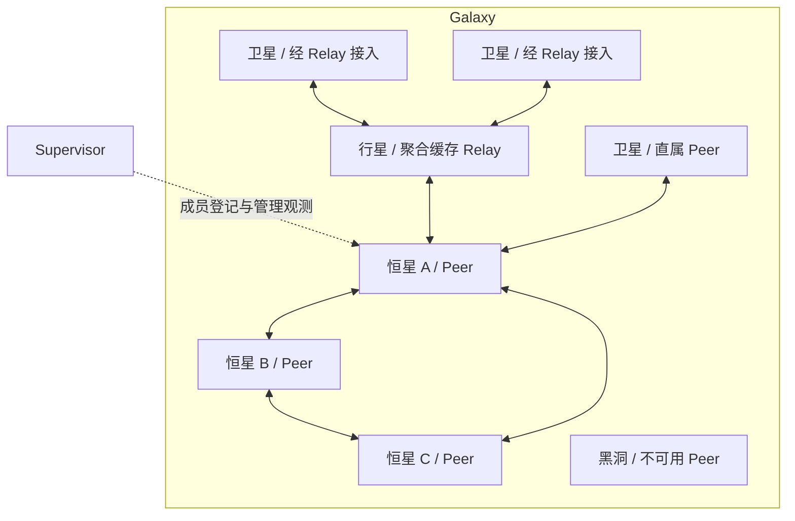

# Verdandi 星图结构修订

日期: 2026-09-10. 状态: 角色映射、Planet 全量授权缓存、离线换绑及可选存储模式已由维护者确认;
Star/Planet 基础连接和协议 v3 已实现, 当前契约见 [连接规则](peer/connection-rules.md).
业务缓存、复制、持久化、重新登记和 Admin 新展示模型仍未实现.

本文是 Peer 后端与 Admin 的共同结构入口. 它替代旧设计中 SDK 只能直连 Peer、Admin 将业务实体称为行星的目标结构.
现有 Redis SDK 契约保持有效; 现有服务认证网络的验证记录见 [服务验证](service-admission-validation-20260910.md).

## 1. 已确认的角色

| 星图对象 | 系统角色 | 归属与职责 |
| --- | --- | --- |
| Galaxy | 一组对等 Peer | 同一群组的成员、复制与访问范围 |
| 恒星 | Peer | 接纳 Publisher/Registry 请求, 将合法状态同步给其他 Star 和所属 Planet, 承担核心业务负载 |
| 行星 | Relay 中继器 | 共用存储/同步规则, 缓存 Galaxy 全部授权状态并向下游分发; Publisher/Registry 请求只转发给所绑定 Star |
| 卫星 | Catalog / Subscriber / Registry 等接入实体 | 可以直接绑定 Peer, 也可以绑定 Relay |
| 黑洞 | 不可用 Peer 的展示状态 | 保留该恒星身份, 不表示新的服务类型或数据删除 |
| 虫洞 | 后续跨 Galaxy 中继器 | 未来用于 Catalog 同步; 当前不实现 |

Supervisor 保持 Go. Star/Planet 的新目标为 C++26, 当前 Rust 实现保留, 尚未执行迁移;
第一阶段仅规划连接骨架, 见 [C++26 详细设计](peer/cpp26-skeleton-design.md).
Supervisor 负责成员登记和管理观测, Admin 负责星图展示.
Supervisor 不自动成为恒星、行星或业务流量的中转站; 它兼任 Catalog Publisher 时使用普通业务接入能力.
Planet 也向 Supervisor 鉴权, 但取得局部候选 Star, 不取得用于加入 Peer full mesh 的完整成员资格.
已确认 Planet 换绑时向新 Star 重新登记所管理的数据, 新 Star 负责扩散并使旧归属失效.
Supervisor 暂时不可用时, 已运行 Planet 可以使用仍有效的已有授权切换至候选 Star 并重新登记.
Star 和 Planet 均可选择内存或落盘模式, 同一 Galaxy 的 Star 允许混用; 存储模式不改变角色权限.
Star 按实际地域等属性划分逻辑组, Planet 优先本组, 故障时允许切换至同 Galaxy 的其他组.
新启动的 Star/Planet 必须等待 Supervisor 鉴权. 具体恢复协议尚待审核, 见第 7 节.



双箭头表示逻辑通信, 不统一规定物理连接数量. 当前 Peer 两两双连接仍成立;
Relay 和卫星接入的连接、多路复用及认证协议尚未实现, 不能直接沿用 Peer 成员握手获得成员权限.

## 2. 四种关系分别表达

星图中的空间包含不能同时承担成员、复制、访问和数据所有权四种含义.

| 关系 | 含义 | 不应推导出的行为 |
| --- | --- | --- |
| Peer 属于 Galaxy | Peer 参加本群组的成员网络 | Relay 和卫星也必须进入 Peer full mesh |
| Relay 嫁接 Peer | Relay 当前从该入口同步 Galaxy 全部授权状态 | Relay 获得写者权威或权威持久确认资格 |
| 卫星绑定 Peer / Relay | 当前业务同步与推送的接入路径 | 所访问的数据只能属于该入口 Peer |
| 数据重新登记到新 Star | 新 Star 接替接纳与同步职责, 扩散后使旧 Star 归属失效 | 新增一份不同身份的数据或无条件删除业务 Key |
| 业务 Key 的写者权威与内容版本 | 由业务协议独立规定 | 切换父节点自动更换 Publisher、重置版本或抹掉已确认内容 |

维护者已明确 Planet 将请求转发给当前绑定的一个 Star; 候选 Star 用于切换, 不同时分担写入.
一个卫星绑定只有一个活动接入点仍是首版建议. 物理连接和逻辑绑定数量另行定义.
Relay 不参加 Peer full mesh, 不承担多数持久确认. 不因增加 Relay 而改变既有 Peer 之间的连接拓扑.

Galaxy 暂映射现有 `cluster_id` / `--cluster`, 不新增一套重复群组标识, 也不立即改名线上字段和命令行参数.
业务 Zone、Catalog 路径与群组继续区分. 跨 Galaxy 通信当前没有通路.

## 3. 全量授权缓存与共用存储

维护者已确认 Planet 全量缓存 Galaxy 内所有已获授权的数据, 包括尚无下游订阅的数据.
这替代前一轮按需缓存及以最后一个下游解绑来释放上游订阅的建议. Planet 是有状态的应用层接入服务,
复用 Star 的状态存储和同步核心; 数据版本、合法写者及删除语义仍由业务协议规定.

上游复制范围与下游绑定数量分离:

```text
当前 Star -> Galaxy 全部授权状态 -> Planet 共用状态存储
Planet 共用状态存储 -> 按各卫星权限和绑定条件筛选 -> 下游快照 / 增量
```

“全部授权状态”包括正文、业务版本、删除标记及同步所需的租约/归属元数据, 不表示绕过权限复制整个 Galaxy.
卫星增加或解绑不改变 Planet 的上游复制范围; 授权范围改变时必须重新校验缓存和下游可见范围.
下游过滤、投影及权限仍各自校验, 不因共用存储就允许跨权限读取. 不引入过滤器包含推导或任意 Relay 级联.

建议流程:

1. Planet 鉴权后与当前 Star 建立会话, 提交已持有的状态基线, 同步全部授权范围.
2. 没有可验证的完整基线时先完成全量同步. 同步期间的更新有界处理, 不能把半份快照标为完整可用.
3. 完成基线后持续接收增量, 即使没有卫星也保留完整授权状态. 切换 Star 时复用版本比较和恢复规则.
4. 卫星提交身份、绑定条件及已有版本; Planet 校验后从共同状态中生成相应视图.
   无法证明所需增量完整时发送快照, 不把当前完整状态误当成拥有无限增量历史.
5. 上游更新经完整校验后安装状态, 再向下游分发不可变结果. 同一缓存版本可共享正文引用,
   下游连接只保留自身游标和有界发送状态, 不为每个卫星复制整份缓存.
6. 最后一个下游解绑只释放其绑定和发送资源, 不删除 Planet 的全量副本或停止上游同步.

必须区分“全量副本”和“本 Planet 当前管理的有效发布/登记关系”. 后者可通过业务身份引用共同存储,
不必再复制一份正文; 换绑只重新登记后者. 不能将全量缓存中的其他发布者、已退出的卫星或旧租约一并复活.

Star 和 Planet 均支持选择内存或落盘模式, 使用同一套记录与合并语义:

| 模式 | 恢复与确认边界 |
| --- | --- |
| 内存 | 本进程重启后从有效来源重新同步; 全部有效副本丢失时不能承诺独立恢复 |
| 落盘 | 加载并校验正文及必要元数据, 与授权上游/副本补齐; 磁盘内容不自动恢复旧会话、租约或接入资格 |

Planet 落盘仍是非权威副本, 不自动计入 Star 的多数持久确认, 也不能在上游失联时独立确认业务写入.
持久部署保留 Publisher 离线、全群重启后从有效磁盘副本恢复 Catalog 的目标; 全内存部署不提供这项耐久性.
旧 A-002 的多数 durable 确认适用于持久路径, 不能将内存接纳冒充落盘成功.
已确认同一 Galaxy 的 Star 可以混用两种模式. 因此必须区分数据副本集合与持久确认成员集合:
内存 Star 可以保存和同步副本, 但不能作为已经落盘的确认者; Planet 即使落盘也不自动取得此资格.
内存入口不能用自身接纳替代 Catalog 所需的持久确认, 更不能因持久节点暂时不可达而静默降低成功标准.
具体持久确认集合、内存入口的处理规则及全内存部署的写入契约仍待协议审核, 本轮不宣称已经解决.
可选存储模式是业务状态设计, 不自动修改 Supervisor 已实现的持久成员表或引入存储依赖.

全量缓存减少订阅范围维护, 同时增加每颗 Planet 的初次同步、容量和持续复制成本.
容量不足时必须显式报告并限制资源, 不能静默丢弃未订阅数据后仍宣称全量同步完成.

Relay 的确认必须区分“Relay 收到”和“业务写入已按 Peer 协议确认”. Publisher/Registry 请求只转发给当前 Star,
业务成功由 Star 按所属协议判定. 转发请求不能先作为已确认更新安装到 Planet 的共享缓存;
不能借订阅聚合吞并、重排或合并未经协议允许的写入, 也不能用缓存接收成功冒充持久确认.

## 4. 故障与缓存有效性

Relay 至少需要表达“正在同步”“上游有效”“缓存已过期/上游失联”这几种可观察状态;
具体字段和状态机待协议设计时收敛, 不先创建多套持久状态.

| 事件 | 必须保留的语义 |
| --- | --- |
| Relay 上游中断 | 已有缓存可以保留, 必须标明过期; 不假装收到新的续租、写入确认或最新状态 |
| Relay 切换 Peer | 重新校验 Galaxy、授权和业务基线, 完成恢复后才能恢复有效推送 |
| Relay 自身重启 | 内存模式重建, 落盘模式加载校验后补齐; 卫星重新绑定, 不能凭同一地址或磁盘缓存沿用旧会话资格 |
| 卫星消费过慢 | 发送内存有上限, 按业务语义合并或要求重同步, 不能拖住所有下游 |
| Registry 租约到期 | 缓存不能因重复展示或下游连接仍在线而替已失效 Registration 续租 |
| Supervisor 失联 | 已运行 Peer 按已有拓扑通信; Planet 可凭仍有效授权切换候选并重新登记; 观测变旧不等于节点不可用 |
| Supervisor 失联期间启动新进程 | Star/Planet 均等待 Supervisor 鉴权, 即使部署曾加入且磁盘仍在; 不自动恢复旧进程准入 |

Catalog 的旧值是否允许读取由既有业务降级契约决定; Registry 的可选服务集合仍需遵守租约与时间有效性.
缓存相同版本不代表它的租约、权限和上游可用性永远有效.

当前业务复制与 SDK Binding 还未实现. 上述是后续协议必须满足的约束, 不能将已经通过的网络层测试当作 Relay 测试证据.

## 5. Admin 当前结构与迁移方向

已核对当前源码:

- `model/types.ts` 的 `PlanetKind` 是 Registry / Subscriber / Publisher, `PeerStar.planets` 直接包含这些业务实体.
- `Planet.peerId` 只允许直属 Peer, 没有 Relay、卫星或可选择的父节点类型.
- `PeerStatus` 只有 available / unavailable. 渲染器收到 unavailable 就创建黑洞, 隐藏其业务实体和连线.
- 当前数据来自 `data/demo.ts`; 尚未连接 Supervisor, 并不能判定真实服务是否不可用.

修订后的展示模型建议分别保存 `peers`, `relays`, `satellites`, `links`;
卫星父节点使用带类型的引用 `Peer(id) | Relay(id)`, 不靠字符串前缀猜测, 不通过任意递归嵌套构造拓扑.
所有父引用必须同属 Galaxy, 存在且类型合法. 当前活动父引用改变只表示接入切换.

Relay 是节点角色, Catalog / Registry 是业务领域, Subscriber / Publisher 是访问角色.
推荐在模型中分开描述“实体角色”和“业务领域”, 展示标签保留用户熟悉的名称;
不继续把这些不同维度固定成一个互斥的行星类型枚举. 卫星对应一个 SDK 进程还是一个逻辑绑定仍需决定,
推荐按逻辑绑定显示, 多个绑定可以归属于同一 SDK 进程, 不把一个图元误当作一条物理 TCP.

恒星的画面位置建议关联部署记录, 当前进程 UUID 单独记录, 保留重启后新 UUID 的已确认要求.
现有部署凭据指纹可以在凭据未变化时关联记录; 证书轮换后的稳定展示身份仍须显式设计, 不能假定指纹永久稳定.

黑洞应是同一 Peer 的状态表现, 恢复时回到恒星. 保留最后已知的关联信息供诊断,
但不把失效连线画成可用连接. UI 可以折叠不可达的下游, 不能据此删除后台关系或业务数据.
某一观察者无法连接、监控源离线和明确判定不可用应区分; 建议增加 unknown/stale 展示状态及观测时间,
由数据适配层提供状态依据, 渲染器不以丢一条边推断整个节点已死亡.

轨道与视觉大小只用于展示. 现有“按行星数量缩放恒星”规则需重新选择指标,
不能把旧 SDK 数量自动替换成 Relay 数量而改变含义; 直属卫星与 Relay 下卫星也不能重复计数.

## 6. 实施顺序与未决项

本轮完成共同架构定义与现状核对, 不修改现有二进制、Protobuf 编号、Admin 模型或渲染交互.
后续按以下顺序推进:

1. 明确卫星粒度与单活动上游建议, 修订 Admin 快照、演示数据、类型校验与选择接口.
2. 接入同一份拓扑数据模型的观测来源, 再展示真实绑定、未知状态及黑洞恢复.
3. 在 Peer 业务同步/SDK Binding 语义明确后实现 Relay 全量授权缓存, 共用存储与恢复规则.
4. 验证下游数量不改变上游同步范围, 无订阅数据仍同步, 权限不串用, 换绑只恢复自身有效登记,
   断线切换不回退版本, 半份快照不泄漏, 租约不被缓存延长, 慢消费者隔离和资源清理.
5. 分别覆盖内存/落盘恢复、磁盘旧状态校验、容量不足和 Supervisor 离线下的授权候选切换;
   存储模式和确认门槛明确后再补齐对应丢失/持久恢复测试.

Star 混合存储、新进程在线鉴权及组内优先/跨组故障切换已确认, 见第 9 节.
后续优先审核持久确认集合与混合模式写入流程, 再细化候选响应及重新登记协议.
卫星按进程还是逻辑绑定显示仍待决定. Relay 的实现语言、独立程序或现有程序运行模式随后再定;
不在未决定前增加包、可执行入口或通用路由框架.

虫洞只记录未来跨 Galaxy 的 Catalog 同步目标. 当前不实现协议、路径搜索、转发链、冲突解决或后台任务,
不允许普通 Relay 借该预留跨群组转发. 将来需先决定方向、授权和循环抑制, 再定义实现.

## 7. Star/Planet 请求方向与重新绑定审核

维护者已明确请求方向、Planet 独立鉴权, 以及换绑时“重新登记到新 Star, 由新 Star 扩散并使旧数据归属失效”.
下列候选名单、代次来源和协议步骤仍是审核建议, 尚未冻结消息字段, 也不表示业务恢复已经实现.

### 7.1 共用核心, 区分处理权限

```text
Publisher / Registry 实例 -> Planet -> 当前 Star A
Star A 接纳后 -> 其他 Star 的副本 + A 所属 Planet
Star B 收到副本 -> B 所属且获准读取该数据的 Planet, 不依赖下游是否订阅
Planet 收到 Star 的同步 -> 共用状态存储 -> 向下游分发
```

Star 处理请求并产生协议允许的新状态; Planet 只转发请求, 接收已确认状态.
两者共用记录格式、版本比较、删除语义、索引、快照/增量同步和有界下游推送.
内容写者、接纳请求的 Star 和传输该副本的节点要分别识别. 不将来源字段简单改写为转发者.

其他 Star 收到副本后向自己所属 Planet 推送, 不因此向所有 Star 再广播一次.
这保留 Star 全互联的传播边界, 同时允许接入节点读取其他 Star 接纳的数据.
Planet 全量缓存 Galaxy 的授权数据, 上游同步不跟随卫星订阅数量变化, 见第 3 节.

### 7.2 局部 Star 名单

建议 Supervisor 返回同 Galaxy 内一个有界候选集合, 而不是把数据按这份名单分片:

- Star 按实际地域等属性划分逻辑组, Supervisor 按分组组织候选入口; Planet 优先本组,
  本组无可用 Star 时允许切换至同 Galaxy 的其他组. 当前候选算法见连接规则.
- 示例可以是 2..3 个候选, 按部署可达范围与容量配置选择, 数量尚未冻结.
- Planet 只绑定一个活动 Star. 已有绑定健康时不因拿到新名单频繁迁移; 故障时按候选退避尝试.
- 名单耗尽时向 Supervisor 请求另一组候选, 请求和拨号有界并带抖动, 不向其他 Planet 传播名单.
- 已确认分组表示入口优先级, 不以本组标签禁止故障时跨组. 跨组目标仍需已有授权有效,
  不能因分组可切换就推导出跨 Galaxy 访问或跳过业务 scope 校验.
- Supervisor 不可用时, 已运行 Planet 可以使用仍有效的已有授权切换至候选 Star 并重新登记,
  不要求每次换绑在线请求 Supervisor. 目标 Star 仍须校验角色、范围及授权有效性;
  无可用授权候选时保持降级并有界重试, 不自动扩张权限. 新启动进程必须等待 Supervisor 鉴权,
  不能用此前部署的业务磁盘或旧会话资格绕过此门槛.

逻辑组只影响连接选择, Galaxy 仍保持全量授权状态同步, 不新增组内独立数据权威或复制分区.
逻辑组也不复用 Registry/Catalog 的业务 Zone 含义; 当前由 `--group=NAME` 配置, 默认 `default`, 不授予权限.
Supervisor 离线时只能使用仍有效的已有信息; 跨组允许并不意味着能离线取得从未获知的候选地址.
候选响应建议有界地保留本组主用和其他组备用入口, 从而支持 Supervisor 离线期间跨组切换;
不需要把 Star 完整成员表交给 Planet. 当前独立 `PlanetRegistrationResponse` 最多返回 8 个候选.

复用现有 mTLS、签名和进程证明实现, 但 Planet 必须有独立角色和有界响应契约.
当前 Peer RegistrationResponse 的完整成员表门槛属于 Star 组网, 不应给它加入“有时只是局部”这一隐式例外.
Planet 数量也不应计入 Star full mesh 或权威持久确认集合.

### 7.3 新 Star 重新登记并扩散旧归属失效

已确认切换语义: Planet 从 A 切换 B 后, 将自己管理的有效发布/登记状态注册到 B;
B 接纳新的登记关系, 向其他 Star 及所属 Planet 同步, 接收方以新归属替代旧归属.
不要求必须先联系 A 撤销成功才能在 B 重建, 也不等待旧租约自然过期才开始恢复.

“旧数据失效”指旧 Star 归属下的登记和处理资格失效, 不是删除该业务 Key 的所有副本.
同一业务身份保留, 新旧记录按可验证的新旧顺序合并. 推荐用同一条版本化替换记录表达
“新登记生效、旧登记被替代”, 避免把无条件 Delete 和 Register 分成两个可能乱序的消息.
批量恢复可以分批执行, 每条成功重建的记录只替代自己的旧归属; 部分失败不能据此清除尚未恢复的整个集合.

这里的 Registry 请求按现有领域语义理解为 Registration 的登记、更新、续租和撤销;
Registry 集合仍由有效 Registration 派生, 不迁移或重写整张集合.

服务进程不变时, Registration UUID 和内容版本不因 Planet 换绑而变化; 服务进程重启才换 Registration UUID.
Star 的进程 UUID、Planet 的连接代次、Registration UUID 和业务版本不能互相替代.

以 Planet P 从 A 切换 B 为例, 协议细化建议是:

1. P 停止向旧上游提交新请求, 关闭旧连接并隔离晚到回调; 已发请求结果可能不确定, 不直接判为失败后重放.
2. P 从已授权候选中与 B 建立会话, 请求重建相关业务绑定.
3. P 重新提交自己管理的有效发布/登记状态, 保留原业务身份、原写者和最新内容版本.
   重建可在有效授权和下游会话范围内批量进行; 如何向 B 证明这一范围仍需设计,
   只读订阅缓存不能当作本 Planet 管理的发布源, 已退出的下游也不能因缓存仍在而被复活.
4. B 对照其副本, 请求缺少的完整正文, 校验版本和恢复资格. B 可能落后, 不要求 A 在线才能提供普通状态正文.
5. B 接纳新登记, 以新的归属/接入代次向其他 Star 和所属 Planet 同步.
   接收方替代同一业务身份的旧归属, 隔离旧状态和旧失效动作; 原 A 恢复后也遵守相同合并规则.
   新登记的确认条件满足后, 对应绑定才恢复可写/可续租状态, 不以本地发送成功代替确认.
6. P 的全量授权副本按原有 head/快照/增量规则补齐, 再恢复相应下游视图;
   不能把旧上游的连接内游标直接当成 B 的游标, 也不能把全量副本都作为自身发布数据重新登记.

P 可以缓存它管理的完整发布/登记状态用于上述恢复. 恢复资格限于仍有效的管理关系,
不扩展到 P 仅作为副本缓存的数据, 也不意味着 P 可以自行生成新的业务内容或更换原 Publisher.
新旧实例、连接取消及错误路径使用同一套业务恢复规则, 不另建 Planet 专用 Registry 数据模型.

### 7.4 旧 Star 和旧租约不能覆盖新绑定

以下情况必须区分: A 真正停止, P 到 A 的链路中断但 A 仍可与其他 Star 通信, 以及 A 处理成功但响应丢失.
只复用同一个 Registration UUID 不足以处理这些情况. 旧更新、旧 Unregister 和旧租约到期动作
都必须受绑定/租约代次约束, 不能清除 B 已恢复的更新实例状态.

切换记录需要可验证的新旧顺序, 接入代次应绑定业务身份和新的 Star/会话, 同一恢复尝试重试保持幂等.
原 Registration 持有者发起代次是上一轮建议; 本轮已确认 Planet 主动重新登记, 因此需继续审核
由持有者授权、Planet 会话代次或 Supervisor 在鉴权时预先赋予的授权基线承载此顺序的具体方式, 不直接冻结其中一种.
已确认 Supervisor 离线时可凭已有有效授权换绑, 因此具体方案不能要求每次切换在线申请序列.
该序列不能仅从可能落后的 B 上执行“当前值加一”, 否则不能证明高于 A 曾接纳的绑定.
代次编码、权限以及下游已换绑/已退出时的校验仍需统一设计; 不因此引入逐 Key 的全局协调表.
当前 Supervisor 的成员 Epoch 只隔离 Star 进程替换, 不能用作 Registration 业务接入代次.

更高代次被某个节点观察并验证后, 它拒绝较旧代次的状态或失效动作. 尚未收到新状态的隔离副本
可能仍暂时显示旧记录, 需要按租约和修复规则收敛. 这符合最终一致的方向, 不等于全网即时撤销旧 Star 权限.
若要求切换后所有节点立即拒绝旧路径写入, 就需要更强的在线授权/协调, 不能只增加一个本地计数器来宣称实现.

这类旧请求隔离的参考是 Chubby 的 sequencer: 接收端检查授权代次并拒绝失效请求;
这里只借鉴边界, 没有引入其锁服务或假定本项目具备相同一致性保证.
见 [Chubby 论文第 2.4 节](https://storage.googleapis.com/gweb-research2023-media/pubtools/4444.pdf).
响应丢失也不能证明写入未执行, [etcd 的操作完成定义](https://etcd.io/docs/v3.5/learning/api_guarantees/#operation-completed) 明确区分了这点.

### 7.5 替代旧固定入口约束, 保留业务恢复边界

旧草案将 Key 固定映射到 owner Star, 新入口仅路由或重定向. 如果仍要求 B 把恢复请求转回 A,
就不能满足 A 不可用时重新确立 Registry 的目标. 维护者现已确认由 B 重新接纳并扩散旧归属失效,
因此旧固定 Star 入口约束被本节替代. Registration 写者身份保持属于服务实例,
接入 Star 的处理/续租责任随重新登记变化; 底层消息、排序和确认协议仍未实现.

Catalog 不能直接照搬租约实例恢复: B 必须依据既有权威恢复和写入确认规则处理,
不能用落后的 B 或 Planet 缓存覆盖已确认 Catalog, 也不能因换绑自动授权另一个 Publisher.
Publisher 的接纳/同步 Star 可以随本轮规则切换; 这不等于转移逻辑 Publisher 身份或删除持久 Catalog.
新入口恢复已确认内容和满足持久写入确认的具体方式仍须单独完成协议审核.

实现前至少验证 A 仍存活的链路故障、落后 B、响应丢失、旧撤销/到期迟到、下游退出与恢复并发,
以及候选全部失效和 Supervisor 离线. 本轮不实现协调服务、逐 Registration 的 Supervisor 成员表或数据迁移事务.

## 8. 第一批已确认决定

以下已由维护者回答, 替代此前按需缓存和仅内存缓存的建议.

| 编号 | 产品问题 | 已确认答案 | 答案影响 |
| --- | --- | --- | --- |
| GQ-001 | Supervisor 离线时是否切换候选并重新登记? | 继续切换, 使用仍有效的已有授权 | 换绑不依赖 Supervisor 每次在线批准; GQ-005 另行明确新进程仍等待鉴权 |
| GQ-002 | Planet 的缓存范围? | 全量缓存 Galaxy 内所有授权数据, 无下游订阅也同步 | 去掉按订阅增减上游范围的逻辑, 接受全量副本的资源成本 |
| GQ-003 | Planet 的存储模式? | 与 Star 一致, 可选择落盘或内存模式 | 共用存储核心, 角色权限不变; 全内存部署不能承诺全群丢失内存后的独立恢复 |

本批不重复确认 Star/Planet 职责、单活动上游、重新登记后使旧归属失效和最终一致方向.
也不要求维护者选择代次字段、数据结构或并发实现; 先明确产品行为, 再设计并审核这些技术细节.
旧 Peer 草案的固定 owner 入口与 `owner == sender` 限制已有修订入口声明, 正文仍待统一;
它们不能覆盖本文后续已确认的角色和重新登记方向.

## 9. 第二批及分组决定

GQ-004/GQ-005 已回答; GQ-006 引入逻辑分组方向, GQ-007 已确认组内优先、故障跨组的边界.

| 编号 | 产品问题 | 状态与答案 | 影响 |
| --- | --- | --- | --- |
| GQ-004 | 同一 Galaxy 的 Star 能否混用内存与落盘模式? | 已确认: 允许混用 | 区分数据副本和持久确认成员, 不能按所有在线 Star 数量直接计算持久多数 |
| GQ-005 | Supervisor 离线时, 已登记部署重启后生成新 UUID 的 Star/Planet 能否接入? | 已确认: 新进程等待 Supervisor 鉴权 | 磁盘业务恢复和进程准入分离; 全群重启恢复依赖 Supervisor 先恢复准入服务 |
| GQ-006 | Planet 的局部候选 Star 名单如何组织? | 已确认: Star 按实际地域等属性逻辑分组 | 用于候选入口组织, 不建立独立的数据复制分区 |
| GQ-007 | 本组 Star 全部不可用时, 能否切换至同 Galaxy 其他组的已授权可达 Star? | 已确认: 优先本组, 故障时允许跨组 | 保持 Galaxy 全量授权数据同步; 离线切换依赖已有有效授权及已获知候选 |

本批不要求维护者选择存储引擎、版本编码或锁实现. 候选数量、具体确认算法等尚未审核的建议不作为实施决定.
候选选择不引入全网扫描或 Planet 转发名单; 数据访问仍受 Galaxy、角色和 scope 校验.
存储模式选择也不自动决定每种业务写入的确认门槛, 后续应先提出简单、可验证的混合模式确认方案.
