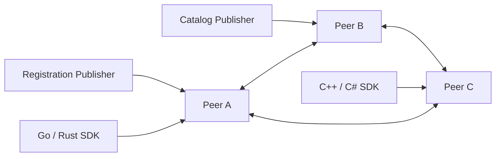

# 对等状态网络架构审核（非实施计划）

日期：2026-09-09。范围：审核一组等价 Verdandi 节点替代 Redis，由每个逻辑值的唯一 Publisher 发布状态，再由节点网络复制并向各语言 SDK 提供同步。本文没有修改现有协议或实现。

## 结论

这个模型比“由 Redis 事件、Hash、TTL 和各语言 SDK 共同维持同步状态”更贴合 Verdandi 的数据所有权，也有机会显著缩小 SDK。可行的最小架构是：

1. 运行固定的 3 或 5 个等价 Verdandi peer；每个 peer 都能接收发布、保存完整状态并服务 SDK。
2. 每个逻辑键只有一个授权 Publisher。一个 Publisher 进程可以拥有多个键，不需要为每个值启动一个进程。
3. Publisher 只连接一个可用 peer；该 peer 负责把写入复制给其余 peer。SDK 也只连接一个 peer，并在断线后切换到下一个地址。
4. peer 之间按每个键的 `(owner_epoch, sequence)` 合并状态。完整状态是恢复单位；Patch 只是连续版本之间的传输优化。
5. Registry 由仍在租约内的 Registration 记录推导出来，本身不再是一份独立写入的数据。
6. 首版采用固定成员、全量复制和 peer 间持久连接。暂不引入动态 gossip 成员管理、自动分片、跨键事务、CRDT 或全局 revision。



这里没有固定中心。接收一次写入的 peer 只是该操作的入口；下一次写入和新的 SDK 连接可以落到其他 peer。所有 peer 运行同一份代码、保存同一类状态并提供同一协议。

该方案仍是一项架构重写，不能直接视为当前 Selector 整理的自然延伸。它把分布式复制集中到一个服务端实现，从各语言 SDK 中删除 Redis、Lua、Pub/Sub 扫描栅栏和 Sentinel 恢复，却新增 peer 的磁盘恢复、复制、鉴权、成员配置及分区测试。应先做独立原型，再决定是否替换生产路径。

### Peer 实现语言

在 Peer 只是普通控制面转发服务的假设下，Go 的开发和部署成本更低；采用紧凑 KV、不可变共享正文、低分配 fan-out、WAL 和严格 p99 延迟作为核心目标后，首选调整为 **只实现一个 Rust Peer**。各语言 SDK 仍是独立客户端。

Rust 不能消除分配，但 `Arc<State>`、连续 `Vec`/boxed slice、共享 bytes 和显式所有权能准确控制正文何时复制、快照何时释放，不依赖 GC 扫描或池是否保留对象。异步与生命周期的额外复杂度只存在于一个 Peer 实现中，不再复制到四种 SDK。

仓库已经具备相关基础：Rust SDK 使用 Tokio、ArcSwap 和 redb，并启用了 `unsafe_code = "forbid"` 及严格 Clippy 规则：[Cargo.toml:15](D:/projects/verdandi/sdk/rust/Cargo.toml:15)、[Cargo.toml:34](D:/projects/verdandi/sdk/rust/Cargo.toml:34)、[Cargo.toml:40](D:/projects/verdandi/sdk/rust/Cargo.toml:40)、[Cargo.toml:49](D:/projects/verdandi/sdk/rust/Cargo.toml:49)。现有 redb 仅作为客户端检查点，不能未经崩溃恢复审核就直接宣称满足 Peer 权威存储；Redis 移除后，TLS 也应成为 Peer 的直接依赖，而不是继续通过 Redis 驱动间接取得。

Go 仍是可接受的基准实现或 SDK，但没有理由同时维护 Go、Rust 两套 Peer。只有 Rust 原型的开发复杂度或吞吐实测明显不合格时，才重新比较 Go。

## 1. 单写者如何改变问题

当前 Registration 已经是单写者：每个进程只写自己的 UUID，[architecture.md:389](D:/projects/verdandi/architecture.md:389)。ACK 也由对应 Registration 写入。新约束把其他数据同样收敛成单写者：

| 数据 | 逻辑键 | 唯一写者 | peer 中的状态 |
| --- | --- | --- | --- |
| Registration | Zone/Type/UUID | 该服务进程 | 有租约的完整 Attr、Version、Data |
| Registry | Zone/Type | 无独立写者 | 从有效 Registration 推导的集合 |
| Catalog | Zone/Part/ID | 被授权的 Publisher | 完整当前值和删除标记 |
| Desired | Zone/Target | 被授权的 Publisher | 完整当前文档 |
| ACK | Target/Registration | 该 Registration | 完整当前确认状态 |
| Zone 配置 | Zone | 管理 Publisher | 完整当前配置 |

同一键只有一个写者时，peer 不需要解析并发分支、字段级时钟或跨节点写入顺序。稳定的 `owner_id` 用于鉴权；单调增加的 `owner_epoch` 用于 Publisher 更换或无法安全续写时的 fencing；Publisher 在一个 epoch 内为每次内容变化递增 `sequence`。合并规则只有四条：

- 经过授权的更高 owner epoch 支配较低 epoch；同一 epoch 中 sequence 更大者替换更小者；
- `(owner_epoch, sequence)` 相同且正文哈希相同是重复消息；
- 版本相同但正文不同是 Publisher 契约错误，必须拒绝并报告；
- Delete/Unregister 是带同样版本的终态记录，保留到旧消息不可能再恢复该值后才能回收。

这个“取最大版本二元组”的合并是可交换、可重复且与到达顺序无关。peer 可以收到乱序或重复消息，最终仍会选择同一状态。Amazon Dynamo 的经验说明，对象版本、去中心化复制和反熵可以构成高可用键值系统，同时也明确指出允许分区写入会牺牲部分一致性并带来冲突处理；本方案通过每键单写者删掉了其中最昂贵的并发写冲突分支。[Dynamo 论文](https://www.amazon.science/publications/dynamo-amazons-highly-available-key-value-store)

### Publisher 重启与替换

Registration 重启会生成新 UUID，因此自然形成新键，旧键按租约或 tombstone 消失。

Catalog、Desired 和 Zone 配置会在 Publisher 重启后继续使用原键。Publisher 必须先从 peer 取得已确认的最新 owner epoch/sequence，再继续发布。正常重启可以在确认旧实例已退出后续写；替换实例或无法证明安全续写时必须使用更高 owner epoch。自动把写权限从一个 Publisher 实例切给另一个实例需要 fencing；单写者约束只能消除正常并发，不能证明旧实例已经死亡。

复杂度优先的首版应把 Publisher 替换定义为受控操作：操作者停掉旧实例，向新实例提供单调增加的 owner epoch，再允许新实例发布。自动选主和无人值守故障切换暂缓。若将来要求网络分区中自动切换且绝不双写，就需要共识或外部租约系统；Raft 的核心用途正是让多数节点对一个复制日志达成最终决定。[Raft 论文](https://raft.github.io/raft.pdf)

## 2. peer 网络的最小拓扑

首版建议固定 3 或 5 个 peer，并让它们全连接。固定小集群有以下性质：

- 所有节点保存全部键，任一健康节点都可以完成 SDK 同步；
- 每次写入最多直接复制到 `peer_count - 1` 个节点；
- peer 断线后按版本摘要做反熵，不依赖保存全部事件；
- 部署配置直接给出集群 ID、peer ID 和 peer 地址；
- peer 成员变化作为受控运维操作，暂不做自动扩缩容。

这比让业务进程或所有 SDK 参加 gossip 更简单。SWIM 适合大规模、弱一致的成员发现与故障探测，并通过随机探测避免全量心跳的平方级消息量；它解决的是成员列表和故障检测，不会自动提供业务状态的顺序、持久化或删除收敛。[SWIM 论文](https://www.cs.cornell.edu/projects/Quicksilver/public_pdfs/SWIM.pdf)

当 peer 数量固定且很小，长期 TCP 流加定期反熵已经足够。只有实测证明 peer 数量需要扩展到全连接不合适时，再评估 SWIM、分片和一致性哈希。HashiCorp Consul 同样把 gossip 成员传播与 Raft 持久状态分开，这说明两者不应被误认为一个协议可以同时解决的问题。[Consul 架构](https://developer.hashicorp.com/consul/docs/architecture)

### 负载边界

全量复制能分散 SDK 连接、读取、快照生成和通知 fan-out，因为这些工作只发生在 SDK 所连接的 peer。它不会让写入工作随 peer 数量线性下降：每个 peer 最终仍要保存每次写入，集群总网络和存储工作会随副本数增加。

因此，增加 peer 主要扩展读取与连接容量，并提升故障容忍度；它不是数据容量的水平分片。首版若无法在 3 或 5 个完整副本上满足目标，就应先测量实际瓶颈，再决定是否承担分片、路由和跨分片订阅合并的复杂度。

## 3. peer 间复制

Publisher 发给入口 peer 的消息至少包含：

```text
cluster_id
zone + kind + key
owner_id + owner_epoch
sequence
operation = update | patch | delete | renew
base_version        # 仅 Patch 需要，包含 owner_epoch 和 sequence
payload_hash
payload / patch
lease metadata      # 仅 Registration/ACK 等租约数据需要
```

入口 peer 完成身份、所有权、大小、schema 和版本检查后，更新本地不可变 State，并把该版本复制到其他 peer。每个 peer 存储每个键的完整最新状态；事件流只是低延迟路径，周期性反熵才是最终收敛路径。

反熵首先交换分页的 `(key, owner_epoch, sequence, payload_hash, terminal)` 摘要，再只拉取缺失或不同的完整状态。现有资格测试使用 5,000 个 Registration，[architecture.md:672](D:/projects/verdandi/architecture.md:672)；在这一数量级，分页版本清单远比 Merkle tree 简单，需由基准证明清单已经成为瓶颈后再增加树形摘要。

### Update 与 Patch

完整 Update 是跨 peer 和断线恢复的基线。Patch 只在接收 peer 已有完全相同的 `base_version` 时应用：

- base 匹配：应用 Patch，生成并保存新的完整 State；
- base 不匹配：不猜测缺失字段，直接请求对应 sequence 的完整 State；
- 反熵：传完整 State，不重放无限 Patch 历史；
- Registration Data 小于约 1 KiB 时，peer 到 peer 和 peer 到 SDK 可优先发完整 State；
- 大 Catalog 值保留 Patch，只有基线匹配的接收端才获得差量收益。

因此，Publisher API 可以同时支持 Update 和 Patch，但多语言 SDK 的恢复协议不必维护 Redis v1 那套局部事件补全状态。Patch 的复杂度集中在唯一的 peer 实现中。

## 4. SDK 连接与顺序同步

每个 SDK 配置同一集群的若干 peer 地址，一次只选择一个活动连接。推荐同步顺序如下：

1. 建立连接，校验集群 ID、协议版本、身份和权限；
2. SDK 声明订阅范围及自己仍持有的每键 owner epoch/sequence；
3. peer 先为该连接建立有界实时队列；
4. peer 在本地 Registry/Catalog 锁内取得一个本地 cursor 和不可变 State 引用集合；
5. 释放锁后，按页发送新增、变化、删除和必要的完整正文；
6. 发送 `SyncEnd(cursor)`，随后发送 cursor 之后排队的实时变化；
7. SDK 原子发布本地视图并进入 Ready；队列溢出、校验失败或切换 peer 时重新同步。

锁只保护“取得 cursor 和状态引用”这一小段，不在持锁时做网络发送、编码或用户回调。peer 的 cursor 只排序该 peer 提供给某条连接的事件，不成为所有 peer 共享的业务 revision。业务收敛仍由每键 sequence 判断。

这一顺序把当前 Redis 的 subscribe-before-read、HSCAN/HGET、Pub/Sub PING 栅栏和丢消息修复变成同一服务进程内的快照加事件尾流。当前复杂流程可见 [architecture.md:271](D:/projects/verdandi/architecture.md:271)。SDK 仍需版本校验、容量限制、原子发布和慢消费者重同步，但不再自行协调两个 Redis 连接及一次不可回放的 Pub/Sub 通道。

SDK 切到另一个 peer 时，可能暂时看见较旧的 peer 视图。SDK 应把自己的最高每键 sequence 带到新连接；新 peer 对落后键完成追赶后才发送 SyncEnd，不能让 SDK 回退已经确认的版本。这里保证的是连接到一个 peer 后得到自洽的本地快照，不保证网络分区两侧在同一时刻拥有完全相同的 Registry。

### TCP、Protobuf 与调度边界

TCP 加 TLS 适合作为首版传输，Protobuf 适合作为 Go、Rust、C++ 和 C# 共用的消息定义。二者不能替代 Verdandi 自己的流协议：TCP 只提供有序字节流，Protobuf wire format 本身也没有消息边界，官方建议在连续流中自行写入消息长度。[Protobuf 流式消息说明](https://protobuf.dev/programming-guides/techniques/)

建议在每个 Protobuf 消息前放一个固定宽度的网络序长度，读取长度后先检查帧上限再分配。大 Catalog 必须分块，使写调度器可以在块之间发送 renew、ack、ping 和实时更新，避免一个大值长期占住同一 TCP 流。每条连接只有一个写循环；消息类型决定内部优先级，不能信任客户端自行声明优先级。

候选顶层 envelope 只负责调度与关联：

```proto
message Envelope {
  uint64 stream_id = 1;
  uint64 request_id = 2;
  oneof body {
    Hello hello = 10;
    Publish publish = 11;
    PublishAck publish_ack = 12;
    Subscribe subscribe = 13;
    SyncStart sync_start = 14;
    StateChunk state_chunk = 15;
    SyncEnd sync_end = 16;
    Event event = 17;
    Ping ping = 18;
    Error error = 19;
  }
}
```

这只是结构草图，不是已经冻结的字段号。协议发布后字段号不得重用，删除字段应保留编号；需要区分“未提供”和显式零值的标量应使用显式 presence。Protobuf 官方把这些列为跨版本兼容规则。[Proto3 指南](https://protobuf.dev/programming-guides/proto3/)

Protobuf 只统一消息结构，不负责队列优先级、背压、超时、重试、幂等、同步 cursor 或版本合并。这些行为仍需写入 Verdandi 协议和跨语言测试向量。

### KV 内存布局与 GC

KV 若直接表示成 `map<string, bytes>`，一次解码会产生 map、桶、字段名、每字段切片和嵌套消息等大量小对象。当前 Go `Fields` 正是 `map[string][]byte`，公开边界的深拷贝还会逐字段复制：[field.go:7](D:/projects/verdandi/sdk/go/field.go:7)、[field.go:41](D:/projects/verdandi/sdk/go/field.go:41)。新 Peer 的持久状态不应沿用这个布局。

建议 Peer 内部采用：

```text
State
  key/owner/version       # 固定元数据
  schema_id               # 固定结构可复用字段表
  names/value byte slab   # 一块或少数几块不可变正文
  compact offsets         # 连续整数数组，无每字段指针对象
```

- Type 固定的 Registration 在首次发布时登记有序字段表，后续用 schema ID 和字段序号；
- 动态 Catalog 字段按 UTF-8 字节排序后紧凑保存；
- 每次内容变化构造一个新的紧凑 State，完成后原子替换指针；
- 快照复制 `[]*State` 引用，不复制正文；
- 只有公开 SDK API 真正需要 `Fields` 时才构造语言原生 map；
- 线上的 Protobuf 可以携带紧凑正文和 packed offset，Peer 不必把每个值长期展开成生成的 Protobuf 对象。

不能直接对完整 Protobuf 序列化结果计算跨语言 `payload_hash`。Protobuf 官方明确说明确定性序列化也不是规范化序列化，schema、构建或库版本变化都可能改变字节结果。[Protobuf 非规范化说明](https://protobuf.dev/programming-guides/serialization-not-canonical/) 哈希应覆盖 Verdandi 明确定义的规范正文，例如按字段名排序后逐项写入长度和原始字节。

`sync.Pool` 适合复用接收帧、编码缓冲和短命工作对象。它不能保存协议状态、限制内存或保证对象一定留在池中；Go 文档明确允许运行时随时移除池中对象。[sync.Pool 文档](https://pkg.go.dev/sync#Pool) 建议长期连接固定复用自己的读写缓冲，公共池采用少量尺寸档位，并拒绝把异常大的 Catalog buffer 放回池中。这样能降低分配速率，但仍需用 allocation profile、GC pause 和 p99 延迟证明效果。

## 5. 租约、删除与时钟

移除 Redis 也移除了统一的 RedisClock。Registration 的过期语义必须重新定义，不能只把 TTL 字段搬到 peer：

- Registration Publisher 每次 renew 递增 lease sequence，内容 sequence 保持不变；
- peer 只接受更高 lease sequence，延迟或重复 renew 不会覆盖更新状态；
- peer 按本地接收时间建立保守期限，并为允许的时钟偏差和传播延迟设置明确上限；
- 显式 Unregister 生成支配此前内容和 renew 的 terminal sequence；
- tombstone 至少保留到旧副本、离线 peer 和在途消息都不能合法恢复该键的窗口结束；
- 新进程使用新 UUID，避免把旧进程的延迟消息合并进新实例。

分区中的故障和慢节点无法仅靠网络观察严格区分。SWIM 也通过 `suspect` 阶段降低误判，而不是消除这一事实。新协议必须公开最大陈旧窗口；如果要求所有 peer 在同一毫秒认定租约失效，就需要共享时钟假设或共识租约，复杂度会重新上升。

## 6. 持久性与确认语义

每键单写者解决了写入冲突，没有自动解决已确认数据是否会在节点损坏后丢失。需要为数据类明确选择：

| 模式 | 确认点 | 后果 |
| --- | --- | --- |
| Publisher 权威 | 一个 peer 接收后即可确认；Publisher 保留完整期望状态并在重连时重发 | 最简单；所有 Publisher 都不在线且 peer 全失时无法自行恢复 |
| peer 网络权威 | 入口 peer 的本地 WAL 和多数 peer 持久化后确认 | 可在 Publisher 离线时恢复；写入受多数节点可用性约束，需要 WAL、快照、压缩和恢复测试 |

Registration 适合 Publisher 权威：运行中的服务本来就能重发，服务退出后状态应过期。Catalog、Desired 和 Zone 配置是否必须在 Publisher 离线及整个 peer 集群重启后仍保留，是正式设计前必须确定的产品语义。

若持久状态采用多数确认，入口 peer 只是当前操作的协调者，仍没有固定中心。由于每键只有一个写者，无需为正常更新建立全局 Raft 日志；多数确认主要提供持久性。若以后恢复多个 Publisher、跨键原子操作或自动 Publisher 选主，则应直接采用成熟共识算法，而不是继续扩充自制 sequence 规则。etcd 的线性一致操作通过 Raft 达成，同时官方文档也明确说明这种保证带来共识成本。[etcd API 保证](https://etcd.io/docs/v3.7/learning/api_guarantees/)

## 7. 明确不进入首版的能力

- 业务 SDK 彼此连接或参与 peer 数据复制；
- peer 数量无限增长、自动分片和多跳路由；
- 动态集群成员变更及自动扩缩容；
- 所有键共享的全局 revision；
- 字段 revision、通用 CRDT 和并发写冲突合并；
- 跨 Registry/Catalog 键事务；需要原子变化的数据应合并为一个 Publisher 拥有的完整值；
- 自动 Publisher 选主或分区中的双写合并；
- 依赖事件历史才能恢复的无限日志。

这些限制使方案保持为“小型全复制、每键单写者、最终收敛”的状态网络。突破任一限制都需要重新审核一致性与复杂度。

## 8. 原型门槛

不应直接同时重写四种 SDK。建议先用一个 peer 实现和一个 SDK 适配器验证以下场景：

1. 三 peer 的全量复制、乱序、重复、断链和反熵；
2. Publisher 连续 Update/Patch、重启续写、受控 owner epoch 切换和旧 Publisher 拒绝；
3. Registration renew、Unregister、peer 分区及恢复后不复活；
4. SDK 在快照期间收到更新、队列溢出、切换落后 peer 后不回退；
5. peer 进程崩溃、WAL 截断、完整集群重启和损坏快照；
6. 500、5,000 和更高目标数量下的连接数、CPU、内存、复制带宽、p95/p99 发布延迟与收敛时间；
7. 1 KiB Registration 完整更新，以及大 Catalog 的 Patch/完整修复两条路径；
8. mTLS、Publisher 每键所有权、Zone 读取权限和恶意超限消息。

原型只有在 SDK 状态机与代码量明显下降、三节点分区恢复可解释、总体资源优于现有 Redis 路径时，才值得进入协议设计。否则，保留 Redis 并只做 Service/锁及完整 Update 的局部简化更稳妥。
