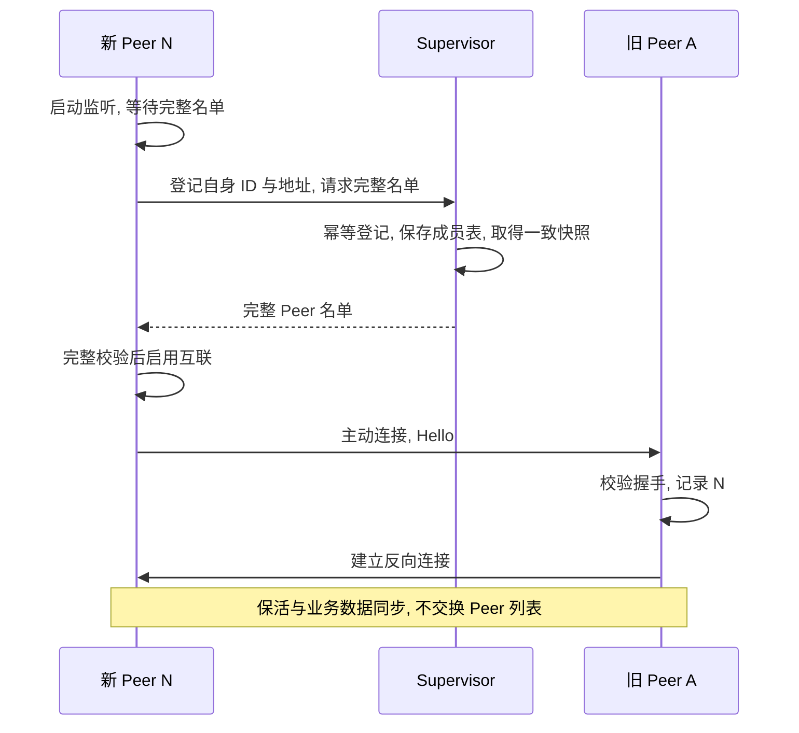
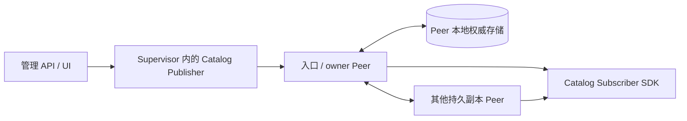

# Verdandi Supervisor 成员登记、Catalog 发布与拓扑 UI 设计

> 当前准入支持 Star/Planet 证书角色, 完整 Star 名单与独立有界候选应答, 见 [基础连接规则](connection-rules.md).

> 星图角色与接入层以 [结构修订](../galaxy-architecture.md) 为准. Peer 为恒星, 全量授权缓存 Relay 为行星,
> SDK 业务实体为卫星; Supervisor 管理观测这些关系, 不因新的展示层次进入业务转发路径.
> Planet 也独立鉴权, 只取得局部候选 Star. 这与下文 Star 取得完整成员表是不同角色流程,
> Star 按地域等属性逻辑分组, Planet 优先本组且故障时可跨组; 不复用现有完整成员响应的隐式局部变体.
> 已运行 Planet 可在 Supervisor 离线时凭已有有效授权切换并重新登记; 新 Star/Planet 进程均等待在线鉴权.
> Star/Planet 可选内存或落盘, Star 允许混用; 下文持久恢复目标适用于持久部署, 确认集合仍需细化.

> 2026-09-10 实现更新: Supervisor 登记, 持久成员表, 进程 UUID, TLS/签名准入和双连接 mesh 已接入,
> 旧 Discover 已删除. 当前可执行契约以 [Peer README](README.md), [协议](../proto/README.md) 为准.
> 下文未实施的 StateStore, 数据复制, Publisher/SDK 和持久业务恢复仍是设计内容.
> 新测试执行状态见 [验证计划](../service-admission-test-plan.md); 历史状态说明不代表当前代码.

日期: 2026-09-09. 状态: 基础加入流程、Peer 持久保存 Catalog 权威数据及 Supervisor 可兼任 Catalog Publisher 已由用户明确; 恢复协议、存储选型、生产身份与拓扑 UI 细节待审核. 当前已完成登记与认证互联, Discover 已移除.

实现进展: [Go Supervisor 骨架](../supervisor/README.md) 已建立管理 HTTP 生命周期与健康接口.
本文的 Peer 登记和持久成员已实现; 业务发布和拓扑观测尚未实现, 管理健康结果不代表群组 Ready.

实现语言已确定: 独立 Supervisor 服务使用 Go, Peer 服务使用 Rust. Supervisor 负责成员登记、管理与观测接口, 并可内置 Catalog Publisher; Peer 负责业务状态复制、权威持久恢复与 SDK 同步. Rust Peer 内部管理连接任务的 supervisor 仍是 Rust 模块, 不属于独立 Go 服务.

启动目标已按 CORE-012 更新为 `peer --listen=... --super=... --cluster=...`, Peer ID 是每次进程启动生成的新 UUID. 同一进程的重连和登记重试不换 UUID; 旧文档跨重启复用 Peer ID 的假设已被替代. 具体命令与待审边界见 [Core 配置](core-design.md#4-peer-身份与配置).

连接数量另见 [单连接与双连接审核](connection-model-review-20260909.md). 当前本文仍按已接受的双连接描述反向拨号; 若改选单连接, 旧 Peer 记录新节点后直接复用该 TCP 双向同步, 注册取全名单的门槛不变.

## 1. 已确认的最小流程

Supervisor 保存群组的完整 Peer 名单. 新节点先向 Supervisor 登记并取得完整名单, 然后主动连接名单中的其他 Peer. 旧 Peer 握手后记录这个新节点, 安排反向连接. Peer 之间不交换名单、不转发节点介绍、不进行拓扑对账.

取得完整名单是新节点开始加入的门槛. 不额外增加单独的准入票据流程, 不要求 Supervisor 向所有旧 Peer 推送成员变更, 不引入成员增量 ACK/重放状态机.

Supervisor 不可用时, 已取得完整名单的节点继续按已有信息互联和通信, 旧 Peer 仍可接纳这些新连接. 尚未取全名单的节点等待 Supervisor 恢复. Supervisor 不转发 Peer 间复制或 SDK 订阅流量; 兼任 Publisher 时, 它是所管理 Catalog 的写入来源, 见第 7 节.

这是成员登记集中、数据通信对等的结构. 它替代先前的双方发现对账和 Supervisor 异常补漏方案. 用户后续明确的“新节点取全名单后主动加入, peers 自动更新”也替代了中间讨论的 Supervisor 全群版本推送与独立准入票据方案.

本文取消的是拓扑对账. 业务数据仍需初始同步、断线后的版本比较与副本修复, 才能补齐未收到的更新. Peer 内部管理单条连接任务的 client supervisor 与独立 Supervisor 不是同一对象.

## 2. 注册与互联

建议实现边界:

1. Peer 启动 listener, 但在拿到完整名单之前不进入群组业务通信. 名单尚未取全时的连接拒绝由对端正常退避处理.
2. Supervisor 将新节点登记和完整名单快照获取按确定顺序执行. 名单包含已登记但暂时离线的节点, 不能只返回当前连接到 Supervisor 的节点.
3. 同一身份及地址的重复请求幂等; 请求或响应丢失后可重试. ID/地址冲突和容量不足明确拒绝, 不悄悄覆盖既有成员.
4. 新节点完整接收并校验名单后, 一次合并至自己的成员记录, 去除自身并去重拨号. 只收到部分响应不能视为取得完整名单.
5. 接收方在 Hello 校验通过后, 将对端自身的 ID 与可达地址合并至本地成员记录并安排反向连接. 不因为旧名单没有该节点就直接拒绝, 也不从对端接收第三方名单.
6. 新节点对所有已知目标执行有界并发与退避; 失败不删除成员, 已在途或已连接的目标不重复创建任务. 新连接可以复用原有 Hello、generation 与资源限制.
7. 注册已记录、完整名单已取得、两向互联完成和业务数据 Ready 分别记录, 不把一次注册响应标记为所有工作已完成.

首版优先使用一份有字节数与成员数上限的完整名单响应. 若未来需要分页, 所有页必须属于同一不可变快照, 在收齐前不能启用加入. 这不要求 Peer 维护全群拓扑 revision 或周期确认.

旧 Peer 只学习当前连接对端, 不向其他 Peer 广播这个变化. Supervisor 巡检可以报告缺边, 但基础补连由已知成员的本地连接调度承担, 不需要独立的陌生成员注入命令.

## 3. 并发加入为何能工作

假设 Supervisor 的注册记录只增加, 登记与完整名单快照顺序一致, 各节点最终成功取得名单并重试可达目标:

- A 先登记, B 后登记, 则 B 的完整名单一定包含 A.
- B 主动连接 A, A 从握手得知 B 并建立反向连接.
- 对每一对新节点都存在同样的先后关系, 因此不要求进程按顺序启动.

这个结论依赖完整名单不是落后的独立缓存, Supervisor 不丢已登记记录, 节点地址最终可达且未超过容量. 未取全名单的节点尚未完成加入, 不要求其他 Peer 靠传播来替它完成初始化.

对于 N 个旧节点, 新节点取得 O(N) 条成员描述并建立 2N 条新 TCP 连接. 旧 Peer 没有为此次加入发起全网列表查询. 这是正常无重试路径的计数, 不是无限故障期间的消息上限; 定期完整连接报告本身仍包含 O(N²) 条记录.

## 4. Supervisor 失效与恢复

| 情况 | 行为 |
| --- | --- |
| 已稳定群组, Supervisor 离线 | 保留已知成员并继续通信, 旧连接断开后正常退避重连 |
| 新节点已取到完整名单, 互联尚未完成 | 继续连接名单中的目标; 旧 Peer 接纳并记录它, 不要求 Supervisor 在线 |
| 新节点尚未取全名单 | 保持初始化等待, Supervisor 恢复后重试 |
| 登记已保存但响应丢失 | 保留登记事实, 重试幂等返回当前完整名单; 不误报全群 Ready |
| 旧 Peer 收到此前未知的新连接 | 按协议与身份策略校验对端, 通过后添加该节点并安排反向连接 |
| Supervisor 正常重启 | 从持久成员表恢复服务, 不要求健康 Peer 数据连接全部重建 |
| 成员删除、地址迁移或替换 | 首版延后, 不能靠超时、名单缺失或 Hello 冲突自动执行 |

Supervisor 必须可靠保存登记结果后再返回成功. 首版建议单实例单写者, 不引入选举. 丢库、旧备份回滚和多实例写入冲突不能靠查询几个在线 Peer 就宣称恢复了完整名单; 这些异常恢复步骤需要单独定义.

Peer 本地名单允许暂时不同: 已收到 N 的 Hello 的节点已经记录 N, 其他节点等 N 主动连接. 只要 N 已持有完整名单并持续重试, 这不需要 Supervisor 后续广播. 若地址缺失、不可达或登记状态丢失, 则不能承诺立即补齐.

CORE-012 规定进程重启后更换 UUID, 因此原先“恢复旧 Peer ID 后沿用登记”的方案已失效. 当前仍运行的进程在 Supervisor 离线时保留 UUID 和名单继续通信. 重新启动的进程需让新的 UUID 完成登记; 若还要支持 Supervisor 同时离线的重启, 必须另行定义既有部署资格与新进程的关联及校验, 不能通过复制旧 UUID、本地成员文件或相同 IP 来假定已完成加入. 此恢复边界尚未关闭, 不取消 Peer 从磁盘恢复权威 Catalog 的目标.

同一地址出现新 UUID 时, 需要区分已退出实例的合法重启和两个仍存活实例的冲突. 旧实例的连接、名单项和观测历史不能每次重启永久累积, 也不能仅凭不可信 Hello 抢占. 替换、回收与权限规则留作身份改造的必要审核项; 同一持久副本不能因先后出现两个 UUID 被计入两票 durable 确认.

“取到完整名单”是正常节点启动流程的门槛, 本身不是接收方可以从普通 Hello 独立验证的安全证明. 当前无认证原型不能宣称能抵御伪造节点. 生产节点身份与可信部署边界单独设计, 本文不引入独立准入票据或把它作为基础加入步骤.

## 5. 3D 拓扑与观测

Supervisor 注册表提供预期成员, 全连接规则提供预期边, 各 Peer 报告实际连接. UI 同时显示登记、初始化、互联、数据同步与观测时效; 管理连接离线不等于 Peer 数据连接已经中断.

| 对象 | 建议内容 |
| --- | --- |
| 登记成员 | cluster、peer ID、登记地址、登记状态 |
| 节点报告 | peer ID、boot ID、是否已取全名单、报告完整性 |
| 会话报告 | 对端 ID、client/acceptor 角色、generation、连接状态 |
| 拨号报告 | 已知目标、在途状态、最近错误、下次重试 |
| 观测信息 | Supervisor 接收时间、报告序号、是否过期 |

Supervisor 的管理连接不计入 Peer mesh. 诊断事件可能丢失, 因此仍需要可重新读取的有界完整连接快照. 实际未采集的 RTT、流量或同步进度不填入模拟值.

每对 Peer 两条 TCP: A.client -> B.acceptor 和 B.client -> A.acceptor. 同一连接两端的报告不能算成两条, 两端本地 generation 也不能直接相等比较. 概览可合并为一条 pair 连线及 2/2、1/2、0/2 状态, 选中后展开拨号方向; owner 数据推送方向由 acceptor 指向 client, 应分别标注.

浏览器可使用 WebGL 提供旋转、缩放和选择; 技术能力见 [MDN WebGL](https://developer.mozilla.org/en-US/docs/Web/API/WebGL_API). 建议默认突出异常边, 选中节点后展开邻接连接, 保留 2D 图及连接矩阵. 完整 mesh 在 3D 中也有遮挡, 布局距离不表示真实物理距离或延迟.

UI 取得一次观测快照再接收合并的增量, 可评估 [SSE](https://developer.mozilla.org/en-US/docs/Web/API/Server-sent_events/Using_server-sent_events). UI 序号只管理浏览器更新, 不变成 Peer 拓扑版本. 慢页面队列有界, 丢增量后重新取快照. 多页面共享 Supervisor 的采集结果; 关闭页面不停止巡检. Supervisor 离线时标记观测过期, 不能虚构所有 Peer 都已掉线.

## 6. 实施顺序与验证

建议先实现 Supervisor 幂等登记与持久成员表、完整名单响应、Peer 初始化门槛与握手学习, 再替换旧 Discover 并验证故障, 最后接入观测和 3D UI. 不需要先实现全群名单推送、成员增量日志、分布式选举或专门补连命令.

至少验证:

- 三节点取得名单后形成 6 条 TCP, Peer 间没有 Discover 或第三方列表传播.
- 并发注册按确定顺序生成完整快照, 每对后登记者知道先登记者, 最终互联.
- 登记响应丢失、重复登记、半包和超限响应不会跳过完整名单门槛或重复创建成员.
- 新节点取全名单后立即关闭 Supervisor, 新旧节点仍能完成两向互联.
- 尚未取全名单时关闭 Supervisor, 该节点保持等待; 已稳定群组通信和旧目标重连正常.
- 旧名单接纳新节点, 重复 Hello、冲突 ID/地址、旧 generation 与容量限制仍正确.
- Supervisor 重启保留成员表; 成员表损坏或恢复不完整时不返回伪完整名单.
- Peer 重启按最终选定的本地持久恢复策略执行, 业务数据恢复不会被成员恢复替代.
- 两端上报不重复统计 TCP, 观测过期不触发删成员, 多个慢浏览器不放大 Peer 负载.

本节的成员协议仍是设计记录; 独立 Go 管理服务骨架已开始实现, 没有改变 Rust 或 Proto. 现有 Discover 消息退出时仍保留历史编号, 不复用. 本文不构成工具或依赖下载许可.

## 7. Supervisor 兼任 Catalog Publisher

### 7.1 已确认的职责边界

本节描述持久部署的 Catalog 恢复目标: Publisher 离线且整个 Peer 群组重启后, 可以从有效磁盘副本恢复.
最新 GQ-003/GQ-004 允许 Star/Planet 可选内存或落盘并混合 Star 模式; 全内存部署不提供全群丢失后的恢复保证.
承担 Catalog 权威持久确认的 Star 磁盘不能当作可随意丢弃的缓存; Planet 磁盘不因此成为权威确认者.
内存仍保存当前视图用于查询、快照和广播. 新进程恢复数据前仍须按 GQ-005 完成 Supervisor 准入.

Supervisor 可以内置 Catalog Publisher, 为它被授权的键生成修改并发布. 一个 Publisher 模块可以管理多个键, 不需要每个键一个进程. 每键仍只有一个授权的逻辑写者; 其他服务可以发布各自被授权的其他 Catalog 键. Registration 仍由对应服务发布, Registry 由 Peer 根据有效 Registration 派生.

图示保留全落盘入口的历史流程, 不代表混合模式下任意入口本地都已持久保存.
Supervisor 的成员登记、观测和 Catalog Publisher 是不同职责, 可以同进程部署;
Publisher 使用正常的授权发布入口, 不直接修改 Peer 存储, 不逐个协调副本.

Supervisor 仍须持久保存成员登记和自身管理身份等控制信息, 但无需再维护第二份独立的 Catalog 权威库. 如以后保留编辑草稿、待发布意图或本地缓存, 必须与“Peer 已确认的 Catalog 状态”区分. Supervisor 实现语言已确定为 Go, 存储引擎尚未冻结.

### 7.2 发布与恢复流程

流程继承 [完整设计](design.md) 的 A-001/A-002 和 Catalog Bind 草案; 以下仍需关闭领域协议细节后实施:

1. Supervisor 以授权 Publisher 身份 Bind 对应 scope, 从已完成恢复的 owner 路径对齐当前版本和完整状态. 不凭本地空缓存覆盖 Catalog, 也不从任意落后副本的版本直接开始写入.
2. 接收管理修改, 生成完整 Update、严格基线 Patch 或 Delete. owner 验证所有权、版本、正文和容量, Patch 物化为完整结果; 版本重复幂等, 同版本不同内容报告冲突.
3. Peer 原子保存完整 State 或版本化删除状态, 在满足既有 A-002 的 owner 与定义成员多数 durable 条件后返回写入成功. Publisher 不需要另外完成一份权威业务数据库提交.
4. Peer 继续同步其他副本并向 Subscriber 推送. 持久确认、全群收敛和所有 SDK 已收到是不同事实; 写入成功不表示全局实时可见.
5. 响应丢失或超时可能是 ambiguous. Publisher 重连后按版本对账再决定重试, 不把未收到 ACK 解释为未执行, 不产生无限历史或逐副本重试任务.

这里只保留原 A-002 的持久确认方向, 没有将多数落盘等同于共识或线性一致.
混合模式中内存 Star 无法满足上述本地 durable 步骤, 必须先设计其入口处理规则再实施.
参与多数的稳定持久成员、恢复水位和故障接管仍须审核; 一次新节点登记不能直接改变写入多数集合.

首版持久恢复单位是“每键最新完整 State 或 terminal, 连同版本与必要所有权元数据”. 不要求保存每次 Patch、全部修改历史或跨键事务. 数据库内部的事务日志/崩溃恢复机制另行选择, 不等同于业务事件重放协议.

### 7.3 故障行为与验证边界

| 情况 | 目标行为 |
| --- | --- |
| Supervisor / Catalog Publisher 离线 | 已加入的 Peer 网络继续读、同步和推送已有 Catalog; 该 Publisher 的新修改暂停, 其他合法写者不因此全部停写 |
| 单个 Peer 重启 | 新进程先完成 Supervisor 鉴权; 落盘节点校验磁盘并补齐, 内存节点从有效来源重建 |
| Publisher 离线, 全部 Peer 重启 | Supervisor 可用且持久副本有效时, 恢复并互相对齐, 包括删除状态; 不等待 Publisher 重建 Catalog |
| Supervisor 也离线, 全部旧 Peer 重启 | 已确认全部新进程等待 Supervisor 恢复并鉴权; 不沿用旧 ID 或仅凭磁盘和缓存名单加入 |
| Publisher 重启或丢失本地缓存 | 从 Peer 对齐已确认状态后继续发布; 原写者身份须可恢复, 换写者仍需受控接管 |
| 个别磁盘副本损坏 | 隔离损坏状态并从可信健康副本修复; 未证明完整前不返回伪完整视图 |
| 所有权威磁盘及备份均丢失 | 无法保证恢复; 这不属于“全群进程重启但磁盘保留”的承诺 |

加载了本地文件不等于拥有最新全局视图. 恢复阶段允许哪些降级读取、何时重新接纳写入, 必须结合版本水位和所有权证明定义. 旧磁盘中的低版本或已删除值不能在重连时复活; tombstone 回收仍是独立待审项.

至少验证 Publisher 关闭时的持久群组重启、新进程在 Supervisor 离线时等待及恢复后的准入、
混合存储确认边界、删除后重启、持久提交各阶段断电、成功响应丢失、Publisher 空缓存重新 Bind、旧磁盘追赶和损坏副本修复.
此次只更新设计, 没有实现或执行这些场景. 不新增 Supervisor 选举、自动写者接管或全群逐条 ACK 协议.
